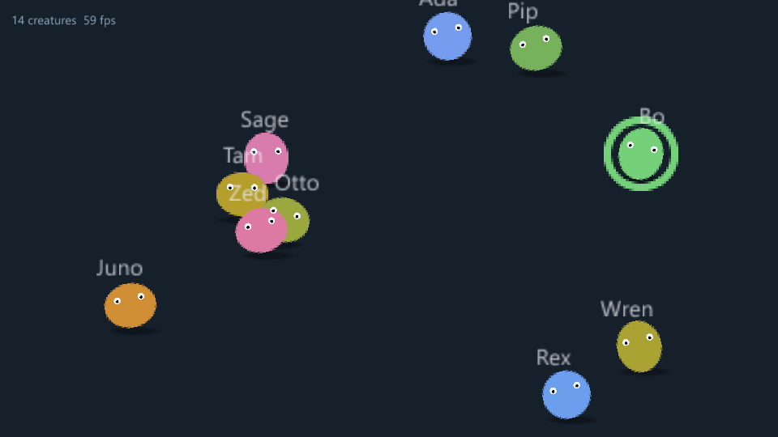
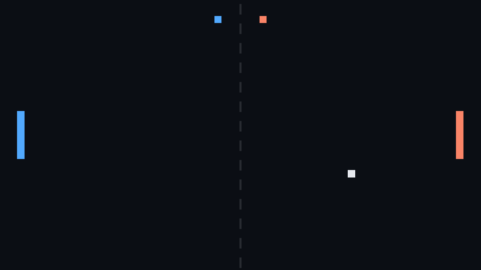
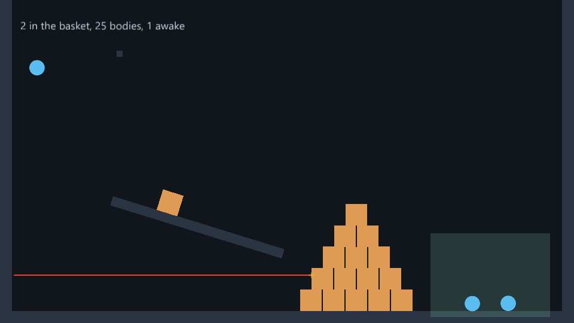

<p align="center">
  <picture>
    <source media="(prefers-color-scheme: dark)" srcset=".github/images/fluxion-logo-white.png">
    
  </picture>
</p>

<h1 align="center">Fluxion Engine</h1>

<p align="center">
  <strong>A window, a world, and the loop between them.</strong><br>
  A game engine for Zig 0.16: an ECS in the middle, a 2D renderer, an interface layer, physics, and scenes kept as JSON or CBOR.
</p>

<p align="center">
  
  
  
  
  
</p>

<p align="center">
  <a href="#-the-frame">The frame</a> ·
  <a href="#-the-2d-layer">The 2D layer</a> ·
  <a href="#-physics">Physics</a> ·
  <a href="#-scenes">Scenes</a> ·
  <a href="#-install">Install</a> ·
  <a href="#-examples">Examples</a> ·
  <a href="#-what-comes-next">What comes next</a>
</p>



| Module | What it is |
| --- | --- |
| `App` | The frame: what it owns, and the order it does things in. |
| `schedule` | When a game's systems run. |
| `components` | What the renderer knows how to read. |
| `assets` | What the GPU is holding, and the handles that name it. |
| `Input` | What the keyboard, the mouse and the controllers did. |
| `Time` | How long the last frame took, and the fixed step. |
| `color` | A colour, and the three ways to write one down. |
| `Window` | The window and the event queue. |
| `render.sprite` | The 2D layer, in one instanced draw per texture. |
| `render.view` | What the camera sees, and where the pointer is in the world. |
| `Interface` | The interface layer: fed from `Input`, laid out by `.ui` systems, drawn on top. |
| `text.Atlas` | Every glyph the game has drawn, in one texture. |
| `hierarchy` | Where a thing really is, once its parent has had its say. |
| `scene` | A world written down and read back, as JSON or as CBOR. |
| `Bodies` | Which body is which entity's: the physics world kept in step with the components. |
| `Clipboard` | Text copied and pasted: the system's, or the program's own with no window. |
| `dialog` | The system's file and folder dialogs: what `app.openFileDialog` asks for, and the answer `app.input` holds for a frame. |
| `Commands` | Spawns, despawns, adds and removes that wait for the system asking for them to return. |
| `States` | A game's own states, each an enum with one value at a time, and the systems that run in them. |
| `Project` | Where a game's files are: `res://` paths from the project's root, the UUIDs in the `.uid` files beside them, and `project.fluxion`, whose renderer chooses the backend. |
| `DebugViews` | What the engine draws into `app.debug` by itself: colliders, bodies, transforms, sprites, cameras, stats. |
| `attr` | What a component's field means, for an inspector to show it by: a range, an angle, a unit, layers, several lines, a value behind a getter and a setter. |

```zig
const fx = @import("fluxion_engine");

pub fn main(init: std.process.Init) !void {
    const app = try fx.App.create(init.gpa, .{ .title = "game", .io = init.io });
    defer app.destroy();

    try app.addSystem(.startup, "spawn", spawn);
    try app.addSystem(.fixed, "move", move);
    try app.run();
}

fn spawn(app: *fx.App) !void {
    _ = try app.world.spawnWith(.{
        fx.Transform2D.at(320, 180),
        fx.Sprite.solid(.hex(0x3AA0FF), 48, 48),
    });
}

fn move(app: *fx.App) !void {
    var it = try fx.Query(.{fx.Transform2D}).over(&app.world);
    while (it.next()) |chunk| {
        for (chunk.slice(fx.Transform2D)) |*place| {
            place.x += app.input.axisOf(.keys(.a, .d)) * 200 * app.time.delta;
        }
    }
}
```

**A scene is a world, and a node is an entity.** The shape is Godot's - open a
window, put things in a scene, give them behaviour, draw - and the thing in
the middle is an ECS rather than a tree of objects with virtual methods on
them. Everything of one shape lives in one table, so a system is a loop over
plain slices with no branch in it asking what this one is. That is
[Fluxion ECS](https://github.com/kisstp2006/fluxion-ecs)' doing, not this
package's; what this package adds is the frame around it.

## 🥞 Three layers, one target

3D first with a depth test, then 2D blended with none, then the interface on
top of both, each its own render pass into the same surface. The first pass
clears and the rest load what the one before them left, which is the whole of
what layering costs - no extra textures, no compositing pass. What
`app.debug` draws goes over all three, last.

Today **the 2D layer and the interface are written**. The 3D pass has its
place in `App.drawLayers` and nothing in it.

## 🔁 The frame

Seven stages, and the list is the frame in order:

| Stage | When, and what belongs there |
| --- | --- |
| `startup` | Once, before the first frame. Spawn the world. |
| `input` | After the events are in. Turn keys into intent. |
| `fixed` | Zero or more times, at a constant delta, each followed by the physics step. Forces and steering. |
| `update` | Once, at whatever the frame took. Everything else. |
| `late` | After `update`, before anything is drawn. Cameras follow here. |
| `ui` | Last before drawing, inside the interface's frame: declare it into `app.ui`. |
| `shutdown` | Once, after the last frame. |

A system is `fn (*App) anyerror!void` - a plain function, not a closure and
not a method on a node. The state it works on is in the world it is handed, so
the function needs nothing of its own.

**`late` earns its place**: a camera that follows a player has to run after
the player has moved, and putting both in `update` makes that an accident of
registration order.

**The fixed stage runs as many times as the frame was worth**, and a frame
too long to catch up with is dropped rather than chased - so a stall shows up
as the world running slow for a moment instead of as a loop that never
finishes.

**A key pressed is one jump, whatever the frame rate.** On a 144 Hz screen
most frames run no fixed step at all, and on a slow machine one frame runs
two - so a `.fixed` system asking `justPressed` is answered from edges kept
since the last *step*, not since the top of the frame. Each press reaches
exactly one step, and a press made while the world is paused reaches none.
A controller's buttons work the same way.

**Every system is timed**, under the name it was added with.
`app.schedule.systemsIn(.update)` gives each one's `time_last_frame` - a
`.fixed` system's steps added up - and `{f}` prints them all:

```zig
std.debug.print("{f}", .{app.schedule});
// fixed     move ball                21.4us
```

## 🧾 Commands

```zig
fn hits(app: *fx.App) !void {
    var it = try fx.Query(.{ Bullet, fx.Transform2D }).over(&app.world);
    while (it.next()) |chunk| {
        for (chunk.entities, chunk.slice(fx.Transform2D)) |bullet, place| {
            if (!struck(app, place)) continue;
            try app.commands.despawn(bullet);                    // when this system returns
            const spark = try app.commands.spawn(.{ place, Spark{} });
            _ = try app.commands.spawn(.{ fx.Transform2D.childOf(spark, 0, -8), Glow{} });
        }
    }
}
```

- **A despawn, an `add` or a `remove` moves rows**, and a query is a walk
  over rows: done in the middle of one, it skips entities or visits them
  twice. `app.commands` keeps them instead, and the engine does them all, in
  the order they were asked for, when the system returns - so the next
  system sees them, and a system that failed leaves none of its own behind.
- **`spawn` hands back an entity that is alive at once** with nothing on it,
  and its components arrive with the rest: it can be named, hung from and
  kept in a component straight away.
- **A command for an entity that has died since is passed over**: two
  bullets despawning the enemy they both hit is not a mistake.
- **A parallel `Query.each` can ask too**, from every worker at once -
  `despawn`, `add` and `remove`; `spawn` only from the system's own thread.
- **`app.commands.apply()` does it all now**, for a system that needs what it
  asked for before it returns - a body for what it spawned, to join it to
  another - and is not inside a query when it asks.

## 🚦 States

```zig
const Mode = enum { menu, playing, paused, game_over };

try app.addState(Mode.menu);                                  // its first value otherwise
try app.addSystemIn(.update, Mode.playing, "move", move);     // only while playing
try app.onEnter(Mode.paused, "pause menu", showPauseMenu);
try app.onExit(Mode.paused, "hide pause menu", hidePauseMenu);
try app.addSystemIf(.update, bossAwake, "boss", boss);        // a condition of the game's own

if (app.input.justPressed(.escape)) try app.setState(Mode.paused);
if (app.state(Mode) == .game_over) showScore(app);
```

- **A state is an enum** with one value at a time, and a game has as many as
  it likes, each changed apart: a `Mode` and a `Weather`.
- **A change waits for the top of the next frame.** Every system of this
  frame sees the same value, whichever of them asked; then what leaves the
  old value runs, the value changes, and what enters the new one runs,
  before the frame's first stage. The last asked for in a frame wins, asking
  for the value it has does nothing, and a change asked for while entering
  waits for the frame after. The first value is entered after `.startup`.
- **A system in a state, or under a condition, is skipped rather than
  removed**: it keeps its place in its stage, and its time is its own.
- **Code that does not know it is being gated can be.**
  `app.addSystemsIn(value, register)` puts every system and hook `register`
  adds under that value too, on top of their own conditions. That is how an
  editor runs a game only in Play, with `time.scale` holding the world still
  and `time.stepOnce()` moving it on by one fixed step:

  ```zig
  const Play = enum { editing, playing, paused };
  try app.addSystemsIn(Play.playing, game.addSystems);

  try app.setState(Play.paused);   // editing and paused: the game's systems are out
  app.time.scale = 0;              // and the world holds still

  try app.setState(Play.playing);  // Step: one frame of the game,
  app.time.stepOnce();             // one fixed step of the world,
  // and back to Play.paused from the frame it ran in
  ```

## 🎮 Controllers and the pointer

```zig
const pad = app.input.anyPad();            // or app.input.pad(1) for player two
const walk = pad.stick(.left);             // a Vec2, dead zone already out
if (pad.justPressed(.a)) jump();

try app.setCursor(.locked);                // a first-person camera, or a drag
const turn = app.input.pointer.dx;
```

- **Controllers are read, not heard.** A stick is a position rather than a
  thing that happened, so the platform polls every controller once a frame
  and "pressed this frame" is this frame's buttons against the last. XInput
  on Windows, evdev on Linux, Android's own, and SDL's mapping format for the
  pad nobody recognises - `app.addGamepadMappings(text)`.
- **`anyPad()` is every controller as one**, for a game with one player who
  should be able to pick up whichever is nearest; `pad(slot)` is one of them,
  and a slot is the controller's for as long as it stays plugged in, which
  makes slots player numbers.
- **The dead zone is round.** On the stick's distance from the middle rather
  than on each axis, so a nearly diagonal push does not snap to a straight
  line, and rescaled so the first movement past it is small rather than a
  jump. `Input.stick_deadzone` is a fifth by default.
- **`setCursor` takes four modes**: `.normal`, `.hidden` for a game that
  draws its own pointer, `.confined` to hold it inside the window, and
  `.locked` to take it away and report movement with no edge to stop at,
  unaccelerated where the system allows. While locked, `input.pointer` holds
  still where it was and only `dx` and `dy` move.
- **A held pointer is let go when the window loses the keyboard**, and taken
  back when it returns - so a player who alt-tabs away from a locked game gets
  their mouse back, and the lock is still a lock when they come back to it. A
  lock asked for while the window is in the background waits for it.

## 🪟 The window

```zig
try app.setWindowTitle("Level 3");
try app.setWindowSize(1280, 720);
try app.setWindowSizeLimits(.{ .min_width = 640, .min_height = 360 });
try app.setWindowState(.maximized);         // .normal, .maximized, .minimized
if (app.resized) layOutAgain(app.width, app.height);
```

- **`app.resized` is true for the one frame the size changed in** - an edge
  dragged, a maximise, fullscreen - and false again the frame after. The
  engine always had to notice, because the swapchain had to be resized; now
  the systems hear about it too, instead of keeping last frame's size to
  compare with.
- **Sizes are the content area, in the units of `Options.width` and
  `height`**: pixels, on every backend there is today.
- **A fullscreen, maximised or minimised window is made an ordinary one
  before it is sized or moved**, because none of them has a size of its own.
  `.normal` means the window's own size even for one that was maximised
  before it was minimised, which Windows would otherwise bring back
  maximised.
- **Limits apply at once.** The platform only enforces them on the next
  drag, so a window already outside new limits is brought inside them when
  they are set.
- **`Options.resizable` and `Options.maximized`** say what can only be said
  when the window is made. Without a window - headless - all of this is
  nothing, and says so without failing.

## 📋 The clipboard

```zig
try app.setClipboardText(seed);                     // for the player to paste anywhere
const pasted = try app.clipboardText();             // what they copied, anywhere
const can_paste = app.hasClipboardText();           // a Paste entry that greys out
```

- **It is the system's**, through
  [Fluxion Platform](https://github.com/kisstp2006/fluxion-platform): what a
  game copies reaches every other program and what they copied reaches the
  game, as UTF-8 with `\n` between lines whatever put it there. The
  interface's Ctrl+C, Ctrl+X and Ctrl+V go through the same one.
- **What `clipboardText` gives is lent** until the next read - the
  interface's paste is one - so a game that keeps it keeps a copy. Read it
  when it is wanted rather than every frame: on X11 and Wayland a read waits
  on the program that owns the clipboard.
- **`hasClipboardText` asks without reading**, which is also the quiet way on
  Android, where every read shows the player a notice.
- **A system may refuse** with `error.Unavailable`: text that is not UTF-8,
  Wayland asked by a window without the keyboard, a page with no clipboard.
  The interface warns and carries on; a copy that failed is lost, not the
  frame.
- **Without a window - headless, in a test - the clipboard is the program's
  own**, so copying and pasting still work inside it, and a test never
  overwrites what the person running it had copied.

## 📂 File and folder dialogs

```zig
browsing = try app.openFolderDialog(.{ .title = "Where the project goes" });
picking = try app.openFileDialog(.{
    .multiple = true,
    .filters = &.{.{ .name = "Images", .extensions = &.{ "png", "jpg" } }},
});

// In any system, a frame or more later:
if (app.input.dialogAnswer(browsing)) |paths| {
    if (paths.len > 0) try useFolder(paths[0]); // none: it was cancelled
}
```

- **They are the system's own**, through
  [Fluxion Platform](https://github.com/kisstp2006/fluxion-platform): over
  the window and modal to it, with the places and the recent files the player
  already knows.
- **Asking returns at once**, with an id, and the game goes on running and
  drawing while the dialog is open. The answer is in `app.input` for every
  system of the frame it arrives in, and gone in the next;
  `app.input.dialogAnswers()` is all of that frame's.
- **A cancel is an answer too**, with no paths, so every dialog is answered
  exactly once.
- **The paths are lent** until the frame ends - they are the platform's, and
  its next pump frees them - so a game that keeps one keeps a copy. A frame
  whose system failed lets them go all the same, so a loop that carries on
  after an error never reads one that is gone.
- **One dialog at a time.** Asking while one is open is `error.Unavailable`,
  and so is a filter two systems would read differently - `"*.png"`,
  `"png;jpg"` - and a platform with no dialogs yet: X11, Wayland, Android.
  `fx.dialog.available` says whether the fluxion-platform this was built with
  has them at all.
- **Without a window, a dialog is never answered by itself.** The app still
  hands out ids, and a test answers for the person who is not there, the way
  it presses keys for them:

```zig
const id = try app.openFolderDialog(.{});
app.input.answerDialog(.{ .id = id, .paths = &.{"C:/games/meadow"} });
_ = try app.step(); // this frame's systems see it, the next frame's do not
```

## ⌛ Frame pacing

```zig
try app.setVsync(false);
app.time.max_fps = 144;                     // null is no cap
if (!app.input.focused) pause(app);
```

- **The cap keeps a schedule**, so a late frame is caught up with and the
  average holds; after a stall longer than `time.max_delta` it starts again.
  On Windows a sleep is only as precise as the system timer - 15.6 ms unless
  something asks for better - so a cap above about 60 is right on average and
  uneven frame to frame.
- **A minimised window is not drawn**, and the loop wakes ten times a second
  instead of spinning. The fixed steps keep the simulation in real time.
- **On `d3d11`, vsync off does not yet go past the refresh rate**: the
  flip-model swapchain in fluxion-rhi has two buffers and no tearing support.
  It is the backend Windows opens by default now.

## 🎨 The 2D layer

One quad in a vertex buffer and a second buffer stepping once per instance
with where each sprite goes, how big, which way round, what colour and which
part of which texture. A thousand sprites sharing a texture is one draw call.

```zig
_ = try world.spawnWith(.{
    fx.Transform2D{ .x = 100, .y = 80, .rotation = 0.4 },
    fx.Sprite{ .texture = hero, .region = .cell(2, 4, 1), .layer = 5 },
});
```

- **Sorted back to front, blended, with no depth test.** A depth buffer and
  half-transparent pixels disagree about what is behind what. The sort is by
  `layer`, then `order`, then blend mode, then texture, then the order the
  sprites were found in - so sprites of one layer sharing a texture come out
  as one run and therefore one call, and two overlapping sprites that tie on
  everything are drawn the same way round every frame.
- **`Sprite.blend = .additive` adds light** instead of covering what is
  behind: sparks, glows, lasers. It is a second pipeline, and additive sprites
  of one layer and order are grouped so they stay one draw call.
- **A texture loaded with `.wrap = .repeat` tiles** across a region that goes
  past its edge: `.region = .repeated(8, 4)` draws it eight times across and
  four down.
- **`Sprite.order` is the sort inside a layer.** Zero by default, which keeps
  the texture grouping. A top-down game writes `transform.y` into it from a
  `.late` system and gets things sorted by their feet.
- **Set `interpolate` on anything moved in `.fixed`** and it is drawn between
  its last two steps, at `Time.alpha`. The engine remembers where it was; the
  game's own systems never touch that. Without it, a sixty-hertz step on a
  hundred-and-forty-four-hertz screen shows every step twice and some three
  times.
- **The whole instance buffer goes up in one call.** Not one per sprite: on
  Direct3D 11 a dynamic buffer is re-sent whole on every map, so a call per
  sprite is quadratic in the number of sprites.
- **A sprite with no texture is a rectangle of solid colour**, because the
  renderer falls back to a one-texel white texture and the tint does the rest.
  One pipeline, no branch in the shader, no artwork for a health bar.
- **A sprite with no size is the size of its own artwork**, so most sprites
  need no size at all.
- **A transform's `parent` attaches one entity to another**, so a turret rides
  on a tank and a health bar rides over an enemy. The numbers in a transform
  are *local* - in the parent's space, and in the world's only when there is
  no parent - which is Unity's `Transform` and Godot's `Node2D`.
  `app.worldTransform(entity)` is the other one, and it costs a walk up the
  chain rather than a field read. `inherit_rotation = false` is the shadow
  that does not tip over. **What hangs from something goes with it**: despawn
  the tank and the turret goes at the end of the frame, and the barrel on the
  turret with it - Unity's rule and Godot's.
- **An `Animation` is a sheet and a rate**, and the engine writes the cell it
  lands on into `Sprite.region` once a frame. One sheet holds a walk, an idle
  and an attack; swapping between them is writing two numbers.
- **A `Text2D` is words at a transform**, drawn through the same pass as
  everything else: each glyph is a quad out of a glyph atlas, so a label sorts
  against sprites by the same `layer` and `order` and all the text in one font
  is one draw call. The text lives *in* the component, in a fixed buffer, and
  `label.print("{d} points", .{score})` is what a game actually does with it.
- **What the camera cannot see is dropped before it costs anything**, one
  comparison per sprite, which is the difference between a renderer that costs
  what is drawn and one that costs what exists.
- **The camera is an entity** with a `Transform2D` and a `Camera2D`, and its
  position is the *centre* of the view. With no camera in the world at all,
  the origin is the top left corner and one unit is one pixel - the same
  coordinate system the interface layer uses, so a game that has not thought
  about cameras yet can lay things out in screen coordinates. A game designed
  at one size says so - `Camera2D.fitting(640, 360)` - and the whole of that
  area is on screen in any window, with `zoom` multiplying it.
- **The pointer is found in the world through the same camera.**
  `app.pointerInWorld()`, `app.screenToWorld(x, y)` and
  `app.worldToScreen(x, y)` run the view the renderer draws with, forwards
  and backwards, and a test holds the arithmetic against the matrix the
  shader is given - so what is under the mouse is what is drawn under the
  mouse, zoomed and turned. `app.spriteCorners(entity)` is where a sprite's
  four corners land in the world, by the vertex shader's own arithmetic,
  for asking whether a click hit it.
- **The world can be drawn through another camera, somewhere else.**
  `app.drawWorld(texture, view)` draws the sprites, the text and `debug` into
  a texture through any `fx.View` - a minimap, a picture-in-picture, an
  editor's scene panel. With `app.world_on_screen = false` the window shows
  only the background and the interface, and a texture is the one place the
  world appears. Drawn into on OpenGL, a texture comes out with its bottom row
  first, and `app.drawnUpsideDown()` says when a picture of it wants turning.
- **The shader is written once**, in
  [Fluxion Shader](https://github.com/kisstp2006/fluxion-shader)'s language,
  and comes out as GLSL and as HLSL. Two hand-written copies would drift, and
  the drift shows up as one backend drawing correctly and the other not.

## 🔘 The interface

```zig
fn pauseMenu(app: *fx.App) !void {
    app.ui.open(.{ .id = "resume", .padding = .all(12), .background_color = .hex(0x2E343D), .focus = .{} });
    defer app.ui.close();
    app.ui.text("Resume", .{ .font_size = 24 });
    if (app.ui.justReleased()) app.time.scale = 1;
}

fn shoot(app: *fx.App) !void {
    if (app.ui.wantsPointer()) return;   // that click was the interface's
    // ...
}

try app.addSystem(.ui, "pause menu", pauseMenu);
```

- **`app.ui` is a [Fluxion UI](https://github.com/kisstp2006/fluxion-ui)
  layout.** Every `.ui` system declares into one root the size of the window,
  after `.late`, every frame. It is drawn in the default font -
  `app.interface.font` names another - over the 2D layer, in a pass that loads
  what that one left. With no font loaded it is laid out and not drawn, as a
  `Text2D` is.
- **It hears the input before the game does**, so an `.input` or `.update`
  system can ask `app.ui.wantsPointer()` and `wantsKeyboard()` about this
  frame. The wheel goes to the list under the pointer first, and only what the
  interface did not use reaches `input.wheel`.
- **The keys it takes.** Tab always moves the focus. The arrows, a d-pad and
  the left stick move it only once something has it, so a game keeps them
  until a menu takes the focus with `app.ui.setFocus`. Enter, Space and a
  pad's A press what has it, and typing and the editing keys reach a text
  input that has it. Ctrl+C, Ctrl+X and Ctrl+V go through the system
  clipboard - see [the clipboard](#-the-clipboard) - so text moves between a
  text input and every other program.
- **The pointer's shape is the interface's** once there is a `.ui` system: an
  I-beam over a text input, the arrows over a resize handle, and
  `app.ui.setCursor` for a game that wants its own. A locked pointer points at
  nothing in it.
- **`app.interface.scale` and `safe_area`** are fluxion-ui's surface: twice
  the size on a 4K screen, clear of a television's edges. A picture on an
  element names one of `app.interface.textures` by its index.
- **Without a `.ui` system none of this happens.** Nothing is fed, laid out or
  drawn, and a game that never asks for an interface runs as it did.

## 🐞 Debug drawing

```zig
fn watchBall(app: *fx.App) !void {
    const ball = app.find("ball") orelse return;
    const place = app.worldTransform(ball) orelse return;
    const at: fx.Vec2 = .init(place.x, place.y);

    app.debug.circle2d(at, 12, .green);
    app.debug.with(.{ .seconds = 2 }).cross2d(at, 6, .red);   // stays for two seconds
    app.debug.screen().print2d(.init(8, 8), "{d:.0} fps", .{app.time.fps()}, .white);
}
```

- **`app.debug` is a [Fluxion Debug Draw](https://github.com/kisstp2006/fluxion-debugdraw)
  pen**: lines, shapes and text, seen through the same camera as the 2D
  layer. The functions ending in `2d` take a `Vec2`, and the filled ones start
  with `solid`.
- **A shape lasts one frame**, or as many seconds as its style says. Drawn
  inside `.fixed` it lasts until the next step instead, so what a step drew
  is still there in the frames between steps rather than flickering on a fast
  screen.
- **`screen()` draws in pixels** from the top left, for a readout that stays
  where it is while the camera moves; `within2d(at, angle)` draws in
  something's own frame.
- **Drawing never fails.** No `try`: a shape there is no memory for is
  counted and dropped rather than stopping the frame.
- **It has its own font**, ASCII at a fixed size in pixels, so a number on
  the screen needs nothing loaded. It is drawn wherever the world is - over
  the interface on screen, and into the texture `drawWorld` draws - and with
  `world_on_screen` off the window shows none of it.

**The engine draws some things itself**, each off until asked for:

```zig
app.debug_views.colliders = true;       // what the physics sees, in its body's colour
app.debug_views.stats = true;           // fps, frame time and what is in the world
app.debug_visible = false;              // none of it, the game's own shapes included
```

| View | What it draws |
| --- | --- |
| `colliders` | Every collider's shape: green static, blue kinematic, orange moving, grey asleep, cyan a sensor. |
| `bodies` | Each moving body's centre of mass, and an arrow a tenth of a second of its travel long. |
| `transforms` | Each transform's axes, `x` red and `y` green, and a line to what it hangs from. |
| `sprites` | Each visible sprite's outline. |
| `cameras` | What the camera shows, and the area a camera fits. |
| `stats` | The frame's rate and length, entities and bodies, and sprites and draw calls, top left. |

- **A view is drawn where the renderer draws**: a body's outline follows its
  entity's transform between fixed steps, as its sprite does, so it stays on
  the sprite on a fast screen.
- **`debug_visible` is the one switch** for everything `debug` holds, and
  `Options.debug_key` - F3, say - flips it. Hidden, the views are not even
  worked out.
- **An editor lists them by walking the struct**, so a View menu needs no
  list of its own and gains an entry when a view is added:

  ```zig
  inline for (std.meta.fields(fx.DebugViews)) |view| {
      if (menu.checkbox(view.name, @field(app.debug_views, view.name))) |on| @field(app.debug_views, view.name) = on;
  }
  ```

## 💥 Physics

```zig
fn spawn(app: *fx.App) !void {
    _ = try app.world.spawnWith(.{                     // a floor: a static body of its own
        fx.Transform2D.at(480, 520),
        fx.Sprite.solid(.hex(0x2B3442), 960, 40),
        fx.Collider2D{},                               // the size of its sprite
    });
    _ = try app.world.spawnWith(.{
        fx.Transform2D.at(480, 100).interpolated(),
        fx.Sprite.of(crate),
        fx.RigidBody2D{},
        fx.Collider2D{ .restitution = 0.3 },
    });
}

fn jump(app: *fx.App) !void {                          // a .fixed system
    const player = app.find("player") orelse return;
    const body = app.world.get(player, fx.RigidBody2D) orelse return;
    if (app.input.justPressed(.space)) body.velocity.y = -500;
}
```

- **A `RigidBody2D` is a body and a `Collider2D` its shape**, both plain
  data. The engine makes the body in
  [Fluxion Physics](https://github.com/kisstp2006/fluxion-physics), changes it
  when the components change, and takes it away with the entity. The handle
  is kept beside the world, as a name is, so a scene saves bodies like any
  other component and an editor's inspector shows them.
- **A collider on its own is a static body**: a floor, a wall, a tile. On an
  entity hanging from a body it is part of that body, where the entity is -
  a compound shape is a body and a few children.
- **A collider with no size is its sprite's**, pivot and all, and the
  transform's scale scales it; `.box(w, h)` and `.circle(r)` say otherwise.
- **The world steps after each `.fixed` stage**, on the same scheduler as the
  queries, so what a `.fixed` system wrote is in that step. Then each moving
  body's place goes into its transform and its speed into `velocity`; set
  `interpolate` on the transform to draw it between steps.
- **Writing is moving.** A transform the game writes puts the body there,
  and a `velocity` it writes sets the body going. For a force or an impulse,
  `app.bodyOf(entity)` is the body itself. A body is in the world's space: a
  moving parent does not carry it, and its place is written back in the
  parent's space.
- **Contacts come back as entities, once.** `app.contactsBegun()` and
  `contactsEnded()` list what touched and what parted in this frame's steps,
  each once however many steps ran; a `.fixed` system hears those of the
  step before. A sensor pushes nothing and is still heard. An ended contact
  may name a despawned entity - often that is why it ended.
- **The three questions, answered in entities**: `app.castRay(from, to, .{})`,
  `app.overlapPoint(point)` and `app.overlapBox(min, max, &buffer)`.
- **Everything else is `app.physics`**: gravity, settings, and joints between
  the handles `app.bodyIdOf` gives. `Options.physics` starts at a hundred
  units a metre, for a world measured in pixels.

**When the bodies catch up.** Before every fixed step the engine compares
each body and collider with what it last made, and on a paused frame - and
the first, which has no time to step - at the top of the frame. So a query
sees what was spawned as of the last step, a static collider moved is found
where it went after the next one, and a system that needs a body at once -
to join it to another just spawned - calls `app.syncBodies()`. The
comparison is one pass over every collider, about 17 ns each on the machine
this was measured on: 131 us a step for 7,500, where the step itself takes
75 us resting and 267 us falling. A level of thousands of tiles wants the
tilemap below rather than an entity a tile.

Not here yet: polygons, joints as components, and a view of the colliders in
`debug`.

## 📁 The project's files

```zig
const hero = try app.assets.loadTexture("res://art/hero.png", .{});  // from the project's root
try app.saveScene("res://levels/meadow.json", .{});
const font = try app.assets.loadFont(fx.Assets.systemFontPath(), .{}); // the operating system's
```

```bash
game --root ../my-game          # or App.Options.root; the working directory otherwise
```

- **A `res://` path is the project's**, as in Godot: `res://art/hero.png` is
  `art/hero.png` under the project's root, whichever directory the program
  was started in. Any other path is the operating system's, as it always
  was - a system font, where a screenshot goes - and every call that takes a
  path takes both: `loadTexture`, `loadFont`, `loadScene`, `saveScene`,
  `saveCapture`.
- **A file inside the root is kept by its `res://` path however it was
  asked for** - `art/hero.png` from the root, its absolute path, `art\hero.png`
  - so `textureSource` gives the project's name for it, `findTexture` finds
  it by any spelling, and a scene never holds one machine's directories. A
  `res://` path that climbs out with `..` is `error.OutsideProject`.
- **A file can have a UUID**, kept beside it in a `.uid` file -
  `art/hero.png.uid`, one line, `uid://...` - as Godot 4 keeps its.
  Saving a scene gives one to every loaded file of the project's that has
  none, and a scene names each file by its UUID as well as its path; reading
  goes by the UUID first, so a texture moved or renamed together with its
  `.uid` file is found where it went (`loaded.moved` counts them). Commit the
  `.uid` files with the files they sit beside.
- **`uid://...` is a path too**, anywhere a `res://` one is taken.
  `app.project.pathOf(uid)` answers from the `.uid` files read so far, and a
  UUID none of them holds sends it through the project once, passing over
  hidden directories, `zig-out` and `zig-pkg`; `app.project.rescan()` looks
  again after files moved while the program ran.
- **The root is `Options.root`**, or `--root` among the engine's flags - the
  folder, or the `project.fluxion` in it - or else the working directory.

### The project file

```json
{
  "fluxion_project": 1,
  "name": "Meadow",
  "description": "",
  "icon": "res://icon.png",
  "renderer": "compatibility",
  "main_scene": "",
  "tags": ["2d"]
}
```

```zig
var settings = try fx.Project.readSettings(gpa, io, "games/meadow", &diagnostics);  // no App, no GPU
defer settings.deinit();
try fx.Project.create(gpa, io, "games/pasture", .{ .name = "Pasture" });           // error.ProjectExists over one
try fx.Project.writeSettings(gpa, io, "games/pasture", renamed);                    // written beside, then moved over
```

- **`project.fluxion` is a project's folder**, as `project.godot` is Godot's.
  A game and an editor read the same file: `App.create` reads the one at the
  root - `app.project.settings` - before anything opens, and a project
  manager lists projects with `Project.readSettings`. A root without one
  starts as it always did, with `settings` null.
- **`name` is all it must have.** The rest are optional: `description`,
  `icon` and `main_scene` (a `res://` or `uid://` path, or empty), `tags`,
  and the renderer. The name is the window's title when the game gives none.
- **What is wrong is said, with its line and column**, and stops the start
  rather than being guessed round: another version, a renderer with no name
  here, a path that is not the project's, no name. `Options.project_diagnostics`
  is where it is said; without one it is said in the log. A key the engine
  does not know is passed over with a warning, so a hand's addition does not
  stop a game.

### The renderer chooses the backend

| Renderer | APIs | Windows | Linux, macOS, Android | Browser |
| --- | --- | --- | --- | --- |
| `compatibility` | Direct3D 11, OpenGL 3.3 | Direct3D 11, then OpenGL | OpenGL | WebGL 2 |
| `modern` | Direct3D 12, Vulkan | not built yet | not built yet | not built yet |

- **`Backend.auto` opens the best of the project's renderer** - the first of
  `Renderer.backends(os)` - and a folder with no project file is drawn with
  the compatibility renderer. So on Windows a game opens Direct3D 11 unless
  asked otherwise, examples and editor included.
- **A renderer that is not built opens nothing**: a `modern` project stops
  with `error.RendererNotBuilt` and says to choose `compatibility`, rather
  than being drawn with something it will not look like.
- **`--backend` wins over the project**, so one game can be checked on every
  backend of its renderer - `--backend gl` on Windows - and one outside it is
  allowed, and said in the log.

## 🆔 UUIDs

```zig
const door = app.findUuid(door_uuid) orelse return;    // the same door after a save and a load
const uuid = try app.ensureUuid(entity);               // one, if it had none
try app.setUuid(respawned, uuid);                      // an editor's undo brings it back as it was
```

- **A handle is new every run; a UUID is for good.** `fx.Uuid` is
  [Fluxion Id](https://github.com/kisstp2006/fluxion-id)'s: 128 bits, random
  (version 4) from a generator the operating system seeds, `{f}` to print
  and `Uuid.parse` to read.
- **An entity's UUID is its own, not a component** - kept beside the world,
  as its name is. One living entity has a UUID at a time (`error.UuidTaken`),
  the nil UUID is no UUID (`error.NilUuid`), and a despawned entity's is free
  at once and forgotten at the end of the frame. `app.newUuid()` makes one
  for anything else a game wants named for good.
- **A scene gives every entity it writes one**, and every entity it reads the
  one it had - unless an entity in the world has that one already, as when
  the same scene is loaded twice, and then a new one (`loaded.reassigned`);
  references inside the scene still find their own.

## 🎬 Scenes

```zig
try app.registerComponents(.{ Wander, Player });                       // the game's own
try app.saveScene("res://levels/meadow.json", .{});                    // to read, diff and edit
try app.saveScene("res://levels/meadow.scene", .{ .format = .cbor });  // the same, in fewer bytes
const loaded = try app.loadScene("res://levels/meadow.scene", .{});    // either: it can tell
```

```json
{
  "fluxion_scene": 2,
  "entities": [
    {
      "uuid": "0b8e3c1a-5f2d-4c6e-9a7b-1d2e3f4a5b6c",
      "name": "player",
      "Transform2D": { "x": 320.0, "y": 180.0 },
      "Sprite": { "texture": "res://art/hero.png", "width": 48.0, "height": 48.0 }
    },
    {
      "uuid": "5c2d7e9f-0a1b-4c3d-8e5f-6a7b8c9d0e1f",
      "Transform2D": { "y": -6.0, "parent": "0b8e3c1a-5f2d-4c6e-9a7b-1d2e3f4a5b6c" },
      "Sprite": { "texture": "res://art/turret.png" }
    }
  ],
  "assets": {
    "res://art/hero.png": { "uid": "uid://2f8a1c40-6d3e-4b17-9f22-c1a5e7b90d34", "filter": "linear" },
    "res://art/turret.png": { "uid": "uid://9d1e4b7a-3c2f-4e8d-a1b6-0f5c7e2d9a83" }
  }
}
```

- **An entity is an object of its components**, each under its type's name,
  with the entity's UUID and name beside them. A field that holds its default
  is left out, so the file says what is particular about each thing - and a
  field added to a component later reads as its default from every scene
  written before it.
- **What a handle points at is written, not the handle.** An entity in a
  field - a transform's `parent`, a game's `leader` - is that entity's UUID,
  so adding one at the top changes no other line of the file. A texture or a
  font is its file's `res://` path, and in `assets` its UUID and, for a
  texture sampled otherwise than by default, how. Loading mints new
  entities, points every reference at them - in the scene first, then in the
  world, so one scene can name an entity another brought - and loads the
  files or finds them already loaded. A texture made from pixels has no
  file, and is written as `null`.
- **Only version 2 is read.** A version 1 scene - references by their place
  in the list, paths from the scene file's own directory - is refused with a
  message that says so, and so is a newer one.
- **JSON and CBOR are one scene in two spellings.**
  [Fluxion JSON](https://github.com/kisstp2006/fluxion-json) writes and reads
  both, and loading tells them apart by the bytes CBOR starts with. CBOR is
  the smaller file; JSON is the one to read, to diff, and to edit by hand,
  comments and all.
- **A scene holds what it has been told about.** The seven engine components
  are registered from the start, and a game's own under their type's name -
  or a `pub const scene_name`, for two types called the same, or failing
  that its `reflect_name`. A component in a file that nothing here is
  registered as is passed over and counted in `loaded.skipped`, so a scene
  from a newer build still opens.
- **A mistake says where it is** - the line and column, or the byte in CBOR,
  and the path to the value - and leaves the world as it was:

  ```
  meadow.json:3:32: no entity in this scene or in the world has the UUID 77777777-7777-4777-8777-777777777777 (at /entities/1/Transform2D/parent)
  ```

- **A scene that is wrong is an error, never a crash**, so an editor shows it
  and goes on. Numbers no hand would give still load - JSON5 keeps NaN and the
  infinities - and the frames after them do not stop either: an animation of
  no columns or an endless rate shows its first cell, a collider with a NaN in
  its shape gets no shape, a label's size is held to what its atlas can keep.

- **A load goes beside what is there.** A level over another is
  `app.clearWorld()` - every entity, name and UUID gone at once - and then
  the load. The font a `Text2D` with no font of its own is drawn in belongs
  to the program, not the scene: whichever was loaded first.
- **One entity on its own** is `scene.EntityJson`, for `json.stringify` or
  `json.Document.from`: the same object a scene holds, and with
  `.every_field = true` every field, which is what an editor's inspector
  shows.

`zig build example-creatures -- --frames 1 --save-scene creatures.json` writes
the example's world - JSON for a path ending in `.json`, CBOR for any other -
and `-- --scene creatures.json` starts from that file instead of from the code
that built the world. Its 74 entities take 36 KB as JSON and 19 KB as CBOR -
a UUID each and one for every reference, 6 KB of either - and the saving
leaves `examples/atlas.png.uid` beside the sheet it names.

## 🪞 Reflection

```zig
const place = app.componentOf(player, "Transform2D").?;       // by the name a scene gives it
try (try place.field("x")).setFloat(320);                      // written where it is
for (place.type.fields()) |field| inspect(field, try place.field(field.name.slice()));

var found: [16]fx.App.ComponentValue = undefined;
for (app.componentsOf(player, &found)) |component| show(component.name, component.value);
_ = try app.addComponentNamed(player, "Collider2D");           // an inspector's Add Component

var title: []const u8 = "Level 2";
try app.callNamed("setWindowTitle", &.{.of(&title)}, null);    // the engine, called by name
try app.setStateNamed("Mode", "paused");                       // a state, by its names
```

An inspector, a console and a script want the game's types while it runs -
long after Zig's own reflection has finished with them.
[Fluxion Reflect](https://github.com/kisstp2006/fluxion-reflect) keeps them
as data, and the engine hands its components and its calls out through it.

- **Every component is described**: its fields, their types, offsets and
  defaults, and what a number means where its name does not say, from
  `fx.attr` - a `Range` for a slider on a sprite's pivot, a colour's
  channels, a collider's friction and bounce; `Angle` on every rotation,
  kept in radians and shown in degrees; a `Unit` after a number (`px`, `s`,
  `/s`); `Layers` on a collider's category and mask, a toggle a bit; a `Doc`
  for a zero that is not zero ("zero is the sprite's width"); `Hidden` on
  `Text2D`'s buffer, whose words are a `Property` instead - `text`, read
  with its method `slice` and written with `set`, which keeps the length and
  the UTF-8 right and is `Multiline`; `ReadOnly` on an animation's
  `finished`, which only the engine sets. A descriptor is made at compile
  time and kept in the binary: nothing is registered or allocated to have
  one.
- **A component is found by the name a scene gives it**, so a scene, an
  inspector and a console say the same thing. `componentsOf` lists an
  entity's in the order they were registered, as many as the buffer holds.
  What comes back points into the world - writing it is writing the
  component - and lasts as a `world.get` pointer does, until rows next move.
  `addComponentNamed` and `removeComponentNamed` move them, so they are for
  between frames and not for inside a query.
- **A game's components are described the same way** once
  `registerComponents` has them, and say more about themselves with the
  declarations the engine's use:

  ```zig
  const Health = extern struct {
      points: f32 = 100,
      regen: f32 = 0,

      pub const reflect_name = "Health";   // its scene name too, unless it has a scene_name
      pub const reflect_fields = .{
          .points = .{fx.attr.Range{ .min = 0, .max = 100 }},
          .regen = .{ fx.attr.Unit{ .text = "/s" }, fx.attr.Doc{ .text = "Points back a second" } },
      };
      pub const reflect_methods = .{.heal};

      pub fn heal(self: *Health, amount: f32) void {
          self.points = @min(self.points + amount, 100);
      }
  };
  ```

  Two types given one `reflect_name` are `error.ComponentNameTaken`: a name
  is what a description is found by. A `Property` in `reflect_attributes`
  is checked when the component is registered: a getter or a setter it
  names that `reflect_methods` does not list, or a getter that does not
  return what the setter takes, stops the build.
- **`App` is described by its calls, not its insides.** `App.reflect_methods`
  lists the ones that take and give plain values - names, the window, the
  clipboard, scenes, components and states by name - and `app.callNamed`
  makes one with values for arguments. An error the call returns is
  returned, where a bare `reflect.Value.call` would put it in a result, or
  nowhere. A console finds the call, parses each word into its parameter's
  type - `Value.parse` reads Zig's own syntax - and calls it.
- **`app.types` holds every type by name**: the seven components, the values
  inside them - `Color`, `Region`, the texture and font handles -
  `DebugViews`, and a game's components as they are registered. A game's own
  console commands go in beside them with `app.types.addFunction("give", give)`,
  to be called through `reflect.call`.
- **`App`'s calls are compiled in only where they are used** - by a
  `callNamed` somewhere in the program, or by `app.types.add(fx.App)`, which
  puts it beside the rest - because a listed call comes with everything it
  reaches. When every `create` registered `App`, that cost a ReleaseSmall
  `pong` 69 KB (1,247 KB to 1,316 KB), `crates` 64 KB, and `creatures`,
  which reads scenes already, 33 KB.
- **States by name, too.** A state is an enum the engine was never compiled
  against, so `app.stateNamed("Mode")` and `app.setStateNamed("Mode", "paused")`
  name it as a scene names a component. An editor's state panel walks
  `app.states.slots`, each with its type and so the names of its values.

## 🧪 It runs with no window and no GPU

```zig
const app = try fx.App.create(gpa, .{ .headless = true, .frames = 60 });
```

The `none` backend accepts every call and draws none of them, the frame goes
into a texture instead of a swapchain image, and the clock advances by a fixed
amount whether or not any time passed. Every test in this package runs that
way, which is why `zig build test` passes on a machine with no display.

For a picture on such a machine, `app.capture(gpa, w, h)` draws one frame into
a texture of its own and hands back the pixels - the same passes, somewhere
else - and `app.saveCapture(path)` writes them to a PNG.
`zig build example-pong -- --frames 420 --capture out.png` is that, and it is
how the screenshot in a pull request gets made.

Those are the engine's own flags, and a game gets them in two lines:

```zig
const flags = try App.parseFlags(App.Flags, arguments);  // --backend --width --height --frames --capture --root
const app = try App.create(gpa, flags.apply(.{ .title = "game", .io = io }));
```

`parseFlags` reads any struct of optional fields by name - `write_atlas` is
`--write-atlas` - and a struct inside it as flags too, so a game puts
`App.Flags` beside its own. `apply` lays the flags over the game's options,
and makes a capture reproducible: every frame one fixed step, whatever the
clock says, so the same flags draw the same picture on every machine.

## 📦 Install

```bash
zig fetch --save git+https://github.com/kisstp2006/fluxion-engine
```

```zig
const fluxion = b.dependency("fluxion_engine", .{ .target = target, .optimize = optimize });
exe_mod.addImport("fluxion_engine", fluxion.module("fluxion_engine"));
```

Thirteen dependencies come with it and **none of them is lazy**, which is the
difference between an engine and the libraries under it. A library keeps its
window and its file reading behind `lazy` so a consumer never downloads what
it does not use; an engine uses all of it by definition.

[ECS](https://github.com/kisstp2006/fluxion-ecs) ·
[RHI](https://github.com/kisstp2006/fluxion-rhi) ·
[Platform](https://github.com/kisstp2006/fluxion-platform) ·
[UI](https://github.com/kisstp2006/fluxion-ui) ·
[Shader](https://github.com/kisstp2006/fluxion-shader) ·
[Image](https://github.com/kisstp2006/fluxion-image) ·
[Font](https://github.com/kisstp2006/fluxion-font) ·
[Debug draw](https://github.com/kisstp2006/fluxion-debugdraw) ·
[JSON](https://github.com/kisstp2006/fluxion-json) ·
[Physics](https://github.com/kisstp2006/fluxion-physics) ·
[Reflect](https://github.com/kisstp2006/fluxion-reflect) ·
[Math](https://github.com/kisstp2006/fluxion-math) ·
[Id](https://github.com/kisstp2006/fluxion-id)

**Every dependency is pinned to a pushed commit**, so `zig fetch` builds the
engine anywhere and not only beside the repositories it is made of. A change
pushed to one of them reaches the engine when its pin moves:

```bash
zig fetch --save=fluxion_rhi git+https://github.com/kisstp2006/fluxion-rhi#<commit>
```

**Some pins have to agree.** `Device.clip()` returns a `math.Clip` and
`math.orthographic` takes one, so the two must be the *same* type - and a Zig
package is identified by what it holds. `fluxion-math` and `fluxion-id` are
pinned where `fluxion-rhi` pins them; another commit would be two copies of
one library and a compiler message reading
`expected type 'proj.Clip', found 'proj.Clip'`. The same goes for
`fluxion-jobs`, which this package never names: `fluxion-physics` pins it
where `fluxion-ecs` does, so a step runs on the scheduler `app.jobs` already
is. And the two renderers that draw with `fluxion-rhi` - fluxion-ui's and
fluxion-debugdraw's - are built here from their source with this package's
rhi, because one pins its own at a commit of its choosing and the other names
it by path.

## 👾 Examples

<table>
  <tr>
    <td width="50%"></td>
    <td width="50%"></td>
  </tr>
  <tr>
    <td align="center"><sub><b>pong</b> - <code>--frames 420 --capture</code> drew it</sub></td>
    <td align="center"><sub><b>crates</b> - <code>--frames 240 --capture</code> drew it</sub></td>
  </tr>
</table>

```bash
zig build example-pong                      # Direct3D 11 on Windows, OpenGL elsewhere
zig build example-pong -- --backend gl      # OpenGL on Windows too
zig build example-pong -- --frames 420 --capture pong.png
```

**`pong`** is two paddles, a ball, and a scoreboard made of the same sprites
as everything else. It is there to be read as much as played: the game's own
components are declared in that file and the engine has never heard of them,
which is the whole point of the arrangement.

```bash
zig build example-creatures
zig build example-creatures -- --frames 300 --capture creatures.png
```

**`creatures`** is the renderer's half: one sprite sheet, an `Animation` over
its cells, and fourteen creatures each made of five entities - a body, two
eyes, a shadow and a name - where only the body is ever moved. Arrows, WASD
or a controller's left stick steer the one with the ring, and so does holding
the left mouse button where it should go: that is `app.pointerInWorld()` at
work, through a camera that follows the creature and stops at the edge of the
field. Dragging with the right button locks the pointer and pulls the view
around. The line in the corner is a label parented to the *camera* and scaled
against its zoom: a heads-up display drawn by the 2D layer rather than by the
interface. The camera and the player are found by name -
`app.find("camera")` - rather than by a query that happens to match only one.
In both examples F11 fills the screen, and in `pong` a controller each drives
the bats.

Its sheet is `examples/atlas.png`, and the example is what drew it:
`-- --write-atlas examples/atlas.png` puts it back, so the one binary file the
code reads is one the code can account for. The screenshots on this page are
accounted for the same way: each is what its example's `--capture` wrote.

```bash
zig build example-crates
zig build example-crates -- --frames 240 --capture crates.png
zig build example-crates -- --views on
```

**`crates`** is the physics: a floor, walls and a ramp that are colliders
with no body, a pile of crates, a ball on a rod from a pin, and a basket -
a sensor - that counts what falls into it from `app.contactsBegun()` and
`contactsEnded()`. Nothing in it makes a body. Left click drops a crate,
right click a ball, and space writes a velocity into every crate at once;
the red line is `app.castRay`, stopped at whatever crosses it first. F3 -
or `--views on` - turns on the colliders, bodies and stats debug views.

## ✅ What is here, and what is not

Here, and checked by the tests:

- The loop, the seven stages, the fixed step and its backlog, and
  `time.delta` that is the step inside it.
- Commands: spawn, despawn, add and remove asked for from inside a query -
  from parallel workers too - and done in order when the system returns.
- States: enums with one value at a time, changed between frames; systems in
  a state or under a condition of the game's own; systems run on entering
  and leaving; code gated by a state it has never heard of; and a paused
  clock moved on by one step.
- Keyboard and mouse as levels and edges, with typing kept in order, and
  edges that a fixed step hears exactly once.
- Controls as data: an `AxisBinding` holds two keys, a second two, a stick
  and a d-pad, lives in a component and saves with the world.
- Timers that live in components, `app.single` for the component there is
  one of, and engine shortcuts for quitting and fullscreen, off unless asked
  for.
- Names that belong to the entity rather than to a component:
  `app.setName`, `app.find` and `app.nameOf`, one living entity to a name,
  and the name free again the moment its entity dies.
- The engine's command-line flags, read into a struct by name with room for
  a game's own, and captures that are the same picture on every machine.
- Controllers: sixteen slots, levels and edges, round dead zones, any pad or
  one pad, and SDL mappings for the ones the system does not know.
- The pointer in world coordinates, through the camera; locked, confined or
  hidden, and let go whenever the window loses the keyboard.
- Fullscreen - borderless, or exclusive at a chosen mode - on whichever
  monitor the window is on, at `create` or at any time after, and a no-op
  without a window.
- The window changed while it runs: title, size, position, size limits,
  maximised and minimised, and `resized` for the frame the size changed in.
- The system clipboard, for the interface's copy and paste and for the
  game's own - `setClipboardText`, `clipboardText`, `hasClipboardText` - and
  the program's own clipboard when there is no window.
- The system's file and folder dialogs, `openFileDialog` and
  `openFolderDialog`, answered in `app.input` a frame or more later, and
  answered by a test when there is no window.
- Frame pacing: vsync switched while running, a frame cap that holds its
  average, and a minimised window that sleeps instead of drawing.
- Every system timed, under the name it was added with: its time over the
  last frame, and the whole schedule printable with `{f}`.
- Textures loaded from PNG, handed out as generational handles, and a white
  texel for everything untextured.
- The 2D pass: transforms, regions, tints, pivots, layers, order within a
  layer, visibility, additive blending, textures that repeat, interpolation
  between fixed steps, and a camera with zoom, rotation and an area it always
  fits to the window.
- Parenting, one entity to another, resolved where it is needed rather than
  cached into a second component, and taken down with its parent.
- Sprite animation over a sheet, looping or one-shot.
- Text: a shelf-packed glyph atlas per font, kerning, several lines, three
  alignments, and a label that formats into itself. Not here yet: wrapping, an
  outline, more than sixty-three bytes in one label, and more than one font in
  one label.
- Culling against the camera, sprites and labels alike.
- The interface: fluxion-ui laid out by `.ui` systems into one root, drawn
  over the 2D layer, fed from the keyboard, the mouse and the pads before the
  game's systems, keeping the wheel it used, and setting the pointer's shape.
- Debug drawing: lines, shapes and text over the world or in screen pixels,
  for a frame, for some seconds, or until the next fixed step; views of
  colliders, bodies, transforms, sprites, cameras and frame stats the engine
  draws itself; one switch for all of it, and a key for the switch.
- Physics: bodies and colliders as components, made, changed and taken away
  with them; boxes and circles sized by their sprites; compound bodies from
  children; places and speeds written back after each step; contacts once per
  frame or per step; rays, points and boxes asked in entities.
- Scenes: the world, its names, its UUIDs and every registered component
  written as JSON or CBOR and read back, with entity references by UUID -
  inside the scene first, then in the world - textures and fonts found again
  by their `.uid` files or their `res://` paths, and a mistake reported at
  its line and column rather than crashing - nor do the frames after a
  scene of NaNs and zeroes.
- The project's files: `res://` paths from a root the program can be started
  away from, `uid://` for a file by the UUID beside it, files moved with
  their `.uid` files found where they went, and entities' UUIDs kept beside
  the world as names are.
- `project.fluxion`: read with no App for a project manager, made and
  rewritten in place, read by every game as it starts, and its renderer
  choosing the backend - Direct3D 11 first on Windows - with `--backend`
  still over it.
- Reflection: every component described - fields, defaults, ranges, units -
  and found on an entity by its scene name, read and written in place, added
  and taken off; the engine's calls and a game's states made by name, errors
  and all.
- The world drawn into a texture through a view of its own, and a window
  that shows only the interface: an editor's scene panel, or a minimap.
- Headless everything, and `capture` for a picture without a screen.

## 🧭 What comes next

In order, and the order is an argument rather than a wish list: each of these
either unblocks the one after it or is the thing most missed by somebody
trying to finish a game with what is here.

### 1. Controls a player can change

The keys are written into the game today - `pong` puts them in a component,
which is better than most and still means the game knows what a key is. What
belongs in the engine is an action map: a name, the keys and buttons and stick
axes bound to it, and `input.action("jump")`. The controllers are read
already, and an `AxisBinding` takes a stick and a d-pad beside its keys; what
is missing is the name between a control and what it does, and a way for the
player to change it.

### 2. Tilemaps

A `Tilemap` component holding a grid of indices into one sheet, drawn in
chunks so a level larger than the screen is a handful of instanced draws
rather than one per tile - and its solid tiles one static body of many
shapes, which the physics compares as one entity rather than thousands. It
wants nothing that is not already here, and it is what makes the difference
between demonstrations and levels.

### 3. Interface anchored to the world

The layer is here. What a game's interface still wants from fluxion-ui is
interface floating over a point in the world - health bars, name plates -
which needs an id scope so forty of them can share one declaration, state per
element so a menu can animate, and nine-slice pictures.

### 4. The 3D pass

Meshes, a depth attachment, a `Camera3D`, and the pass drawn before the 2D one
into the same target. The place it goes is marked in `App.drawLayers`, and
`fluxion-rhi` has had depth states, cull modes and depth attachments since
before this package existed - the seam was cut for it deliberately.

## 💭 Not on the list yet

- **Audio.** There is no `fluxion-audio`, and it is a library and a set of
  platform backends rather than an afternoon in this repository.
- **Resources** - a typed store for state that is not a component. A singleton
  entity is the answer today - `app.single(Score)` finds it - it saves and
  loads with the world for free, and the case for a second mechanism has not
  been made.
- **Parallel systems.** Work inside a system already goes on every core
  through `Query.each`; running two whole systems at once needs each to
  declare what it touches, which is a change to what a system *is* and should
  wait until there is a game slow enough to want it.
- **Hot reload**, which is what [Fluxion VFS](https://github.com/kisstp2006/fluxion-vfs)
  is for and is not wired up.
- **An editor.** A separate program one licence tier up, `fluxion-editor`,
  begun on the interface layer; what it needs from here is its own list.

## 🧩 What counts as a component

Seven: `Transform2D`, `Sprite`, `Text2D`, `Animation`, `Camera2D`,
`RigidBody2D` and `Collider2D`. Each one is something a person making a game
would name, which is the test.

Two things that used to be on that list are not any more, and the reason is
the same for both. `Parent` was a component holding a link and an offset; it
is a field of `Transform2D` now, because parenting is what a transform *does* -
Unity puts it on `Transform`, Godot puts it in the tree - and nobody building
a scene thinks "I will add a Parent to this". `Previous2D` held where
something was a step ago; that is the engine's own bookkeeping and a game
should never have to declare it, so it is a flag on the transform and a table
beside the world.

The rule that falls out: **a component is a thing, not a mechanism.** If it
exists so that the engine can do its job rather than so that the game can say
what something is, it belongs inside another component or beside the world.

**A name is not a component either**, although Bevy makes it one. It is what
an entity is called rather than something it has - Unity's `GameObject.name` -
so the engine keeps it beside the world, the way it keeps where things were a
step ago:

```zig
fn spawn(app: *fx.App) !void {
    const camera = try app.world.spawnWith(.{ fx.Transform2D.at(0, 0), fx.Camera2D{} });
    try app.setName(camera, "camera");
}

fn pan(app: *fx.App) !void {
    const camera = app.find("camera") orelse return;
    const place = app.world.get(camera, fx.Transform2D) orelse return;
    place.x += app.input.axisOf(.keys(.left, .right)) * 200 * app.time.delta;
}
```

Naming something does not move it into another table or change which queries
match it. And a name picks out one living entity at a time - a second one is
`error.NameTaken` - because a `find` that had to choose between two would
sometimes choose the wrong one. Many things of one kind are a component and a
query; a name is for the camera, the player, the door to the next room.

**Nor is a body's handle.** `RigidBody2D` says that something falls and
how, and `Collider2D` what shape it is - what a game means. The body
`fluxion-physics` makes from them is the engine's business, so its handle is
kept beside the world with the names, and the components stay what a scene
can write down and an inspector can show.

## 🪤 Two things that will catch you once

**Writing a texture back out as a PNG drops its alpha.** `fluxion-image`'s
`Options.keep_alpha` defaults to false, because a screenshot has no alpha
worth keeping and a texture has nothing but. A sheet written without it draws
as a row of black squares, which is exactly what it looks like.

**A component may not contain a `packed struct`.** Not by rule - by accident:
`fluxion-ecs` walks a component's fields by pointer to remap entities, and a
field of a packed struct cannot have an ordinary pointer taken to it, so it
fails to compile inside the ECS with a message about pointer host sizes. It is
one line to fix there (skip packed layouts, which cannot hold an `Entity`
anyway); until then, this package's `TextureHandle` is an `extern struct` for
that reason and a game's components should be too.

## 📜 Licence

BSD-3-Clause. Tier four of [the ladder](../licensing/README.md): the same as
`fluxion-ecs`, one rung above the subsystems it is built from, and one below
the editor.
