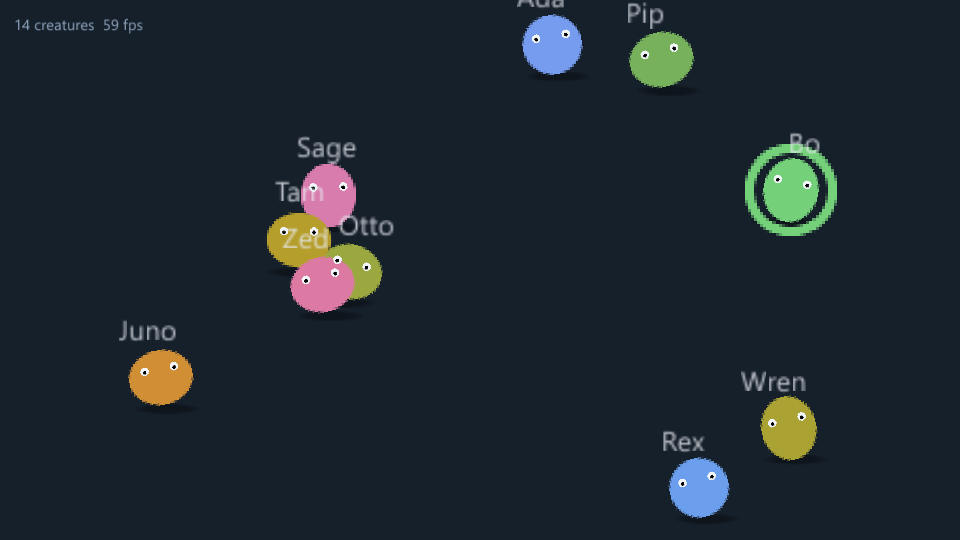
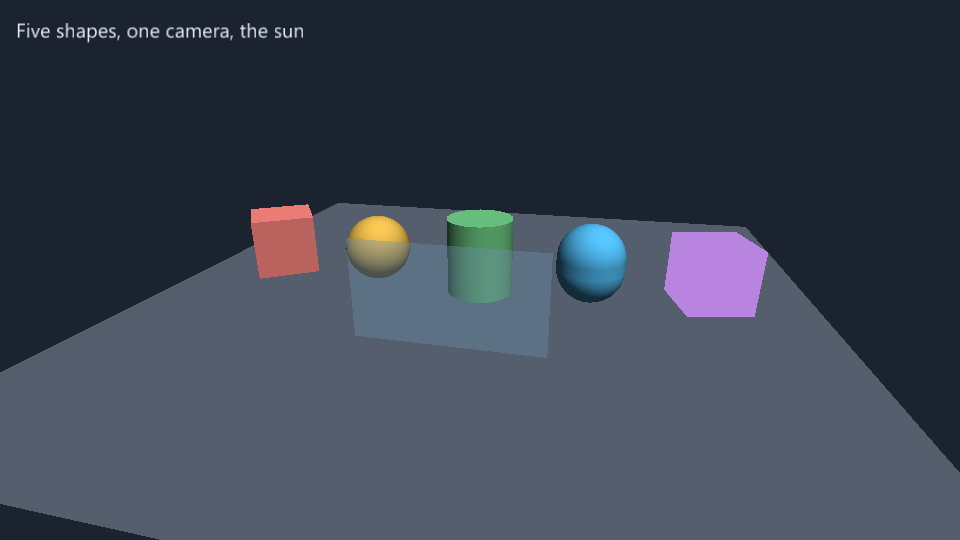
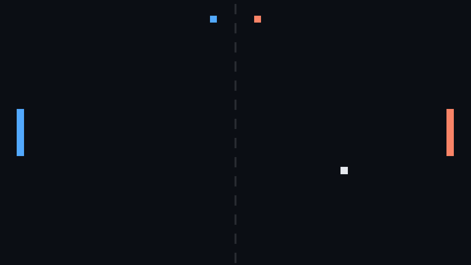
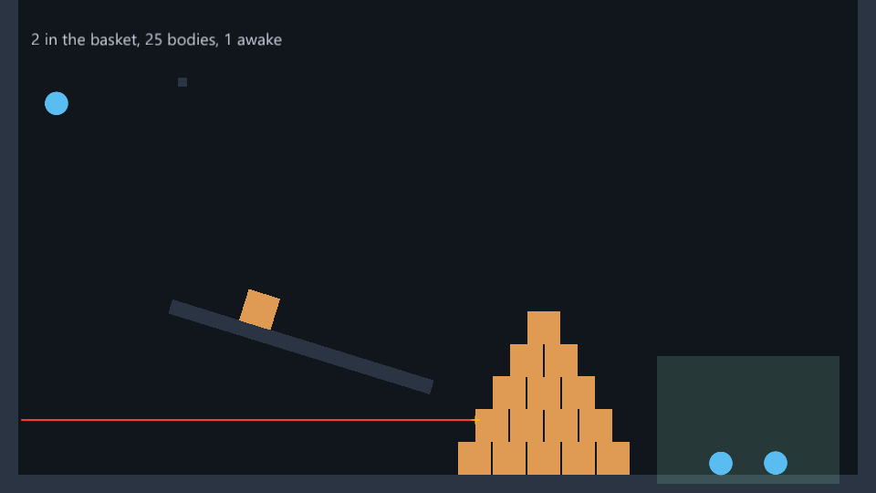

<p align="center">
  <picture>
    <source media="(prefers-color-scheme: dark)" srcset=".github/images/fluxion-logo-white.png">
    
  </picture>
</p>

<h1 align="center">Fluxion Engine</h1>

<p align="center">
  <strong>A window, a world, and the loop between them.</strong><br>
  A game engine for Zig 0.16: an ECS in the middle, a 2D renderer, an interface layer, physics, and scenes kept as JSON or CBOR.
</p>

<p align="center">
  
  
  
  
  
</p>

<p align="center">
  <a href="#-the-frame">The frame</a> ·
  <a href="#-the-2d-layer">The 2D layer</a> ·
  <a href="#-physics">Physics</a> ·
  <a href="#-scenes">Scenes</a> ·
  <a href="#-install">Install</a> ·
  <a href="#-examples">Examples</a> ·
  <a href="#-what-comes-next">What comes next</a>
</p>



| Module | What it is |
| --- | --- |
| `App` | The frame: what it owns, and the order it does things in. |
| `schedule` | When a game's systems run. |
| `components` | What the renderer knows how to read. |
| `assets` | What the GPU is holding, and the handles that name it. |
| `Input` | What the keyboard, the mouse and the controllers did, and the game's actions they set off. |
| `Time` | How long the last frame took, and the fixed step. |
| `color` | A colour, and the three ways to write one down. |
| `Window` | The window and the event queue. |
| `render.sprite` | The 2D layer, in one instanced draw per texture. |
| `render.view` | What the camera sees, and where the pointer is in the world. |
| `Interface` | The interface layer: fed from `Input`, laid out by `.ui` systems, drawn on top. |
| `text.Atlas` | Every glyph the game has drawn, in one texture. |
| `hierarchy` | Where a thing really is, once its parent has had its say. |
| `scene` | A world written down and read back, as JSON or as CBOR. |
| `Bodies` | Which body is which entity's: the physics world kept in step with the components. |
| `Bodies3D` | The same for the 3D world's bodies, areas and colliders. |
| `Clipboard` | Text copied and pasted: the system's, or the program's own with no window. |
| `dialog` | The system's file and folder dialogs: what `app.openFileDialog` asks for, and the answer `app.input` holds for a frame. |
| `Commands` | Spawns, despawns, adds and removes that wait for the system asking for them to return. |
| `States` | A game's own states, each an enum with one value at a time, and the systems that run in them. |
| `Project` | Where a game's files are: `res://` paths from the project's root, the UUIDs in the `.uid` files beside them, the player's own under `user://`, and `project.fluxion`, whose renderer chooses the backend. |
| `ConfigFile` | Settings a game keeps for itself, in sections of keys: the player's volume in `user://settings.cfg`. |
| `Image` | A picture in memory, a pixel at a time: captured from the frame, read or written as a PNG or a JPEG, made a texture. |
| `DebugViews` | What the engine draws into `app.debug` by itself: colliders, bodies, transforms, sprites, cameras, stats. |
| `attr` | What a component's field means, for an inspector to show it by: a range, an angle, a unit, layers, several lines, a value behind a getter and a setter. |

```zig
const fx = @import("fluxion_engine");

pub fn main(init: std.process.Init) !void {
    const app = try fx.App.create(init.gpa, .{ .title = "game", .io = init.io });
    defer app.destroy();

    try app.addSystem(.startup, "spawn", spawn);
    try app.addSystem(.fixed, "move", move);
    try app.run();
}

fn spawn(app: *fx.App) !void {
    _ = try app.world.spawnWith(.{
        fx.Transform2D.at(320, 180),
        fx.Sprite.solid(.hex(0x3AA0FF), 48, 48),
    });
}

fn move(app: *fx.App) !void {
    var it = try fx.Query(.{fx.Transform2D}).over(&app.world);
    while (it.next()) |chunk| {
        for (chunk.slice(fx.Transform2D)) |*place| {
            place.x += app.input.axisOf(.keys(.a, .d)) * 200 * app.time.delta;
        }
    }
}
```

**A scene is a world, and a node is an entity.** A game goes: open a window,
put things in a scene, give them behaviour, draw - and the thing in the
middle is an ECS rather than a tree of objects with virtual methods on
them. Everything of one shape lives in one table, so a system is a loop over
plain slices with no branch in it asking what this one is. That is
[Fluxion ECS](https://github.com/kisstp2006/fluxion-ecs)' doing, not this
package's; what this package adds is the frame around it.

## 🥞 Three layers, one target

3D first with a depth test, then 2D blended with none, then the interface on
top of both, each its own render pass into the same surface. The first pass
clears and the rest load what the one before them left, which is the whole of
what layering costs - no extra textures, no compositing pass. What
`app.debug` draws goes over all three, last.

The 3D layer is drawn through the current `Camera3D`, when there is one, and
clears the frame; with none, the 2D layer clears it as it always has. Its
light is added up in a texture of its own first - brighter than white where
it is - and turned into the frame's picture by a few passes over the whole of
it: glow, tone, and smoothing where the project asks for it. See
[The 3D layer](#-the-3d-layer).

A frame something reads - a shader of a material's that reads what is drawn
under it - or a game stretched to its window is drawn into a texture of its
own instead, copied where it is read, and put on the window last: see
[Shaders and materials](#-shaders-and-materials) and
[Made at one size](#-made-at-one-size). Every other frame is drawn straight
on the window, as before.

## 🔁 The frame

Seven stages, and the list is the frame in order:

| Stage | When, and what belongs there |
| --- | --- |
| `startup` | Once, before the first frame. Spawn the world. |
| `input` | After the events are in. Turn keys into intent. |
| `fixed` | Zero or more times, at a constant delta, each followed by the physics step. Forces and steering. |
| `update` | Once, at whatever the frame took. Everything else. |
| `late` | After `update`, before anything is drawn. Cameras follow here. |
| `ui` | Last before drawing, inside the interface's frame: declare it into `app.ui`. |
| `shutdown` | Once, after the last frame. |

A system is `fn (*App) anyerror!void` - a plain function, not a closure and
not a method on a node. The state it works on is in the world it is handed, so
the function needs nothing of its own.

**The engine's own work goes between the stages**, in one list that is the
frame in order: `src/app/frame_steps.zig`. The scripts' `input` before the
`input` stage, the timers, tweens and animations before `update`, the scene
change, the sound and the particles after `late`, then the drawing. **What
the engine says is heard at the end of the pass that said it** - a timer's
`timeout` before the scripts' `update` - as a system's emits are heard when
the system returns.

**`late` earns its place**: a camera that follows a player has to run after
the player has moved, and putting both in `update` makes that an accident of
registration order.

**The fixed stage runs as many times as the frame was worth**, and a frame
too long to catch up with is dropped rather than chased - so a stall shows up
as the world running slow for a moment instead of as a loop that never
finishes.

**A key pressed is one jump, whatever the frame rate.** On a 144 Hz screen
most frames run no fixed step at all, and on a slow machine one frame runs
two - so a `.fixed` system asking `justPressed` is answered from edges kept
since the last *step*, not since the top of the frame. Each press reaches
exactly one step, and a press made while the world is paused reaches none.
A controller's buttons work the same way.

**Every system is timed**, under the name it was added with.
`app.schedule.systemsIn(.update)` gives each one's `time_last_frame` - a
`.fixed` system's steps added up - and `{f}` prints them all:

```zig
std.debug.print("{f}", .{app.schedule});
// fixed     move ball                21.4us
```

## 🧾 Commands

```zig
fn hits(app: *fx.App) !void {
    var it = try fx.Query(.{ Bullet, fx.Transform2D }).over(&app.world);
    while (it.next()) |chunk| {
        for (chunk.entities, chunk.slice(fx.Transform2D)) |bullet, place| {
            if (!struck(app, place)) continue;
            try app.commands.despawn(bullet);                    // when this system returns
            const spark = try app.commands.spawn(.{ place, Spark{} });
            _ = try app.commands.spawn(.{ fx.Transform2D.at(0, -8), fx.Parent.of(spark), Glow{} });
        }
    }
}
```

- **A despawn, an `add` or a `remove` moves rows**, and a query is a walk
  over rows: done in the middle of one, it skips entities or visits them
  twice. `app.commands` keeps them instead, and the engine does them all, in
  the order they were asked for, when the system returns - so the next
  system sees them, and a system that failed leaves none of its own behind.
- **`spawn` hands back an entity that is alive at once** with nothing on it,
  and its components arrive with the rest: it can be named, hung from and
  kept in a component straight away.
- **A command for an entity that has died since is passed over**: two
  bullets despawning the enemy they both hit is not a mistake.
- **A parallel `Query.each` can ask too**, from every worker at once -
  `despawn`, `add` and `remove`; `spawn` only from the system's own thread.
- **`app.commands.apply()` does it all now**, for a system that needs what it
  asked for before it returns - a body for what it spawned, to join it to
  another - and is not inside a query when it asks.

## 🚦 States

```zig
const Mode = enum { menu, playing, paused, game_over };

try app.addState(Mode.menu);                                  // its first value otherwise
try app.addSystemIn(.update, Mode.playing, "move", move);     // only while playing
try app.onEnter(Mode.paused, "pause menu", showPauseMenu);
try app.onExit(Mode.paused, "hide pause menu", hidePauseMenu);
try app.addSystemIf(.update, bossAwake, "boss", boss);        // a condition of the game's own

if (app.input.justPressed(.escape)) try app.setState(Mode.paused);
if (app.state(Mode) == .game_over) showScore(app);
```

- **A state is an enum** with one value at a time, and a game has as many as
  it likes, each changed apart: a `Mode` and a `Weather`.
- **A change waits for the top of the next frame.** Every system of this
  frame sees the same value, whichever of them asked; then what leaves the
  old value runs, the value changes, and what enters the new one runs,
  before the frame's first stage. The last asked for in a frame wins, asking
  for the value it has does nothing, and a change asked for while entering
  waits for the frame after. The first value is entered after `.startup`.
- **A system in a state, or under a condition, is skipped rather than
  removed**: it keeps its place in its stage, and its time is its own.
- **Code that does not know it is being gated can be.**
  `app.addSystemsIn(value, register)` puts every system and hook `register`
  adds under that value too, on top of their own conditions. That is how an
  editor runs a game only in Play, with `time.scale` holding the world still
  and `time.stepOnce()` moving it on by one fixed step:

  ```zig
  const Play = enum { editing, playing, paused };
  try app.addSystemsIn(Play.playing, game.addSystems);

  try app.setState(Play.paused);   // editing and paused: the game's systems are out
  app.time.scale = 0;              // and the world holds still

  try app.setState(Play.playing);  // Step: one frame of the game,
  app.time.stepOnce();             // one fixed step of the world,
  // and back to Play.paused from the frame it ran in
  ```

## ⏸️ Pause

```zig
app.setPaused(true);                                           // the game waits
try app.world.add(pause_menu, fx.Processing{ .mode = .when_paused });
try app.addSystemAlways(.input, "pause key", togglePause);     // runs paused or not
try app.addSystemWhenPaused(.ui, "pause screen", drawPauseScreen);

if (app.isPaused()) ...
if (app.isProcessing(door)) ...
```

- **Paused, only what asked to run runs.** Everything else waits where it
  is: its script's `fixed` and `update`, its timers, its `await wait(...)`,
  its animation, its buttons and the pointer over it, and the game's
  systems. The physics stops for everything - there is one physics.
- **What an entity does is a `Processing`**, or the nearest one above it:
  `.pausable` - what a root with none is - `.when_paused`, `.always`, or
  `.disabled`, which never runs. So a pause menu says `.when_paused` once,
  at its top, and every button in it answers while the game waits.
- **A system runs while the game runs**, unless it was added with
  `addSystemAlways` - the key that pauses and unpauses - or
  `addSystemWhenPaused`. `.startup`, `.shutdown` and the systems run on a
  change of state run either way.
- **Time goes on.** A paused game still ticks, so a pause menu can fade in
  and a `.when_paused` timer counts; `time.scale` at nought is the other
  thing, a world held still, which is what an editor does to the scene it
  edits.
- **Worked out once a part of the frame**, as it is asked: see
  `inherited.zig`. A system that changes a `Processing` is heard from the
  next part - the next fixed step, the update, the drawing - on.
- **Hiding is the same**: `app.setVisible(entity, false)` hides an entity
  and what hangs from it through its `Appearance` - given one when it has
  none - and `app.isVisibleInTree(entity)` says whether anything above hides
  it; a script's `self.entity.setVisible(false)` too.

## 📨 Events

```zig
const Damage = struct { to: fx.Entity, amount: f32 };

fn hits(app: *fx.App) !void {
    // ... inside a query, as often as it likes:
    try app.send(Damage{ .to = enemy, .amount = 5 });
}

fn hurt(app: *fx.App) !void {
    const Place = struct { var damage: fx.EventReader(Damage) = .{} };
    var it = Place.damage.read(app.events(Damage));
    while (it.next()) |d| {
        if (app.world.get(d.to, Health)) |health| health.hp -= d.amount;
    }
}
```

- **An event is a value of any type**, and whoever reads that type hears it:
  the sender names no receiver and the reader no sender.
- **Sending only appends**, so a system can send from inside its own query's
  loop. Only from its own thread, though: a parallel `Query.each` worker
  cannot send.
- **An event lives two frames**, the one it was sent in and the next. A
  reader that runs before the sender still sees it once, a frame later. A
  reader that does not read for two frames misses what went by.
- **A reader is a place, not a queue.** An `fx.EventReader(T)` is a count of
  what it has read, kept wherever the system keeps its state. Two readers
  each see every event, once each.

## 📡 Signals

```zig
pub const Health = extern struct {
    hp: f32 = 100,
    pub const signals = .{ .died = struct {}, .hit = struct { damage: f32, by: fx.Entity } };
};

try app.addMethod("_on_player_hit", onPlayerHit);
fn onPlayerHit(app: *fx.App, self: fx.Entity, damage: f32, by: fx.Entity) !void { ... }
fn shake(app: *fx.App, args: struct { damage: f32, by: fx.Entity }) !void { ... }

const hit = app.signal(player, Health, .hit);                        // the player's hit
try hit.connect(.method(hud, "_on_player_hit"), .{});                // a method of hud's, by name
try hit.connectFn(shake, .{ .flags = .{ .one_shot = true } });       // a lambda
try app.emit(player, Health, .hit, .{ .damage = 5, .by = sword });   // checked as it is compiled
```

- **A component declares what it can say** as `pub const signals`: each
  signal's name, and the struct of its arguments. An entity has the signals
  of all its components. When two of them declare the same name, the signal
  is written `Health.hit`.
- **The engine declares its own**: an `Area2D` says what came into it and
  what left. See [Areas](#-areas-what-is-in-a-place).
- **A connection is to one component's signal.** If a component that
  declares the same name is added later - a `Shield` that also has `hit` -
  the connection is only written differently, as `Health.hit`, and still
  hears only `Health`.
- **A connection is data, kept beside the world** as names and UUIDs are,
  never in a component. `app.connectionsFrom`, `app.connectionsTo` and
  `signal.connections` list them, and `app.connectionCount` counts them.
- **An emit is heard when the emitting system returns.** The calls run at the
  same sync point as `app.commands`, in the order the connections were
  made, and never under the emitting system's query. **No handler runs at
  the emit itself.**
  - The arguments are copied as the emit happens, text included, so a
    handler reads what was said.
  - What a handler emits is heard in the same round.
  - Ten thousand calls in one round is taken as a loop: it is stopped and
    returns `error.TooManyCalls`.
- **A `.deferred` connection is heard at the end of the frame**, after
  `.late`.
- **The rest of the flags**:
  - `.persist`: saved with the scene;
  - `.one_shot`: gone as it is emitted;
  - `.reference_counted`: a second connect counts up, and each disconnect
    counts down;
  - `.append_source`: the emitting entity is handed after the emitted
    arguments and before the binds.

  `unbinds` is how many of the emitted arguments, from the last, the method
  is not handed, and `binds` are handed to it after the rest. An `fx.Bind`
  is a bool, an integer, a float, text, a `Vec2`, a colour or an entity.
- **A method is found by name when it is called, not when it is connected.**
  The engine looks first among the methods the target's components list in
  `reflect_methods`, then among those the game gave `app.addMethod`. A
  connect checks neither, and that is what lets a tool connect to methods it
  cannot see.
  - A failed call is logged, counted in `app.signals.failures`, and the other
    connections are still heard. A call fails when the method is missing,
    the arguments are wrong, or the method returns an error.
  - Until scripts have methods of their own, those two lists are where
    methods come from. `app.methodsOf(entity, &buffer)` lists both, with what
    each method takes.
- **Death undoes connections.** A call to an entity that has died since the
  emit is not made. The connections from and to the dead go at the end of
  the frame.
- **A Zig function is never saved**: `connectFn` with `.persist` returns
  `error.NotPersistable`.
- **By name, for code that was not compiled against the game** - an editor, a
  console, a scene:
  - `app.signalNamed(entity, "hit")`, `app.emitNamed`, `app.hasSignal`;
  - `app.signalsOf(entity, &buffer)` and `app.signalsOfComponent("Health", &buffer)`,
    each signal with its arguments' names and types;
  - `app.connectNamed` and `app.disconnectNamed`, which keep a connection
    whether or not any component declares its signal;
  - `app.hasMethod` and `app.callMethodOn`.
- **An editor turns them off.** With `app.signals.dispatch = false`, every
  connection is kept, saved and listed, and none is called.
  `app.setBlockSignals(entity, true)` silences one entity.

A scene keeps the connections made with `.persist`, by UUID, in a list of
their own:

```json
"connections": [
  { "from": "0b8e3c1a-5f2d-4c6e-9a7b-1d2e3f4a5b6c", "signal": "hit",
    "to": "5c2d7e9f-0a1b-4c3d-8e5f-6a7b8c9d0e1f", "method": "_on_player_hit" },
  { "from": "0b8e3c1a-5f2d-4c6e-9a7b-1d2e3f4a5b6c", "signal": "died",
    "to": "5c2d7e9f-0a1b-4c3d-8e5f-6a7b8c9d0e1f", "method": "_game_over",
    "flags": ["deferred", "one_shot"], "binds": [3, "easy", { "vec2": [1.0, 2.0] }] }
]
```

`signal` is the bare name, or `Component.name` when the bare one is
ambiguous on that entity, and reading takes either.

A connection whose signal or method this build does not know is kept, and
written back as it was read; `loaded.connections_unknown` counts them. An
editor without the game's components must not lose the game's connections.
- **Such a connection is never heard**, even after its component arrives.
  Connecting the same thing again makes it a known one, in the same place.
- **A bare name that two of the entity's components now declare** is kept
  the same way, and heard by neither.
- **One whose `from` or `to` is nowhere** is passed over, and counted in
  `loaded.connections_skipped`.

## 🕹️ Actions

```zig
if (app.input.actionJustPressed("jump")) jump();
const walk = app.input.actionVector("move_left", "move_right", "move_up", "move_down");
var words: [32]u8 = undefined;
const key = app.input.describeAction(&words, "interact");   // "E", or "Pad X" on a controller

try app.input.actions.bind(gpa, "jump", .keyOf(.j));         // the player's own keys
try app.saveInputMap("user://input.json");                   // kept, and read back with loadInputMap
```

```json
"input": { "actions": [
  { "name": "jump", "bindings": [ { "type": "key", "key": "space" }, { "type": "pad_button", "button": "a" } ] },
  { "name": "move_left", "deadzone": 0.2, "bindings": [ { "type": "key", "key": "a" }, { "type": "pad_axis", "axis": "left_x", "direction": "negative" } ] }
] }
```

- **A game asks for what the player means, not for a key.** An action is a
  name and the inputs that set it off - keys, mouse buttons, a controller's
  buttons, a way a stick or a trigger is pushed - in the project file's
  `input` section, which the editor's Input Map tab writes. A key is bound
  where it sits on a US layout, which is what WASD wants, or with
  `"physical": false` by the letter the player's layout puts on it; a
  controller's input on any controller, or with `"pad"` on one.
- **An action is down while any of its inputs is.** Its edges are its own:
  a second key pressed while the first is held is no new press, and letting
  go of one of two is no release. A tap inside one frame is a press and a
  release, and a `.fixed` system hears each exactly once, as it does a key's.
- **How far, as well as whether**: `actionStrength` is one for a key, and
  for a stick or a trigger how far past the action's dead zone it is, from
  nought to one. `actionAxis` makes two actions an axis, and `actionVector`
  four of them a direction no longer than one, up negative.
- **Held from code**: `pressAction("fire", 1)` holds an action down, with its
  edge, until `releaseAction` - what a button on a touch screen does.
- **Six are always there**: `ui_accept`, `ui_cancel`, `ui_left`,
  `ui_right`, `ui_up` and `ui_down`, what the interface moves by. A
  project's action of the same name takes the place of one.
- **The player can change them.** `app.input.actions` is where the game's
  actions stand as it runs - `bind`, `unbind`, `unbindAll`, `setDeadzone`,
  `add`, `rename` - and `saveInputMap` keeps them in a file of the player's
  own. `loadInputMap` takes what it says of the actions the game still has,
  and passes over the rest, so a save from before an update still reads.
- **Named as the player last used them**: `describeAction` says the input on
  the keyboard or the controller, whichever was pressed last, for "Press E to
  open".
- **From a script**: `app.actionDown`, `actionJustPressed`,
  `actionJustReleased`, `actionStrength`, `actionAxis`, `actionVector`,
  `pressAction`, `releaseAction`, `describeAction`, `saveInputMap` and
  `loadInputMap`. Inside the quotes of any of them, the language service
  `app.scriptSetup()` sets up offers the project's actions by name, each
  with its inputs - so an editor completes `app.actionDown("ju` to `jump`.
- **A program whose keys are its own** - an editor - leaves
  `Options.project_input` off, and moves round its interface with the six
  alone.

## 🎮 Controllers and the pointer

```zig
const pad = app.input.anyPad();            // or app.input.pad(1) for player two
const walk = pad.stick(.left);             // a Vec2, dead zone already out
if (pad.justPressed(.a)) jump();

try app.setCursor(.locked);                // a first-person camera, or a drag
const turn = app.input.pointer.dx;
```

- **Controllers are read, not heard.** A stick is a position rather than a
  thing that happened, so the platform polls every controller once a frame
  and "pressed this frame" is this frame's buttons against the last. XInput
  on Windows, evdev on Linux, Android's own, and SDL's mapping format for the
  pad nobody recognises - `app.addGamepadMappings(text)`.
- **`anyPad()` is every controller as one**, for a game with one player who
  should be able to pick up whichever is nearest; `pad(slot)` is one of them,
  and a slot is the controller's for as long as it stays plugged in, which
  makes slots player numbers.
- **The dead zone is round.** On the stick's distance from the middle rather
  than on each axis, so a nearly diagonal push does not snap to a straight
  line, and rescaled so the first movement past it is small rather than a
  jump. `Input.stick_deadzone` is a fifth by default.
- **`setCursor` takes five modes**: `.normal`, `.hidden` for a game that
  draws its own pointer, `.confined` to hold it inside the window,
  `.confined_hidden` for both at once, and `.locked` to take it away and
  report movement with no edge to stop at, unaccelerated where the system
  allows. While locked, `input.pointer` holds still where it was and only
  `dx` and `dy` move; `.confined_hidden` keeps saying where it is.
- **The pointer's shape is the one the interface asks for** - the hand over
  a button, the caret over text, what a control's `MouseCursor` names - and
  the game's default everywhere else: the arrow, until
  `app.setDefaultCursorShape(.crosshair)` says otherwise.
  `app.currentCursorShape()` is the one it took in the last frame.
- **Any shape can be a picture of the game's own**, with the pixel in it
  that points:

  ```zig
  try app.setCustomCursor(try app.assets.loadTexture("res://ui/sword.png", .{}), .arrow, .init(2, 2));
  try app.setCustomCursor(try app.assets.loadTexture("res://ui/hand.png", .{}), .pointing_hand, .init(8, 1));
  try app.setCustomCursor(.none, .pointing_hand, .init(0, 0)); // the system's hand again
  ```

  From Flux, `app.setCustomCursor("res://ui/sword.png")` for the arrow, or
  with a shape and a point: `app.setCustomCursor("res://ui/hand.png",
  "pointing_hand", vec2(8, 1))`. `setCustomCursorFile(path, ...)` reads a
  picture without making a texture of it, and `setCustomCursorPixels` takes
  RGBA in memory. A side is 256 pixels at most (`error.CursorTooLarge`),
  and a point outside the picture is moved to its edge. The project's
  `display.mouse_cursor` and `mouse_cursor_hotspot` give the arrow its
  picture from the start. A browser quietly keeps its arrow past 128 by 128,
  so a cursor a page will see should be small.
- **Where the pointer is, and how fast**: `input.pointer.x/y` in the
  framebuffer's pixels - `app.pointerOnScreen()` from a script - against
  `app.screenSize()`, the game area's size in those pixels, so a place on the
  screen reads the same at every resolution:
  `app.pointerOnScreen().x / app.screenSize().x` is 0 at the left and 1 at
  the right. `app.pointerInWorld()` is through the camera,
  `app.pointerIn(entity)` in one entity's own space, and
  `input.pointer.velocity` in pixels a second, worked out over at least a
  tenth of a second and nought once it has been still for three. A game
  puts it somewhere itself with `app.warpPointer(x, y)`, in the same pixels
  as `pointerOnScreen`, a stretched frame's too.
- **A script asks as Zig does**: `app.keyDown(.w)`, `keyJustPressed`,
  `keyJustReleased`; `app.mouseButtonDown(.left)` and its two edges; and a
  controller by its slot, or any for none - `app.padButtonDown(.a)`,
  `app.padButtonDown(.a, 1)`, `padButtonJustPressed`, `padAxis(.left_x)`,
  `padStick(.left)`, `padConnected()`, and `connectedPads()`, the slots
  something is plugged into, a player to each.
- **A double click is the system's own**: `input.doubleClicked(.left)` for
  the press that made one, by Windows' setting or four hundred
  milliseconds within a few pixels elsewhere.
- **A held pointer is let go when the window loses the keyboard**, and taken
  back when it returns - so a player who alt-tabs away from a locked game gets
  their mouse back, and the lock is still a lock when they come back to it. A
  lock asked for while the window is in the background waits for it.

### Fingers on a touch screen

```zig
for (app.input.touches()) |finger| {
    if (finger.pressed) spark(app.screenToWorld(finger.position.x, finger.position.y));
    if (finger.down()) drag(finger.finger, finger.relative);
}
```

- **Every finger is a `Touch` of its own**, on Android and in a browser:
  `finger`, its number from the frame it touches to the frame it is lifted,
  `position` in the game area's pixels as the pointer's, `start`, `relative`
  (this frame's moving), `pressure`, and the edges `pressed` and `released`
  - a finger lifted is there one last frame with `released`, and `canceled`
  when the system took it. `input.touches()` is this frame's fingers in the
  order they touched, `touchOf(finger)` one of them, `fingersDown()` how many
  are down. From a script: `app.touchCount()`, `app.touchAt(i)`,
  `app.touchOf(finger)`, `app.fingersDown()`.
- **The first finger is the mouse as well**: the one that touches when no
  other is down moves the pointer and holds the left button until it is
  lifted, so the interface, picking and a game made for a mouse work under a
  finger. A project turns that off with `touch.mouse_from_touch`, and makes
  the left button a finger - to try a touch game with a mouse - with
  `touch.touch_from_mouse`; `app.setMouseFromTouch` and
  `app.setTouchFromMouse` as it runs.
- **`app.hasTouchscreen()`**: Android, or a screen a finger has touched.
- **Gestures, worked out once a frame from the fingers**, and heard with
  the rest of the input:
  - a `TapEvent` - a finger lifted soon and within 10 dp of where it
    touched - with `count` 2 for a double tap (the next touch within 0.3 s
    and 100 dp), 3 for a third, and on;
  - a `LongPressEvent`, once, for a finger held still half a second, which
    then makes no tap;
  - a `SwipeEvent` for a finger lifted at least 30 dp from where it touched
    while going at least 300 dp a second: `start`, `position`, `velocity`
    and `direction` (`.left`, `.right`, `.up`, `.down`);
  - for two fingers - the first two down that no touch button holds - a
    `PinchEvent` (`factor` since the last, `scale` since the second
    touched), a `PanEvent` (`relative`, how far their middle moved) and a
    `RotateEvent` (`angle` since the last, `total`), each about their
    `center`; and the same, asked rather than heard, as `app.twoFingers()`.
  - a `PinchEvent` too for the wheel turned with Ctrl, at the pointer - a
    notch up a tenth larger, `scale` going on until the wheel rests 0.3 s -
    since that is what a laptop touchpad's pinch is on Windows and in a
    browser (the wheel's own event comes as well). `touch.pinch_from_ctrl_wheel`
    turns it off, `app.setPinchFromCtrlWheel` as it runs.

  A dp is a 160th of an inch, so a gesture is the same size under a finger
  on any screen. Only a finger alone - no other down while it was, and no
  touch button holding it - taps, presses long and swipes; two fingers'
  never do. With `touch.touch_from_mouse` the left button taps, presses
  long and swipes as a finger.

  ```
  fn input(self, event: InputEvent) {
      if (event is TapEvent and event.count == 2) self.zoomIn(event.position);
      if (event is SwipeEvent and event.direction == .left) self.nextPage();
      if (event is PinchEvent) self.camera.zoom *= event.factor;
  }
  ```
- **A `TouchButton` is a control fingers press**, as many at once as there
  are fingers - the interface answers one pointer, the first finger's.
  Beside a `Control` and what draws it, it is pressed by a finger that
  touches inside, until that finger is lifted; with `passby_press`, by any
  finger on it, until it slides off. It says `pressed` and `released`, is
  `down` while held, and holds its `action` down meanwhile, as
  `pressAction` would - a game made for keys plays by touch with nothing of
  its own. `visibility = .touchscreen_only` draws it only on a touch screen.
  Worked out each frame before the actions, from where the interface laid
  it out.

## 🪟 The window

```zig
try app.setWindowTitle("Level 3");
try app.setWindowSize(1280, 720);
try app.setWindowSizeLimits(.{ .min_width = 640, .min_height = 360 });
try app.setWindowMode(.fullscreen);         // .windowed .minimized .maximized .fullscreen .exclusive_fullscreen
try app.setWindowBorderless(true);
if (app.resized) layOutAgain(app.width, app.height);
```

- **`app.resized` is true for the one frame the size changed in** - an edge
  dragged, a maximise, fullscreen - and false again the frame after. The
  engine always had to notice, because the swapchain had to be resized; now
  the systems hear about it too, instead of keeping last frame's size to
  compare with.
- **Sizes are the content area, in the units of `Options.width` and
  `height`**: pixels, on every backend there is today. `app.windowSize()` is
  the size now - what `setWindowSize` asked for, once it has arrived - for a
  settings menu to show.
- **A window is in one of five `WindowMode`s**: `windowed`, `minimized`,
  `maximized`, `fullscreen` - the screen it is on, at the resolution the
  screen has, what a game should use - and `exclusive_fullscreen`, the
  screen switched to a video mode: its own, or the one `setVideoMode` gave.
  `toggleFullscreen` goes between a window and `fullscreen`. A script says
  the same enum: `app.setWindowMode(.fullscreen)`, `app.windowMode() ==
  .windowed`.
- **A fullscreen, maximised or minimised window is made an ordinary one
  before it is sized or moved**, because none of them has a size of its own.
  `.windowed` means the window's own size even for one that was maximised
  before it was minimised, which Windows would otherwise bring back
  maximised.
- **Its frame, its place in the pile, the screen's sleep**:
  `setWindowBorderless`, `setWindowResizable`, `setWindowAlwaysOnTop` and
  `setKeepScreenOn`, each with its question - `windowBorderless()`. Where
  the system decides, as on Wayland, a phone and a page, they give
  `error.Unavailable`.
- **The screens**: `screenCount`, `windowScreen`, `primaryScreen`,
  `setWindowScreen` - the middle of it, or all of it for a window that
  fills its screen - and `centerWindow`; of each, `screenRect`,
  `screenUsableRect` (what no taskbar covers), `screenScale`,
  `screenRefreshRate`, and its `videoMode(screen, i)` up to
  `videoModeCount`, for a menu of resolutions.
- **The project says how the window opens**: `display.mode`, where -
  `initial_position`: the middle of the primary screen, of `screen`, or at
  `position` - how big when not the game's size (`window_width`,
  `window_height`), `resizable`, `borderless`, `always_on_top` and
  `keep_screen_on`. It opens hidden, is put in its place and its mode, and
  shows then, so it never flashes up somewhere else first.
- **Limits apply at once.** A window already outside new limits is brought
  inside them when they are set, and one that is maximised, minimised or
  fullscreen when it is a window again.
- **The window's own picture** is `app.setWindowIcon(&.{ big, small })`,
  straight RGBA rows in as many sizes as a game has, and the system takes
  the one it wants. An empty list puts the system's own back. Wayland has
  none - a window's picture comes from its desktop file there.
- **The close button can ask rather than close.** With
  `Options.ask_before_closing` - or the project's `application.quit_on_close`
  off - pressing it, or Alt+F4, only sets `app.close_pressed`, and
  `closeRequested()` for the frame it was pressed in; the run goes on until
  the program calls `quit`: an editor asks about work not saved first, a
  game shows its "Quit?" A game leaves it on and closes at once.
- **`Options` overrule the project, field by field**: `window_mode`,
  `initial_position`, `screen`, `position`, `resizable`, `borderless`,
  `always_on_top`, `keep_screen_on`, and the flags `--window-mode`,
  `--screen`, `--position-x` and `--position-y` overrule both - how an
  editor's Play puts the game where it was asked. Without a window -
  headless - all of this is nothing, and says so without failing. The
  project's `display.min_width` and `min_height` are the least the player
  may drag the window to.

### 🗔 Tool windows: more than one window

```zig
const tool = try app.openToolWindow(.{ .title = "Code", .width = 900, .height = 700 });
tool.draw = .{ .context = editor, .run = drawCode }; // lays out `tool.ui` each frame
// each frame, somewhere other than its own `draw`:
if (tool.close_pressed) app.closeToolWindow(tool);
```

- **A window beside the main one, with an interface of its own**: an
  editor's panel torn off, a debug view on a second monitor. Its `input` is
  fed with its own events and no other window's - a press in it is not the
  game's - and its `ui` is laid out by `draw` after the `.ui` systems, in
  the main interface's fonts, so a style's font index means the same in
  both. It has a renderer of its own; the textures its images name are its
  `interface.textures`.
- **One device draws both.** On Direct3D and Vulkan the tool window is a
  swapchain of its own; on OpenGL, a context of its own that shares the main
  one's textures, buffers and shaders, which the renderer draws in and
  presents with in turn. It does not wait for the display: one window per
  frame does.
- **Its close button asks**: `close_pressed` is set and the window stays
  until `closeToolWindow`, called anywhere but its own `draw`. The engine
  closes whatever is left when the run ends.
- **Headless it is a texture** of its size, and a test hands its `input`
  events itself - `tool.input.apply` - or `tool.take` for one the platform
  would have sent.

## 📐 Made at one size

```json
"display": { "width": 640, "height": 360, "stretch_mode": "canvas", "stretch_aspect": "keep", "stretch_scale_mode": "integer" }
```

- **`stretch_mode` fits a game made at one size to a window of any.**
  `disabled` is the window as it is: a bigger one shows more. `canvas` lays
  the world and the interface out at the project's `width` and `height` and
  draws them at the window's, scaled - text stays sharp at any size.
  `picture` draws everything at the project's size, into a picture of its
  own, and scales the picture - pixel art stays pixels, sampled as
  `rendering.default_texture_filter` says.
- **`stretch_aspect` says what the spare room is.** `keep` keeps the
  project's shape and fills the rest with bars; `expand` shows more of the
  game the long way, the project's size the least of it; `keep_width` and
  `keep_height` keep the one and show more the other way - a phone game
  held upright, a side-scroller on a wide screen.
- **`stretch_scale` draws it bigger** on top of that - two shows half as
  much, twice the size - and **`stretch_scale_mode = integer`** scales only
  by whole numbers, so every pixel of pixel art is the same size, with bars
  round what is left.
- **A game changes all four as it runs**: `setStretchMode`,
  `setStretchAspect`, `setStretchScale`, `setStretchScaleMode`, each with
  its question, a settings menu's "pixel perfect" included.
- **What the game sees is its area**: `app.game_area` - its `width` and
  `height`, what the interface is laid out in and the camera's view is
  sized by, and its `scale` - and the pointer in the area's pixels, turned
  from the window's as it comes, so `pointerInWorld` and a click on a
  control need nothing. `app.width` and `app.height` are still the window's.
- **An editor's window is its own**: `Options.stretch = .{}` is the window
  itself, whatever the project says.

## 📋 The clipboard

```zig
try app.setClipboardText(seed);                     // for the player to paste anywhere
const pasted = try app.clipboardText();             // what they copied, anywhere
const can_paste = app.hasClipboardText();           // a Paste entry that greys out
```

- **It is the system's**, through
  [Fluxion Platform](https://github.com/kisstp2006/fluxion-platform): what a
  game copies reaches every other program and what they copied reaches the
  game, as UTF-8 with `\n` between lines whatever put it there. The
  interface's Ctrl+C, Ctrl+X and Ctrl+V go through the same one.
- **What `clipboardText` gives is lent** until the next read - the
  interface's paste is one - so a game that keeps it keeps a copy. Read it
  when it is wanted rather than every frame: on X11 and Wayland a read waits
  on the program that owns the clipboard.
- **`hasClipboardText` asks without reading**, which is also the quiet way on
  Android, where every read shows the player a notice.
- **A system may refuse** with `error.Unavailable`: text that is not UTF-8,
  Wayland asked by a window without the keyboard, a page with no clipboard.
  The interface warns and carries on; a copy that failed is lost, not the
  frame.
- **Without a window - headless, in a test - the clipboard is the program's
  own**, so copying and pasting still work inside it, and a test never
  overwrites what the person running it had copied.

## 📂 File and folder dialogs

```zig
browsing = try app.openFolderDialog(.{ .title = "Where the project goes" });
picking = try app.openFileDialog(.{
    .multiple = true,
    .filters = &.{.{ .name = "Images", .extensions = &.{ "png", "jpg" } }},
});

// In any system, a frame or more later:
if (app.input.dialogAnswer(browsing)) |paths| {
    if (paths.len > 0) try useFolder(paths[0]); // none: it was cancelled
}
```

- **They are the system's own**, through
  [Fluxion Platform](https://github.com/kisstp2006/fluxion-platform): over
  the window and modal to it, with the places and the recent files the player
  already knows.
- **Asking returns at once**, with an id, and the game goes on running and
  drawing while the dialog is open. The answer is in `app.input` for every
  system of the frame it arrives in, and gone in the next;
  `app.input.dialogAnswers()` is all of that frame's.
- **A cancel is an answer too**, with no paths, so every dialog is answered
  exactly once.
- **The paths are lent** until the frame ends - they are the platform's, and
  its next pump frees them - so a game that keeps one keeps a copy. A frame
  whose system failed lets them go all the same, so a loop that carries on
  after an error never reads one that is gone.
- **One dialog at a time.** Asking while one is open is `error.Unavailable`,
  and so is a filter two systems would read differently - `"*.png"`,
  `"png;jpg"` - and a platform with no dialogs yet: X11, Wayland, Android.
  `fx.dialog.available` says whether the fluxion-platform this was built with
  has them at all.
- **Without a window, a dialog is never answered by itself.** The app still
  hands out ids, and a test answers for the person who is not there, the way
  it presses keys for them:

```zig
const id = try app.openFolderDialog(.{});
app.input.answerDialog(.{ .id = id, .paths = &.{"C:/games/meadow"} });
_ = try app.step(); // this frame's systems see it, the next frame's do not
```

## 📥 Files dropped on the window

```zig
for (app.input.dropped()) |drop| {
    for (drop.paths) |path| try bringIn(path, drop.x, drop.y); // where they were let go
}
```

- **A drop is input**, as a dialog's answer is: everything let go in one
  armful is one `Dropped`, there for every system of the frame it arrives in
  and gone in the next, its paths lent until the frame ends.
- **`x` and `y` are where it was let go**, in the pixels `input.pointer` is
  in - into the folder under it, onto the thing under it. A fluxion-platform
  from before drops said where gives the pointer's last place instead.
- **Every desktop drops files**: Windows through `WM_DROPFILES`, X11 by
  XDND with the program they come from, Wayland through the seat's data
  device, and the web from the page. A phone has nothing to drag.
- **A test drops them itself**: `app.input.dropFiles(.{ .paths = &.{"C:/Art/hero.png"}, .x = 40, .y = 60 })`.

## ⌛ Frame pacing

```zig
try app.setVsyncMode(.disabled);            // .enabled .adaptive .mailbox
app.time.max_fps = 144;                     // null is no cap
if (!app.input.focused) app.setPaused(true);
```

- **A project caps its frames with `application.max_fps`** - nought for no
  cap - and a game's `Options.max_fps` overrules it. A settings menu sets it
  with `app.setMaxFps(60)` and reads it with `maxFps()`, from a script too.
- **In the background, fewer frames**: `app.setBackgroundFps(30)`
  (`time.background_fps`) holds the frames to 30 a second while no window of
  the program - its own or a tool window - has the keyboard
  (`app.inForeground()`); nought, the default, for no other cap. A minimised
  window draws ten a second whatever these say.
- **What a counter on screen shows**: `app.fps()`, the frames of the last
  whole second (`time.frames_per_second`; `time.fps()` is the last frame's
  alone), `app.frameCount()` and `app.elapsed()`, the game's seconds since it
  began.
- **How much the scripts hold**: `app.scriptStats()` gives `bytes` (the
  objects, and their lists' and maps' storage), `objects`, `cycles`
  (collections finished), `live` (what the last one left) and `threshold`
  (where the next starts). `live` rising frame after frame is a leak;
  `bytes` rising only between collections is not.
- **Slow motion is `app.setTimeScale(0.5)`**, `timeScale()` to read it:
  every frame's time and every fixed step's is multiplied by it, and a hit
  that holds the world still for a moment is `setTimeScale(0)` and back. It
  is not a pause - what runs while paused runs slowed too.
- **`VsyncMode` is how a frame meets the refresh**: `disabled` never waits
  and may tear; `enabled` shows one a refresh and never tears; `adaptive`
  shows a late one at once, tearing that once rather than stuttering;
  `mailbox` shows the newest at each refresh, the game never waiting. The
  project's `display.vsync_mode` opens with it; a backend without one - an
  OpenGL driver with no late swap - shows it `enabled`.
- **The fixed step catches up at most `physics_2d.max_steps_per_frame`
  steps** in a frame - eight - so a long stall slows the simulation down
  rather than freezing the game to catch up with it:
  `setMaxPhysicsStepsPerFrame`, and `setPhysicsTicksPerSecond` for the rate.

- **The cap keeps a schedule**, so a late frame is caught up with and the
  average holds; after a stall longer than `time.max_delta` it starts again.
  On Windows a sleep is only as precise as the system timer - 15.6 ms unless
  something asks for better - so a cap above about 60 is right on average and
  uneven frame to frame.
- **A minimised window is not drawn**, and the loop wakes ten times a second
  instead of spinning. The fixed steps keep the simulation in real time.
- **With vsync off nothing waits for the refresh**: on `d3d11` and `d3d12`
  a frame tears onto the screen where the system allows tearing, rather than
  the compositor showing only the newest at each refresh, and Vulkan
  presents `immediate`, or `mailbox` where that is all there is.

## ⏲️ Timers

```zig
const door = try app.world.spawnWith(.{ fx.Transform2D.at(0, 0), fx.Timer{ .wait_time = 2, .one_shot = true, .autostart = true } });
try app.signal(door, fx.Timer, .timeout).connect(.method(door, "_on_timer_timeout"), .{});

app.world.get(door, fx.Timer).?.start(5);      // five seconds from now; start(-1) is wait_time
const fuse = try app.createTimer(1.5);         // one to connect to and forget
try app.signal(fuse, fx.Timer, .timeout).connectFn(explode, .{});
```

- **A timer is a component.**
  - `wait_time`, `one_shot`, `autostart`, `paused` and `time_left`.
  - `start`, `stop` and `isStopped`.
  - The `timeout` signal, and it is saved with a scene.
- **Counted by the engine**: once a frame before the `.update` systems, or
  with `clock = .fixed` once a fixed step before `.fixed`, so a wait the
  game's simulation depends on is the same length on every machine.
  - What it says is heard before that stage's systems run.
  - A repeating timer keeps what a frame ran past, so it keeps its rhythm.
- **Counted while its entity runs.** A paused game's timers wait - but for
  those whose `Processing` runs while it is paused - and a frame with no
  time counts nothing: an editor, which gives its world no time, starts none
  in the scene it edits. A timer read back from a scene saved while it ran
  goes on from where it was.
- **`app.createTimer(seconds)`** makes a one-shot timer on an entity of its
  own, which goes once it has said `timeout`.

## 📅 Dates, times and the player's culture

```zig
const now = app.now();                                  // an Instant: this moment, everywhere
const here = app.localNow();                            // a DateTime: the player's calendar and clock
const culture = try app.culture();                      // how the player writes them
var buf: [128]u8 = undefined;
here.writeStyle(culture, .long, .short, &buf)           // "2026. szeptember 25. 19:42", "September 25, 2026 at 7:42 PM"
here.write(culture, "EEEE, MMMM d.", &buf)              // "péntek, szeptember 25."
here.addDays(1).startOfDay()                            // tomorrow at midnight, by the clock
here.plus(.ofHours(24))                                 // exactly a day on
fx.datetime.relative(culture, then, now, .local, .wide, &buf)  // "5 perccel ezelőtt", "yesterday"
try fx.DateTime.parseIso("2026-09-25T19:42:05+02:00", .local)
try app.setLocale("de-DE");                             // from now on, as Germany writes them
```

- **A moment and a calendar's fields are two things.** An `Instant` is a
  point in time, in microseconds since 1970 UTC. A `DateTime` is what a
  calendar and a clock show for it in a `Zone`: UTC, the system's own with
  its summer time, or a fixed offset. `addDays`, `addMonths` and `addYears`
  keep the hour on the clock - the 31st of January and a month is the last
  of February - and `plus` adds exactly. A `Duration` is a span, written as
  a clock (`1:05:03`) or in the culture's words (`1 hour, 5 minutes`).
- **Counted in the Gregorian calendar**, back and forward as far as anyone
  needs: weekdays, the day of the year, ISO weeks, the start of a day, a
  week, a month or a year. ISO 8601 is written and read, with offsets and
  fractions of a second.
- **Written as the player's culture writes them**, which the system says -
  see `platform.culture`, the system's own ICU. The names of months and
  days, the four date and time styles, a pattern for any fields
  (`writeSkeleton(culture, "MMMMd")`), twelve hours or twenty-four, the first
  day of the week, how long ago in words, and plural forms. Patterns are
  CLDR's letters; see `DateTime.write`. Without ICU it is English.
- **The game chooses** with the project's `internationalization.locale` - a
  tag such as `hu-HU`, or empty for the player's own - and `app.setLocale`
  as it runs.
- **Clocks of the game's own**, without an entity: a night from midnight to
  six in six minutes, a farm's days.

  ```zig
  const night = try app.newClock(.{ .start = fx.DateTime.at(.utc, 2026, 1, 1, 0, 0, 0), .rate = 60 });
  app.clockTime(night)                // a minute of it every real second
  app.clockPassed(night).hours        // what turned over in the last frame
  app.pauseClock(night);
  ```

  A clock keeps the time it is given, without a zone, and runs on the
  frame's time: `time.scale` slows it and a pause stands it. Given an
  `owner`, it runs as that entity does and goes with it.

## 🔊 Sound

```zig
const door = try app.loadAudio("res://sounds/door.ogg");       // .wav, .ogg or .mp3
const creak = try app.world.spawnWith(.{ fx.Transform2D.at(400, 300), fx.AudioPlayer{ .clip = door }, fx.AudioSpatial2D{} });
app.world.get(creak, fx.AudioPlayer).?.play(0);                 // from the start, at the next audio pass
try app.signal(creak, fx.AudioPlayer, .finished).connect(.method(creak, "_on_creak_finished"), .{});
_ = app.setBusVolumeDb("Music", app.linearToDb(0.5));            // a settings screen's slider
```

- **A sound is a file**: `loadAudio` reads a WAV, an Ogg Vorbis or an MP3
  once and gives an `AudioClipHandle`, which a component holds and a scene
  writes as its path. Vorbis and MP3 are decoded as they play, so a long piece
  of music is never all samples at once; an MP3's encoder silence is left
  out, so one that loops goes round without a gap. `audioLength(clip)` says
  how long one is.
- **An `AudioPlayer` plays one**, and is data: `clip`, `volume_db`, `pitch`
  (faster and higher above 1, as a record sped up - cheap enough for a
  sound a little different each time), `bus`, `autoplay`, `loop` and
  `paused`. `play(from)`, `stop()` and `seek(to)` ask the engine's audio
  pass, once a frame after the game's `.late` systems; `playing` and
  `position` say what it found; `finished` is said when a sound that does not
  loop comes to its end.
- **It plays while its entity runs.** A paused game's sounds are held where
  they are - but for those whose `Processing` runs while it is paused, a pause
  menu's music - and a frame with no time starts none: an editor never plays
  the scene it edits. A player read back from a save made while it played
  goes on from where it was.
- **In the world**, with an `AudioSpatial2D` beside it, a player is quieter
  the farther it is from the listener, to silence at `max_distance`, and
  panned to its side. The listener is the `AudioListener2D` that is
  `current`, or the middle of what the camera shows.
- **Buses** are the project file's `audio.buses`: each with its volume in
  decibels, muted or not, and the bus it sends into; `Master` is always there
  and everything ends in it. `setBusVolumeDb`, `busVolumeDb`, `setBusMute`,
  `isBusMuted`, and `linearToDb` and `dbToLinear` for a slider - from Zig and
  from Flux.
- **On the machine's sound card** - WASAPI on Windows, ALSA on Linux,
  OpenSL ES on Android - through
  [Fluxion Audio](https://github.com/kisstp2006/fluxion-audio). With none,
  and always headless, each frame's sound is mixed and heard nowhere, so
  `finished` and `position` are the same everywhere and a test can listen to
  how loud a frame was; `Options.audio = .silent` asks for that on purpose.

## 🎞️ Tweens and animations

```zig
// A tween: steps one after another, or together once tweenParallel says so.
const fade = try app.tween(panel);
try app.tweenProperty(fade, panel, "Appearance.modulate.a", .{ .number = 0 }, 0.3);
try app.tweenEase(fade, .quad_out);
try app.tweenParallel(fade, true);
try app.tweenProperty(fade, panel, "Transform2D.x,y", .{ .vec2 = .{ 0, -40 } }, 0.3);
try app.signal(fade, fx.Tween, .finished).connectFn(closed, .{});

// Keyed animations, made in the editor's Animation panel.
const menu = try app.loadAnimations("res://ui/menu.anim");
const ui = try app.world.spawnWith(.{ fx.Transform2D.at(0, 0), fx.AnimationPlayer{ .library = menu } });
app.world.get(ui, fx.AnimationPlayer).?.play("open", -1);

// Pictures in turn, in the Sprite beside it.
const hero = try app.loadSpriteFrames("res://art/hero.frames");
const walker = try app.world.spawnWith(.{ fx.Transform2D.at(0, 0), fx.Sprite{}, fx.AnimatedSprite2D.autoplaying(hero, "walk") });
app.world.get(walker, fx.AnimatedSprite2D).?.play("run", 1, false);
```

- **A property is a path**: a component's scene name and a field in it -
  `Transform2D.rotation`, `Appearance.modulate`, `Control.offset_left` - or two
  number fields with a comma between, `Transform2D.x,y`, moved as one pair.
  `fx.Property.compile` finds it once, and `read` and `write` go straight to
  the component's bytes. A number, an integer, a flag, a vector, a colour and
  a name kept in a `[N]u8` - `AnimatedSprite2D.animation` - can be moved:
  numbers and vectors and colours slide, flags and names jump. In a `.anim`
  file a name is a string, and a string that reads as a colour, `"#ff8800"`,
  is a colour.
- **A tween is an entity** with a `Tween` component, made with
  `app.tween(owner)` under its owner, and its steps are the app's:
  `tweenProperty(tween, entity, path, to, seconds)` from wherever the field
  is when the step starts, `tweenInterval` a wait, `tweenParallel(tween,
  true)` the steps after it each with the one before, and `tweenEase` the
  curve of the step before - any of `fx.math.ease`'s thirty-one. `speed`,
  `loops` - nought is for ever - and `paused` are its own; it says `finished` and goes when it is done, and
  despawning it is killing it. It runs while its entity runs, so a pause
  holds it, and Flux calls all of it by the same names.
- **The step just added can be shaped**: `tweenFrom(tween, value)` starts it
  there rather than where its field is, `tweenRelative(tween)` moves it by
  its value - forty on from wherever it is - and `tweenDelay(tween, seconds)`
  waits before it starts. A script's function is a step too:
  `t.tweenCallback(self.shut)` calls it once when it is reached, and
  `t.tweenMethod(self.show, 0.0, 100.0, 1.0)` with each value along the way
  - a score counted up. The scripts hold the function while the tween does.
- **An animation library is a `.anim` file** of named animations: a length,
  a loop - once, round again, or back and forth - and tracks. A track moves
  one property of the player's own entity, or of one under it by name or by
  path (`Panel/Title`), from key to key; each key says the curve it is got to
  by, and a `discrete` track jumps to each key as it comes. Its keys are
  found by halving, so a track of thousands costs a few looks. **A bone's
  track** names a bone of its entity's `Skeleton3D` - `"bone": "Hips"` - and
  moves its `position`, `rotation` or `scale`.
- **An `AnimationPlayer` plays one**, and is data as an `AudioPlayer` is:
  `library`, `autoplay`, `speed`, `paused` and `default_blend`;
  `play(name, blend)`, `stop()`,
  `seek(to)` and `queue(name)` - the one after this - ask the engine's pass,
  once a frame before the `.update` systems; `current`, `playing` and
  `position` say what it found. `playBackwards(name)` plays from the end to
  the start, `pause()` holds it and `play()` with no name goes on from
  there, `isPlaying()` says whether it plays, and `clearQueue()` forgets the
  next. `app.animationNames(player)`, `hasAnimation(player, name)` and
  `animationLength(player, name)` say what its library holds. **A change of
  animation fades** over `blend` seconds - `default_blend` where it is below
  nought, and nought cuts: what played goes on as the new one comes in, each
  bone and each property between the two, and a bone only one of them moves
  between that one and its rest. A queued one fades in over `default_blend`.
  Names in a player hold 56 bytes. `animation_started` and
  `animation_finished` say so with the animation's name. A frame with no
  time moves nothing: an editor poses a scene with `fx.animation.pose`.
- **Sprite frames are a `.frames` file** of named animations, each a
  `speed` in frames a second - 5 unless it says -, a `loop` - `linear`,
  round again; `pingpong`, back and forth; `none`, once - and its frames: a
  texture, or a `region` of one in texels, shown for as many of the
  animation's frames as its `duration` says. A frame with no texture shows
  nothing. `SpriteFrames` answers `addAnimation`, `addFrame`,
  `addFrameRegion`, `clear`, `clearAll`, `duplicateAnimation`,
  `getAnimationNames` (in the order of the alphabet), `getAnimationSpeed`,
  `getFrameCount`, `getFrameDuration`, `getFrameTexture`, `getFrameRegion`,
  `hasAnimation`, `removeAnimation`, `removeFrame`, `renameAnimation`,
  `setFrame` and the loop and speed setters; `app.newSpriteFrames()` makes a
  set with one animation, `"default"`, and `app.saveSpriteFrames(frames,
  path)` writes it. `app.addGridFrames` makes them from the cells of a sheet,
  as the `creatures` example does.
- **An `AnimatedSprite2D` plays them in the `Sprite` beside it**: the
  Sprite's texture, region, `flip_h` and `flip_v`, size, which
  is the frame's in texels, and pivot, which `centered` and `offset` say, are
  its to write; the Sprite's tint, layer and blend stay the Sprite's.
  - `play(name, custom_speed, from_end)` plays an animation - with no name
    the one it has, on from where `pause()` held it - at `speed_scale` times
    `custom_speed` its own speed, backwards below nought; `playBackwards(name)`
    is `play(name, -1, true)`, `stop()` holds it on its first frame, and
    `isPlaying`, `getPlayingSpeed` and `setFrameAndProgress` say and set the
    rest. Flux leaves the last arguments out: `sprite.play("run")`.
  - A frame shows while `frame_progress` goes from 0 to 1, and every new
    frame says `frame_changed`. At the end a loop goes round and says
    `animation_looped`, a ping-pong turns round and says the same, and a
    one-shot stays on its last frame, paused, and says `animation_finished`.
  - Writing `animation` starts it from its first frame (its last, backwards)
    and says `animation_changed`; writing `frame` shows that frame from its
    beginning and says `frame_changed`; other `sprite_frames` stop it and say
    `sprite_frames_changed`. A script's write goes through the setter at once,
    and any other write - an inspector's, a track's - is made the same at the
    engine's next pass, where the signals are said.
  - `autoplay` starts by itself the first time the game runs its entity; an
    editor's frames, which have no time, show the frame and play nothing.
  - What it works out while it plays - whether it plays, `play`'s own speed -
    is `attr.Unsaved`: never written to a scene.
  - In Flux, `sprite.sprite_frames` is a `SpriteFrames` value with the calls
    above by the same names and `resource_path`; a path is taken as well:
    `sprite.sprite_frames = "res://art/hero.frames"`. Inside `play("` the
    code editor offers the names of the animations read.

## 📱 In the background

```zig
fn keep(app: *fx.App) !void {
    if (app.input.justSuspended()) try app.saveScene("res://save.json", .{}); // the last word
    if (app.input.lowMemory()) forgetWhatCanBeLoadedAgain(app);
}
```

- **Only a phone and a page go into the background.** A desktop program
  never does, and none of this happens to it.
- **The frame the news comes in runs as usual**, and `justSuspended()` is a
  system's last chance to save: Android may end a program in the background
  without another word. The frames after it run no systems and draw
  nothing until `justResumed()`, and the clock starts again then, so the
  time away is not one long frame throwing everything forward.
- **Nothing is drawn while Android has taken the surface away**, and the
  swapchain is made again at the size the new one comes back at.
- **`lowMemory()` is the system asking for memory back**, for the one frame
  it asked in: a game lets go of what it can load again.
- **The notch and the gesture bar are kept out of.** `app.safeArea()` is
  how far in from each edge of the framebuffer the part nothing covers
  starts, and the interface keeps its root inside it, which is all a game
  with an `.ui` system has to do. `app.interface.follow_safe_area = false`
  for a game that would rather draw into the notch itself. Nought on every
  desktop; a page gets it only with `viewport-fit=cover` in its viewport
  meta tag, and what it answers there is the page's own edges in the
  canvas's pixels - exact for a canvas that fills the page, which is what a
  game is, and an over-estimate for one with a page above it.

## 🌳 One tree

```zig
const tank = try app.world.spawnWith(.{ fx.Transform2D.at(100, 100), fx.Sprite.of(hull) });
const turret = try app.world.spawnWith(.{ fx.Transform2D.at(0, -6), fx.Parent.of(tank), fx.Sprite.of(gun) });
try app.setName(turret, "turret");
const reload = try app.world.spawnWith(.{ fx.Timer{ .wait_time = 2 }, fx.Parent.of(turret) });  // no transform: a clock
try app.addToGroup(tank, "enemies");

const barrel = app.findPath(tank, "turret/barrel");   // null until there is one
try app.callGroup("enemies", "alert");
```

- **`Parent` is the one link between entities.** Whatever an entity is - a
  sprite, a control, a timer, something with only a script - it hangs from
  its `Parent`, or it is a root. A transform's numbers are in the space of the
  transform above it, a control is laid out in the control above it, and a
  timer or a sound belongs to what it hangs from. **What hangs from something
  goes with it**: despawn the tank and the turret goes at the end of the
  frame, and the clock on the turret with it - or all of it at once, with
  `app.despawnTree`.
- **`app.setParent(entity, parent, keep_global)` moves an entity in the
  tree**, `.none` for the roots, last among its new siblings. With
  `keep_global` it stays where it is in the world, its own transform written
  to land there; without, its numbers stay and it moves with the new parent.
  A loop - the entity itself, or something under it - is `error.Loop`.
  `app.parentOf` and `app.isDescendantOf` read it. A `Parent` written straight
  into the component is seen after the next spawn, despawn or change of
  components, and renames nothing, so an inspector shows it read-only and
  leaves the move to `setParent`.
- **A parent's children keep an order**: `app.children(parent)` in it -
  `.none` for the roots, a list from a script, `self.entity.children()` -
  `app.childrenOf(parent, &buf)` into a buffer, `app.childCount` and
  `app.childAt` one at a time, `app.siblingIndex(entity)` for one's place, and
  `app.setSiblingIndex(entity, i)` to move one, the ones from there on moving
  along. A child never placed comes after the ones that were, in the order it
  was made. A scene writes its list in this order and a read keeps it, so the
  tree comes back as it was, after whatever was in the world already.
  `app.siblingBefore` sorts siblings a caller has grouped itself. The
  families are an index kept beside the world and built again when the world
  changes shape, so asking every frame is a lookup, not a walk over the world.
- **A name is its siblings' own.** Two children of one parent - or two roots
  - cannot share one: `app.setName` says `error.NameTaken`, and
  `app.setFreeName` takes the first free one after it, "Rock 2", which is
  what a scene read into a family and `setParent` do. Two copies of a scene
  keep the names inside them. `app.find(name)` answers with the first living
  entity given it; `app.findPath(from, "Arm/Hand")` follows names down, `..`
  up and a leading `/` from the roots; `app.findIn(root, name)` looks
  anywhere under a root.
- **A group is a name many entities are put under**, wherever they are in the
  tree: `addToGroup`, `removeFromGroup`, `isInGroup`, `groupMembers` - the
  living ones, in the order they joined, a list from a script -
  `groupsOf`, and `callGroup(group, method)`, which calls a method - a
  component's, the script's, or one `addMethod` gave - on every member that
  has it. Groups are kept beside the world, as names are, because one entity
  is in any number of them; a scene writes them with each entity.
- **All of it is a script's too**: `app.setParent(self.entity,
  app.find("ship"), true)`, `app.findPath(self.entity, "../Door")`,
  `app.callGroup("lights", "flicker")`.

### 🧊 Where a thing is in 3D

```zig
var lamp: fx.Transform3D = .at(0, 2.5, -4);
lamp.setRotationDegrees(.init(-30, 0, 0));       // tipped down
const held = try app.world.spawnWith(.{ lamp, fx.Parent.of(room) });
try app.lookAt3D(held, .init(0, 0, 0), .unit_y);  // -z towards the middle
const where = app.globalPosition3D(held).?;
```

- **`Transform3D` is the 3D twin of `Transform2D`**: `position` and `scale`
  as `Vec3`s and `rotation` as a `Rotation` - the four numbers of a quaternion,
  laid out as a component's fields must be (`Rotation.of(q)`, `rotation.quat()`)
  - with the same `inherit_rotation`, `inherit_scale` and `interpolate`. The
  axes are right-handed, `+y` up, and a thing faces its own `-z`, as a camera
  and a glTF model do.
- **It hangs in the one tree.** Its numbers are in the space of the 3D
  transform above it; a parent with none - a 2D one, a timer - places nothing,
  so a 3D entity under a 2D one is a root of its own world.
- **The same calls, ending in `3D`**: `worldTransform3D`,
  `setWorldTransform3D`, `globalPosition3D`, `globalRotation3D`,
  `globalScale3D` and their `set` twins, `globalTranslate3D`, `toLocal3D`,
  `toGlobal3D`, `globalForward3D`, `globalRight3D`, `globalUp3D` and
  `lookAt3D(entity, point, up)`. On the component: `translate`,
  `translateLocal` (along its own axes), `rotateX`, `rotateY`, `rotateZ`,
  `rotateAbout(axis, radians)`, `rotateLocal`, `lookAt`, `forward`, `back`,
  `right`, `up`, `rotationDegrees` and `setRotationDegrees` (pitch, yaw and
  roll, applied roll first, then pitch, then yaw).
- **From a script** the rotation is a `quat`, and `rotation_degrees` the same
  turn as a `vec3`: `t.position.y += 1.0`, `t.rotation_degrees.y += 90.0`,
  `t.rotation = t.rotation * quat(vec3(0, 1, 0), 0.1)`,
  `self.entity.lookAt3D(target)`. A tween and an animation track move a
  `Vec3` and a rotation too - `"Transform3D.position"`,
  `"Transform3D.rotation"` along the shortest arc - and an `.anim` file
  writes a `Vec3` as three numbers and a rotation as `{"x", "y", "z", "w"}`.

## 🧊 The 3D layer

```zig
const red = try app.addMaterial("red", .{ .albedo_color = .hex(0xCC3333) });
_ = try app.world.spawnWith(.{
    fx.Transform3D.at(0, 0.5, 0),
    fx.MeshInstance3D{},
    fx.PrimitiveMesh3D{ .shape = .box },
    fx.Material3D{ .material = red },
});
var sun: fx.Transform3D = .{};
sun.lookAt(.init(-0.4, -1, -0.6), .unit_y);
_ = try app.world.spawnWith(.{ sun, fx.DirectionalLight3D{} });
var eye: fx.Transform3D = .at(0, 2, 5);
eye.lookAt(.zero, .unit_y);
_ = try app.world.spawnWith(.{ eye, fx.Camera3D{ .current = true } });
```

- **A `MeshInstance3D` draws a mesh** where its `Transform3D` is: the one its
  `mesh` names - a `.mesh` file, or a mesh made in code and kept with
  `app.addMesh(name, mesh)` - or the one a `PrimitiveMesh3D` beside it makes
  from a few numbers: a box, a sphere, a plane, a cylinder or a capsule.
  `fx.mesh.box`, `sphere`, `plane`, `cylinder` and `capsule` make the same in
  code, a primitive's mesh is made once for its numbers and shared, and
  `app.saveMesh` and `app.loadMesh` write and read a `.mesh` file - the
  vertices and the indices as they are held. A mesh's corners go
  counter-clockwise seen from the side they face.
- **A `Material3D` beside it names the material it is drawn with**: a
  `.mat3d` file, or one made in code with `app.addMaterial`. It holds nothing
  else - the material does, and what changes it changes every mesh drawn
  with it. Without one, each surface is drawn with its own material: a mesh
  is surfaces, runs of its triangles each with a material, as a model's are.
  With none it is white, rough and lit. `Appearance.visible` hides it and
  `Appearance.modulate` tints it, as everything drawn.
- **A material - a `Material3DData` - says how it looks**: `albedo_color` times
  `albedo_texture`, laid on with `uv_scale` and `uv_offset`, times the mesh's
  corner colours with `vertex_color`; how much of it is `metallic` and how
  rough it is - `roughness`, nought a mirror and one chalk - times the blue
  and the green of `metallic_roughness_texture`; a `normal_texture` tilting
  its surface by `normal_scale`, and an `occlusion_texture` darkening its
  creases by `occlusion_strength`; `emission` times `emission_energy` - and
  `emission_texture` - for the light it gives off; `transparency` to lay it
  over what is behind it by its alpha, or to cut it where the alpha is under
  `alpha_scissor_threshold`; `cull` for which side of its triangles is left
  out; `unshaded` for its colour as it is; and a `shader` of its own - see
  below. Its pictures are read through a chain of levels, each half the one
  above, made on the GPU the first time they are drawn on a surface - before
  the next frame - so that a surface far off does not shimmer; a model's
  pictures come with theirs. A picture made from pixels in memory keeps its
  one level. `LoadOptions.mips` asks for a chain when a picture is loaded.
  `texture_filter` says how they are read: `linear`, by default, smoothly
  through those levels and sharp seen at a slant; `nearest`, texel by texel,
  for pixel art; or `texture`, as each picture itself is sampled. A glTF
  material whose picture is nearest is nearest.
- **It is lit as a real surface is**, by how much of it is metal and how
  rough it is - the model a glTF material is written for. Colours are made
  linear as they are read, a picture's and a material's alike, and light adds
  up as it does. A mesh's corners carry a tangent for its normal map: a
  model's own, or worked out from its pictures' places.
- **A `Camera3D` is what the screen is seen through**: from its transform,
  down its `-z`, perspective with a `fov` or orthogonal with a `size`,
  between `near` and `far`. Of the cameras that draw no picture of their
  own, the one that is `current` - `app.makeCurrent3D(camera)` - or else any.
  Its `cull_mask` and a mesh's `layers` say what it sees, by the project's
  `layer_names.render_3d`.
- **The lights**: a `DirectionalLight3D` is a sun, along its `-z`; a
  `PointLight3D` shines all round from where it is, as far as its `range`,
  fading by `attenuation` - one is even, more falls off sooner; a
  `SpotLight3D` the same in a cone down its `-z`, `angle` from the middle to
  the edge, its light fading toward the edge by `angle_attenuation`. Each has
  a `color` and an `energy`. Up to four suns light the world; the sixty-four
  point and spot lights the camera sees, nearest first, are kept, and each
  mesh is lit by the eight of them nearest it that reach it.
- **Shadows**: a light with `shadow` has what it lights cast one - every
  mesh with `cast_shadow` (on unless turned off) that is not laid over what
  is behind it. A sun's shadow reaches `shadow_max_distance` from the
  camera and fades out before it, the view cut into `shadow_cascades`
  pieces, nearest smallest, so near shadows stay sharp - each mixed into
  the next over its last tenth, so where one ends does not show; a spot
  light's is its cone; a point light's every way, a side of a cube at a
  time.
  - **Keeping a surface from shadowing itself**: `shadow_bias` moves the
    point looked up toward the light and `shadow_normal_bias` out along its
    surface, both counted in the shadow's own texels there, so the same
    numbers hold near and far.
  - **Soft edges**: `shadow_blur` softens the edge, one being the filter's
    own. A light's `size` - a sun's `angular_size` - softens a shadow the
    further it falls from what casts it, as a real light's does.
  - **The project's say**: `rendering.shadow_atlas_size` is the one picture
    every shadow is drawn into, and `shadow_filter` how many times a shadow
    is read for its edge, hard to soft. A sun's cascades take tiles
    first, then the lamps lighting most of the picture; one that does not
    fit gets a smaller tile, or casts none.
  - **A still shadow is drawn once.** A light keeps its tiles from frame to
    frame, and a view whose light and casters - where each is, what it is,
    its material - are as they were is not drawn again, in any render view
    that sees it; a surface whose shader reads `TIME` is drawn every time.
    `app.renderer3d.shadowAtlasPicture()` is the atlas as a picture to look
    at, beside `plan.views`.
  - **What casts** is drawn by its own surface's shader, depth alone, so
    what its alpha cuts away - a material's or a `.shader3d`'s `ALPHA` - casts
    no shadow either. `app.renderer3d.shadow_views`, `shadow_views_drawn`, `shadow_casters` and
    `shadow_draws` say what the last draw drew into the atlas.
- **A light's `cookie`** is a picture it shines through: a spot light's
  across its cone, the picture's top toward the light's `+y`; a point
  light's a panorama all the way round it, its middle along the light's
  `-z`. Up to sixteen pictures are lit through in a frame.
- **An `Environment` is what is round it all** - the first one that is
  visible: what is behind everything (`background`: the clear colour, or
  `background_color`), the light from everywhere (`ambient_color` times
  `ambient_energy`), fog (`fog`, its `fog_color` and `fog_density`, thicker
  under `fog_height` by `fog_height_density` a unit), and how the light
  becomes a picture: `exposure`, a `tonemap` - linear, Reinhard with its
  `white`, filmic or ACES - and `glow`, the light brighter than
  `glow_threshold` spread round it by `glow_intensity` and `glow_spread`.
  With none, a little grey light from everywhere, and the light as it is.
- **A `LightmapGI` bakes the light from everywhere**, once, and the world
  is lit by it after: the sky's - the environment's ambient light - and
  every light's bounced off what it lights, as many `bounces` as it says.
  - On the meshes that never move - `MeshInstance3D.gi_mode` static, the
    default - it is held in a lightmap: a picture of their lightmap UVs side
    by side, `texels_per_unit` a unit across, up to `max_size`. A mesh drawn
    from it gets that light in place of the ambient light.
  - On the meshes that move - `gi_mode` dynamic - it is the light at a grid
    of probes `probe_spacing` apart, mixed from the eight round each mesh;
    `off` leaves a mesh out of it.
  - A light's `bake` says what of it is baked: `indirect` - the default -
    its light bounced; `all` its own light too, and it is not drawn over the
    lightmap; `none` nothing.
  - `app.bakeLightmap(gi, "res://office.lightmap")` gathers what the world
    is now and traces it on threads of its own, `quality` rays a texel,
    `denoise` smoothing the grain; `progress`, `cancel` and `finish`, which
    writes the `.lightmap` and gives the `LightmapGI` it. A mesh is found
    in it by its entity's UUID; one with no lightmap UVs is lit by the
    probes, and the bake's `notes` say which. The same world bakes the same.
  - The baker is a module of its own, built for speed whatever the engine
    is built as.
- **Lightmap UVs** are a second place on a picture for each vertex, where no
  two triangles of the mesh overlap: `Vertex.uv2`, and how many texels across
  its charts need - `Mesh.uv2_texels`. The shapes made from numbers have
  them; a model brings its own second coordinates, or works them out as it
  is read with `"lightmap_uvs": true` in its `.import` -
  `fx.lightmap_uv.unwrap` cuts a mesh into charts that face nearly one way,
  lays each flat and packs them with a gap.
- **Smoothing is the project's**: `rendering.msaa_3d` draws the 3D layer
  with two, four or eight samples a pixel - as many as the device has, up to
  it - and `rendering.screen_space_aa` smooths the edges of the finished
  picture, cheaper and softer. A device that draws into no half floats keeps
  the light in a picture's bytes, and what is brighter than white is cut
  off.
- **Where the pointer is in 3D**: `app.projectRayOrigin(camera, point)` and
  `projectRayNormal` are the ray through a point on the screen,
  `unprojectPosition(camera, point)` where a point of the world is on it,
  `isPositionBehind`, and `projectPosition(camera, point, depth)` the point
  that far in front. `app.cameraView3D(camera)` is all of it as a
  `View3D`, which an editor makes for a camera of its own and hands to
  `app.drawWorld3D`.
- **A `RenderView` beside a `Camera3D`** draws the 3D world into its picture,
  as one beside a `Camera2D` draws the 2D one.
- **How it is drawn**: what the camera sees, its box tested against the
  frustum; solid meshes grouped so every instance of a mesh with the same
  shader, pictures, material and sides culled is one draw, nearest first,
  then the see-through ones furthest first. Depth is a texture of the
  renderer's at each size it draws at, in the most precise format the device
  draws into. `app.renderer3d.drawn`, `draw_calls`, `culled`, `lamps_kept`
  and `samples` say what the last draw did. The shader is the engine's, in
  fluxion-shader's language, so every backend draws the same picture.
- **`app.debug_3d` draws lines in the 3D world**, through its camera after
  the meshes and hidden where a mesh is in front of them - unless their
  style says `.depth = .always`, or the layer was drawn with several samples
  a pixel, whose depth they cannot be tested against: then they are over it.

### 🖌️ A surface's own shader

```
uniform Look : 3 {
    float speed = 0.5;
}

fragment {
    float wave = sin(WORLD_POSITION.y * 4.0 - TIME * speed) * 0.5 + 0.5;
    ALBEDO = ALBEDO * wave;
    ROUGHNESS = 0.3;
}
```

- **A `.shader3d` file says what a surface is**, and the engine lights it:
  its fragment stage starts with `ALBEDO`, `ALPHA`, `METALLIC`, `ROUGHNESS`,
  `EMISSION`, `NORMAL_MAP` and `AO` as the material says - its colours,
  numbers and pictures - and what it leaves them as is lit. It reads `UV`,
  `COLOR`, `WORLD_POSITION`, `WORLD_NORMAL`, `CAMERA_POSITION`, `TIME` and
  the material's pictures, and does not write `target`.
- **Named by a material's `shader`**, read as a `.shader` file is -
  `app.loadShader` - and given the numbers of its one block at slot 3: what
  the shader's file writes after each field, then what the material gives -
  `app.setMaterialParam(material, name, numbers)`, written in its `.mat3d`
  under `params` - and over that what an entity drawn with it gives -
  `app.setShaderParam(entity, name, numbers)`, written in a scene as
  `params` beside its `Material3D`. One that does not compile, or that the
  driver refuses, draws as the engine's own.
- **An editor reads it as it is compiled**: `fx.shaders.edit.analyzeFile`
  colours it, says what is wrong at its own lines, and completes and
  explains the names above.

### 🗿 Models and materials

```zig
const robot = try app.loadScene("res://models/robot.glb");
const one = try app.instantiate(robot, level);
const brick = try app.loadMaterial("res://materials/brick.mat3d");
app.world.get(wall, fx.Material3D).?.material = brick;
```

- **A model is a scene**: `loadScene`, `instantiate` and a scene's
  `"instance"` take a model file as they take a `.json` one, and give the
  tree its nodes make - each a `Transform3D`, with a `MeshInstance3D`, a
  `Camera3D` or a light as the node has - under a root named
  after the file. Each node keeps its UUID from one read to the next, so a
  scene's changes to an instance of it hold.
- **glTF 2.0 is read as it is**: `.glb`, or `.gltf` with its files beside it
  or in it. Meshes - positions, normals (flat where it has none), tangents
  (worked out where it has none), UVs, corner colours, strips and fans made
  triangles -, materials from their `pbrMetallicRoughness` colour, metal and
  roughness and their pictures, normal map, occlusion, emission and its
  strength, `alphaMode`, `doubleSided`, unlit and the picture's own
  transform; pictures, PNG and JPEG, in the file or beside it; cameras; and
  its lights: suns, point lights and spot lights.
- **FBX and Blender files are turned into glTF by Blender** - an editor's,
  when it brings them in - into the project's `.fluxion/imported/` folder,
  where a game reads them under their own names. One no editor has turned is
  `error.NotImported`.
- **What a model is made of is named after it**: `res://models/robot.glb#mesh/0`,
  `#material/2`, `#image/1`, `#skeleton/0`, `#animations`. A scene or a
  script names a part as it names any file, and the model is read first; a
  part has no UUID of its own.
- **A skin is a skeleton, and its bones are not entities**: a `Skeleton3D`
  on the entity its top bones hang from - Blender's armature - holds the
  model's `Skeleton` and a pose of its own; the mesh it bends is a
  `MeshInstance3D` whose `skeleton` names that entity, drawn in its space
  and bent on the GPU, each vertex by up to four of up to 256 bones. Its
  box comes from its bones' boxes as they are now, so it is culled where it
  is. What hangs from a bone in the file hangs from an entity named after
  the bone with a `BoneAttachment3D`, which the engine moves to the bone
  every frame. `app.boneCount`, `findBone`, `boneName`, `boneParent`,
  `bonePose`, `setBonePose`, `setBonePosition`, `setBoneRotation`,
  `setBoneScale`, `boneGlobalPose`, `boneGlobalPosition` and `resetPose`
  read and move the bones, from a script too, and `show_bones` draws them
  with the debug drawing. A `.skeleton` file is a skeleton of its own, and
  `app.addSkeleton` keeps one made in code.
- **Its animations are one library**, `#animations`, which an
  `AnimationPlayer` on the model's root plays: a bone's channel is a track
  of the bone, any other node's a track of its `Transform3D`. A step's
  channel jumps, a cubic spline is made straight keys thirty a second, and
  a morph target's weights are left out. A bone hung from its parent bone
  through nodes that are not bones is baked with them: its place through
  them at each of their keys and its, and thirty times a second between.
- **`<model>.import` beside it says how it is brought in**: `{ "scale": 0.01 }`
  for a model made in centimetres, the root that much smaller,
  `"lightmap_uvs": true` for lightmap UVs worked out for the meshes that
  bring none, and `"loop_animations": true` for animations that go round -
  one whose name ends in `loop` does either way.
- **A `.mat3d` is a `Material3DData`**, written as a scene writes a
  component - only what is not as a material starts - with its shader's
  numbers under `params`, and kept under a `MaterialHandle`: `loadMaterial`,
  `addMaterial` for one made in code, `materialOf` to change it - what draws
  with it draws the change - `materialParam` and `setMaterialParam` for its
  shader's numbers, `saveMaterial` and `reloadMaterial`.
- **A `.mesh` file holds surfaces too**, with corner colours, tangents and
  lightmap UVs: what `saveMesh` writes now; one written before is read as it
  was, its tangents worked out and its lightmap UVs none.

## 🎨 The 2D layer

One quad in a vertex buffer and a second buffer stepping once per instance
with where each sprite goes, how big, which way round, what colour and which
part of which texture. A thousand sprites sharing a texture is one draw call.
An instance is a corner and two sides, so it is any parallelogram - or, with
its last corner folded onto the one before, a triangle: what a drawing's
circles and polygons are made of, in the same pass.

```zig
_ = try world.spawnWith(.{
    fx.Transform2D{ .x = 100, .y = 80, .rotation = 0.4 },
    fx.Sprite{ .texture = hero, .region = .cell(2, 4, 1), .layer = 5 },
});
```

- **An `Appearance` shows what hangs from it.** `visible` false hides the
  entity and everything under it; `modulate` is multiplied into its own
  colour - a sprite's `tint`, a label's `color`, a tile map's `tint` - and
  into everything under it; `z` raises the layer it and everything under it
  is drawn on, added to the one it inherits unless `z_relative` is off. It is
  optional, as `Processing` is: an entity without one is shown as its parent
  is. A control takes the alpha and the visibility: see
  [Controls and themes](#-controls-and-themes). `render_layers` puts it and
  everything under it on render layers of its own, which only a camera whose
  `cull_mask` has them sees: see [Render views](#-render-views).
- **Sorted back to front, blended, with no depth test.** A depth buffer and
  half-transparent pixels disagree about what is behind what. The sort is by
  `layer`, then `order`, then blend mode, then texture, then the order the
  sprites were found in - so sprites of one layer sharing a texture come out
  as one run and therefore one call, and two overlapping sprites that tie on
  everything are drawn the same way round every frame.
- **`Sprite.blend = .additive` adds light** instead of covering what is
  behind: sparks, glows, lasers; `.subtractive` takes it away, and
  `.multiply` multiplies what is under it by its colour - a stain, tinted
  glass - leaving it as it was where the picture is see-through. Each is a
  pipeline of its own, and the sprites of one layer and order that blend
  alike are grouped so they stay one draw call.
- **A texture loaded with `.wrap = .repeat` tiles** across a region that goes
  past its edge: `.region = .repeated(8, 4)` draws it eight times across and
  four down.
- **`Sprite.order` is the sort inside a layer.** Zero by default, which keeps
  the texture grouping. A top-down game writes `transform.y` into it from a
  `.late` system and gets things sorted by their feet.
- **Set `interpolate` on anything moved in `.fixed`** and it is drawn between
  its last two steps, at `Time.alpha`. The engine remembers where it was; the
  game's own systems never touch that. Without it, a sixty-hertz step on a
  hundred-and-forty-four-hertz screen shows every step twice and some three
  times.
- **The whole instance buffer goes up in one call.** Not one per sprite: on
  Direct3D 11 a dynamic buffer is re-sent whole on every map, so a call per
  sprite is quadratic in the number of sprites.
- **`flip_h` and `flip_v` mirror a sprite** where it is: a character facing
  the other way, with no negative scale to turn its children round too.
- **A sprite with no texture is a rectangle of solid colour**, because the
  renderer falls back to a one-texel white texture and the tint does the rest.
  One pipeline, no branch in the shader, no artwork for a health bar.
- **A sprite with no size is the size of its own artwork**, so most sprites
  need no size at all.
- **An entity can draw on itself.** `app.drawLine`, `drawRect`, `drawCircle`,
  `drawArc`, `drawPolyline`, `drawPolygon`, `drawTexture` and `drawText` add
  a shape to its picture, in its own space, giving it a `Drawing2D` - its
  `layer`, `order` and `visible` - if it has none. The picture stays until
  it is drawn again: `app.clearDrawing(entity)` empties it. A health bar, a
  graph, a selection box, with no sprite for each part.
  - A circle and an arc are cut into pieces by their size; a polygon is cut into triangles, whichever way round its points go, as long as its sides do not cross; a line and a box's edges are `width` wide.
  - A drawing's shapes keep the order they were drawn in, among the sprites of its layer, by `order`. It is shown as its entity is - `Appearance`, render layers, a `Material` - and dropped with the rest of what the camera cannot see.
  - A script draws in `draw(self)`, which runs once as its entity is first shown and again after `self.entity.queueRedraw()`, each time on an emptied picture: see [Scripts](#️-scripts).
- **A transform's numbers are *local*** - in the space of the transform it
  hangs from through its `Parent`, so a turret rides on a tank and a health
  bar rides over an enemy, and in the world's only when there is none above.
  `app.worldTransform(entity)` is the other one, and it costs a walk up the
  chain rather than a field read. `inherit_rotation = false` is the shadow
  that does not tip over. See [One tree](#-one-tree).
- **Calls on the app work through the chain**:
  - `globalPosition`, `globalRotation`, `globalScale` and `worldTransform` read where an entity is in the world, and their `set` twins put it there under the parents it keeps.
  - `globalTranslate` moves it by an amount in the world, and `toLocal`/`toGlobal` take a point in and out of its space.
  - `lookAt` turns its `+x` to a point, and `getAngleTo` says how far that is.
  - `moveLocalX`/`moveLocalY`, `rotate` and `applyScale` change its own numbers along its own axes.
  - `getTransformRelativeTo` says where it is in an ancestor's space.
  - These are where the entity is. What an entity that `interpolate`s is drawn at between two steps is `drawnTransform`.
- **Particles and lights are drawn in this pass too**: see
  [Particles](#-particles) and [Lights and shadows](#-lights-and-shadows).
- **An `AnimatedSprite2D` plays sprite frames**: a `.frames` file of named
  animations, each a run of textures or pieces of them at a speed. The
  engine puts the frame it is on in the `Sprite` beside it - texture, region,
  size and pivot - once a frame; `play("attack")` swaps one for another. See
  [Tweens and animations](#%EF%B8%8F-tweens-and-animations).
- **A `Text2D` is words at a transform**, drawn through the same pass as
  everything else: each glyph is a quad out of a glyph atlas, so a label sorts
  against sprites by the same `layer` and `order` and all the text in one font
  is one draw call. The words are the app's, kept beside the component as
  long as they are - `app.setText(label, fx.Text2D, "text", "Score")` - and
  `app.printText(label, fx.Text2D, "text", "{d} points", .{score})` is what a
  game actually does with them. See [Controls and themes](#-controls-and-themes).
- **A label wraps, has an outline, and reads tags.** With a `wrap_width`
  its lines break between words to stay within it, and inside a word longer
  than a line; each line is aligned on the transform by itself.
  `outline_size` grows every letter by that much all round into an
  `outline_color` shape drawn under all of them - worked out from the
  glyph's own coverage and kept in the atlas beside it, so a thick outline
  is as smooth as a thin one. With `markup` on, the words' tags are a
  `RichText`'s but for pictures: `{color=red|...}`, `{size=32|...}`,
  `{shadow_color=black_offset=0.1,0.1|...}`, and `{b|...}` set in the
  `bold_font` - one label in two fonts and as many sizes - or, with none,
  the label's own font struck twice. A line is as tall as its tallest
  letter. The box an editor outlines and the camera tests is laid out by
  the same code the letters are, `label_layout.zig`.
- **A font is a file, or one font of a collection.** `app.assets.loadFont`
  opens a `.ttf` or an `.otf`, and `.member = n` the nth font of a `.ttc`,
  which is what Windows ships its Chinese, Japanese and Korean fonts in.
  `app.assets.loadSystemFont(.{})` asks the system which font its own
  dialogs use - Segoe UI, Yu Gothic UI on Japanese Windows, what fontconfig
  makes of sans-serif, Roboto - and opens that, at whatever place in its file
  the system names: for a tool's interface, or a game's debug text.
  `.mono = true` opens its monospaced font instead - Cascadia Mono or
  Consolas, fontconfig's monospace, Menlo, Droid Sans Mono - for a code
  editor or a console. A game's own words are set in a font it ships.
- **Emoji are drawn in colour, in every text.** `app.assets.loadEmojiFonts()`
  opens the system's emoji fonts - Segoe UI Emoji on Windows, Noto Color
  Emoji and its flags on a phone, what fontconfig names on Linux, the ones a
  page brings in a browser - which the runtime and the editor do at start.
  From then on a label, a control's words and a field typed into draw an
  emoji from them, in its own colours, and a character their own font has no
  glyph for too: the words are walked a cluster at a time, so a family, a
  flag or a thumb with a skin tone is one picture, put together by the
  emoji font's own rules, and a caret steps over it whole. Only the text's
  alpha tints an emoji; its shadow and its outline are its shape. The fonts
  are Fluxion Font's colour glyphs - layers and paints (`COLR`), pictures
  (`CBDT`) - drawn into the same atlases as the letters.
- **What the camera cannot see is dropped before it costs anything**, one
  comparison per sprite, which is the difference between a renderer that costs
  what is drawn and one that costs what exists.
- **The camera is an entity** with a `Transform2D` and a `Camera2D`, and its
  position is the *centre* of the view. With no camera in the world at all,
  the origin is the top left corner and one unit is one pixel - the same
  coordinate system the interface layer uses, so a game that has not thought
  about cameras yet can lay things out in screen coordinates. A game designed
  at one size says so - `Camera2D.fitting(640, 360)` - and the whole of that
  area is on screen in any window, with `zoom` multiplying it - or the
  project's stretch fits the whole game to the window at once: see
  [Made at one size](#-made-at-one-size).
- **A camera follows as a game wants.** `offset` moves where it looks, turned
  with it - a shake, a look ahead; `limit_left`, `limit_top`, `limit_right`
  and `limit_bottom` are the world's edges it never shows past, a level
  narrower than the screen shown in its middle; `smoothing` catches up at
  `smoothing_speed` rather than at once, and `app.resetSmoothing(camera)`
  puts it there after a teleport. `app.screenCenter(camera)` is where the
  middle of what it shows is, all of that counted.
- **The pointer is found in the world through the same camera.**
  `app.pointerInWorld()`, `app.screenToWorld(x, y)` and
  `app.worldToScreen(x, y)` run the view the renderer draws with, forwards
  and backwards, and a test holds the arithmetic against the matrix the
  shader is given - so what is under the mouse is what is drawn under the
  mouse, zoomed and turned. `app.spriteCorners(entity)` is where a sprite's
  four corners land in the world, by the vertex shader's own arithmetic,
  for asking whether a click hit it; `app.textCorners(entity)` is the same
  for a label, the box its lines are laid out in, and
  `app.drawnCorners(entity)` is whichever of the two an entity is drawn as.
- **The world can be drawn through another camera, somewhere else.**
  `app.drawWorld(texture, view)` draws the sprites, the text and `debug` into
  a texture through any `fx.View` - a minimap, a picture-in-picture, an
  editor's scene panel. With `app.world_on_screen = false` the window shows
  only the background and the interface, and a texture is the one place the
  world appears. Drawn into on OpenGL, a texture comes out with its bottom row
  first, and `app.drawnUpsideDown()` says when a picture of it wants turning.
  An editor draws with `app.drawWorldWithoutDebug`, then its interface
  preview, then `app.drawDebugOverlay`: a material over the screen reads the
  game's picture then, not the editor's marks.
  `app.drawControlPreview(texture, view, picked)` draws the interface over
  it as the game lays it out: at `gameSize()` - the project's
  `display.width` and `height` - with the screen's top left at the world's
  origin, as big as the view shows the world. A tree with no root of its
  own is shown over that screen too, to be laid out.
- **The shader is written once**, in
  [Fluxion Shader](https://github.com/kisstp2006/fluxion-shader)'s language,
  and comes out as GLSL and as HLSL. Two hand-written copies would drift, and
  the drift shows up as one backend drawing correctly and the other not. A
  sprite with no material is drawn with the plainest material there is -
  its picture times its colour - through the same vertex stage as every
  other.

## 🎇 Particles

```zig
_ = try world.spawnWith(.{
    fx.Transform2D.at(320, 300),
    fx.Particles2D{ .amount = 64, .lifetime = 1.5, .speed_min = 80, .speed_max = 140, .color_end = .{ .r = 1, .g = 0.3, .b = 0, .a = 0 } },
});
try app.emitParticles(sword, 20); // a hit's sparks, over and above the cycle
```

- **A cycle of places.** An emitter has `amount` places, and each starts a
  particle once every `lifetime`, spread over it - or bunched at its start by
  `explosiveness`, all at once at one. A particle lives its `lifetime`, less
  up to `randomness` of it. `one_shot` stops after one cycle: when its last
  particle is gone, `emitting` is false and `finished` is said.
  `preprocess` runs it that many seconds before it is first shown - a fire
  already burning - and `app.restartParticles(e)` starts it again from
  nothing. Turned off and on, the cycle starts over and what is still out
  lives on.
- **Where and how fast.** From a point, a circle, a circle's edge or a box;
  along `direction`, turned by up to `spread`, at a speed from `speed_min` to
  `speed_max`; pulled by `gravity`, pushed along its way, away from the
  emitter or round it, slowed by damping, turned and spun, or turned the way
  it goes.
- **What it looks like.** A soft round dot with no `texture`, or a frame of
  a sheet `frames_across` by `frames_down` - played through over its life,
  or one of its own for a `frame_speed` of nought; its scale and colour
  picked between two, and multiplied towards `scale_end` and `color_end` by
  the end of its life along a curve. `blend`, `layer` and `order` place it
  among the sprites, and a `Material` beside it draws it.
- **The particles are the app's, not the component's**: `local_coords` moves
  them with the emitter, and without it they stay where they were let go of.
  They go with the entity. The emitter's `Appearance` shows them, and a
  paused emitter holds them where they are.
- **On the CPU**, drawn through the sprite pass - one instance each, a draw
  for all of an emitter's - so there is no second path for a backend to get
  wrong. An editor moves them with `fx.particles.update(app, dt, .preview)`,
  which writes nothing to the scene and says nothing.

## 💡 Lights and shadows

```zig
_ = try world.spawnWith(.{fx.AmbientLight2D{ .color = .rgba(0.12, 0.12, 0.22, 1) }});
_ = try world.spawnWith(.{ fx.Transform2D.at(200, 200), fx.PointLight2D{ .radius = 220, .shadows = true } });
_ = try world.spawnWith(.{ fx.Transform2D.at(280, 170), fx.Sprite{ .texture = crate }, fx.LightOccluder2D{} });
```

- **The world is lit as a whole.** Once a view sees a light or an
  `AmbientLight2D`, what it draws of the world is multiplied by the light
  that falls there: the ambient light - white without one, so a light only
  brightens - with every light added on, or taken off for one whose `blend`
  subtracts. Light can make what it falls on up to twice as bright.
- **A `PointLight2D`** shines from its entity out to `radius`, fading to
  nothing there - or as its own `texture` says, stretched over that reach and
  turned and scaled with its entity: a torch's cone. **A
  `DirectionalLight2D`** lights everything alike, falling along its entity's
  `+y`. `energy` is how strong either is, `color` its colour.
- **Shadows.** A light with `shadows` is stopped by every `LightOccluder2D` -
  a box, a circle or a capsule, the sprite's size when it gives none, as a
  `Collider2D` is - and by the solid tiles of a `TileMap` with
  `light_occlusion`, merged into as few boxes as they make, as its physics
  is. Where an occluder hides a light, the light is multiplied by its
  `shadow_color`: black lets none of it through. The occluder itself is lit,
  and so is its face toward the light.
- **Soft shadows.** A light's `shadow_softness` is how wide it is - in world
  units for a point light, an angle either way for a directional one - and
  its shadows' edges soften the farther they fall from what casts them. A
  soft light casts them from fifteen places across it, each taking its
  share of the shadow, so a penumbra has fifteen steps; the light itself is
  still drawn once.
- **What is not lit.** The interface never is. An `Appearance` whose
  `lighting` is `unshaded` - and everything under it - is drawn over the lit
  world as it is: a sign that glows in the dark, a fire, a cursor in the
  world. A light is on its `Appearance`'s render layers, and lights only
  through a camera whose `cull_mask` sees them.
- **One buffer, one pass for all the lights.** The light is drawn into a
  picture the size of the target, cleared to half the ambient light, and
  laid over the world, multiplied twice. A light's shadows are marked in the
  buffer's alpha before it is drawn - its reach, then the edges of every
  occluder facing away from it drawn out past it - so no light needs a
  buffer of its own. A frame that sees no light is drawn as it always was,
  in one pass.

## ✨ Shaders and materials

```
// res://shaders/crt.shader
uniform Crt : 1 {
    float lines = 180.0;
    float darkness = 0.35;
}

fragment {
    vec4 under = sample(SCREEN_TEXTURE, SCREEN_UV);
    float scan = step(0.5, fract(VIEW_UV.y * lines));
    target = vec4(under.rgb * mix(1.0, scan, darkness), 1.0) * COLOR;
}
```

```zig
const crt = try app.loadShader("res://shaders/crt.shader");
try app.world.add(screen, fx.Material{ .shader = crt });
try app.setShaderParam(screen, "darkness", &.{0.6});
```

- **A `.shader` file is a fragment stage**, in Fluxion Shader's language:
  functions, constants, one `uniform` block of its own at slot 1, and a
  `fragment` block. The engine writes the rest after it - the vertex stage
  that places the quad, and what a material reads - so a line a message
  names is the file's own. It reads `UV`, `COLOR` and `TEXTURE` for its
  picture, `VIEW_UV` for a top-left screen coordinate, `SCREEN_UV`,
  `SCREEN_TEXTURE` and `SCREEN_PIXEL_SIZE` for what is drawn under it, and
  `TIME`, the seconds since the game started. `SCREEN_UV` follows the render
  target so that sampling `SCREEN_TEXTURE` is right-side up on every backend.
- **A `Material` beside a `Sprite`, a `ColorRect` or a `TextureRect` draws
  it through the shader.** A colour rect's picture is white and its colour
  its own; a texture rect's is its texture. A control's box is left by the
  interface for the shader and drawn in its place among the other controls:
  a CRT on a canvas layer over everything is a colour rect with a material,
  the size of the screen, that reads the screen.
- **The block's fields are the material's numbers**, and a field says what
  it starts as - `float darkness = 0.35;` - until a material gives it its
  own: `app.setShaderParam(e, "darkness", &.{0.6})`, `app.shaderParam`,
  and from a script as the material's own field,
  `self.entity.get(Material).darkness = 0.6`. A `vec4` is a colour to a
  script, a `vec2` and a `vec3` vectors. The numbers are the app's, kept
  under the entity, and a scene writes them as the material's `params`.
- **Materials batch as sprites do.** Sprites with the same shader, giving
  it the same numbers, are one draw call; each set of numbers is a uniform
  buffer of its own.
- **Reading the screen costs a copy.** A frame with a material that reads
  `SCREEN_TEXTURE` is drawn into a texture of its own, and what is drawn so
  far is copied just before it - once, and again only when more has been
  drawn since. A frame without one is drawn as it always was.
- **A file that does not compile keeps its handle**, says why in the log at
  its own lines - `3:14: cannot assign a vec3 ...` - and draws what names it
  as though it named none. `app.shaderOf(handle).problems` keeps the words,
  and `app.reloadShader` reads the file again. A name the engine's part
  declares, written again in the file, is said to clash with "the engine's
  part". Each message has where it is under it, `--> res://crt.shader:3:14`,
  as a script's does.
- **An editor asks `fx.shaders.edit`** about a file being written, as it is
  compiled - its text, then the engine's part: `analyze` gives its colours,
  every name coloured by what it names, and what is wrong at the file's own
  places; `complete`, `signature` and `hover` know the engine's names too,
  `UV` to `TIME`, with the doc written above each, and leave out what the
  file never reads. `app.previewShader(handle, text)` draws with text not yet
  saved, as it is typed: one that does not compile keeps what last did
  drawing, and `reloadShader` goes back to the file.
- **Not here yet**: textures of a material's own besides its picture and the
  screen's, a vertex stage of the file's, and materials on tile maps and on
  a `Text2D`.

## 📺 Render views

```zig
const arcade = try app.world.spawnWith(.{
    fx.Transform2D.at(5000, 0),
    fx.Camera2D{ .cull_mask = 0b10 },
    fx.RenderView{ .width = 256, .height = 224 },
});
_ = try app.world.spawnWith(.{ fx.Transform2D.at(400, 200), fx.Sprite{}, fx.ViewTexture{ .view = arcade } });
```

- **A `RenderView` is a camera that draws into a picture** rather than on
  the screen: a game in an arcade cabinet, a minimap, a monitor on a wall.
  It sits beside a `Camera2D`, which says how close it is and what it sees,
  and a `Transform2D`, which says where it looks. It is drawn every frame
  it is `active`, before the screen, at its `width` and `height`, cleared to
  its `clear_color`; the screen is never looked at through it.
- **A `ViewTexture` shows the picture** in place of a `Sprite`'s or a
  `TextureRect`'s own texture, at the picture's size unless the sprite says
  one: `app.viewTexture(view)` is the picture's handle, for anything else a
  texture goes on. A picture is never drawn into itself, and one drawn on
  OpenGL is turned over as it is shown.
- **Render layers keep a world out of the screen.** An `Appearance`'s
  `render_layers` puts a branch on layers of its own, and a camera's
  `cull_mask` says which layers it sees: the game in the cabinet on the
  second layer, the main camera seeing only the first. Nought is the
  parent's, and the top is on the first. `layer_names.render_2d` names them.
- **The picture goes with its view**, at the end of the frame the view dies
  in or loses its `RenderView`.

## 🧱 Tile maps

```zig
const set = try app.loadTileSet("res://tiles/terrain.tileset");
const map = try app.world.spawnWith(.{ fx.Transform2D{}, fx.TileMap{ .tile_set = set } });
_ = try app.setTile(map, 3, 2, .at(0, 1, 0));                          // source 0, column 1, row 0
_ = try app.setTile(map, 4, 2, fx.Cell.at(0, 1, 0).with(fx.Cell.flip_h, true));
const hurts = app.tileDataAt(map, app.pointerInWorld(), "damage");     // what the tile set says of it
```

- **A `TileMap` is a grid of cells over a tile set**, drawn with the sprites
  of its `layer` and sorted by its `order`, tinted, and stopping what its
  `collision_layer` and `collision_mask` say.
- **A cell is four bytes**: which source of the set, the column and row of
  the tile in it, and whether it is flipped across, flipped over or turned -
  `Cell.flip_h`, `flip_v` and `transpose`, three of which make every quarter
  turn. A tile added to the sheet later leaves every painted cell where it
  was, since a cell names its tile by place and not by number.
- **Cells live in chunks of sixteen by sixteen**, entities of their own that
  a map owns: a level larger than the screen is a handful of instanced draws,
  and the camera drops the chunks it cannot see. `app.setTile` and
  `app.tileAt` go through an index, not a walk of the world. The chunks are
  the engine's - a scene writes the map's cells under the map itself,
  `"cells": { "0,0": "<base64>" }`, and builds the chunks again when it reads
  them.
- **What stops at a tile is the tile set's word**: the whole tile - whole
  tiles side by side are merged into as few boxes as cover them - or a shape
  of up to eight corners, turned and flipped the way its cell is. A map's
  solid tiles are one static body per chunk.
- **A tile set is a file**, `.tileset`, read once however many maps name
  it, and kept by a handle as a texture is. A source is a sheet cut into a
  grid past its margin and between its gaps; a source with no texture is one
  tile of the white texel, which a map's tint colours - a level blocked out
  before its art exists.

  ```json
  {
    "fluxion_tileset": 1,
    "tile_size": [16, 16],
    "data_layers": [{ "name": "damage", "type": "int" }, { "name": "water", "type": "bool" }],
    "sources": [{
      "id": 0, "texture": "res://art/terrain.png", "margin": [0, 0], "separation": [0, 0],
      "tiles": [
        { "at": [0, 0], "collision": "full" },
        { "at": [2, 0], "collision": "polygon", "polygon": [[0, 16], [16, 0], [16, 16]] },
        { "at": [1, 0], "probability": 0.5, "data": { "damage": 2 } }
      ]
    }]
  }
  ```

  `tiles` lists only the tiles with something to say. What a tile does not
  say is its default, and is not written back.
- **Data layers are values a tile carries under a name** - how much it
  hurts, whether it is water - whole numbers, numbers or truths, eight at
  most. `app.tileData(map, x, y, "damage")` asks a cell,
  `app.tileDataAt(map, point, "damage")` the cell under a point of the world,
  and a Flux script gets the number or the truth itself:
  `app.tileDataAt(ground, vec2(x, y + 20.0), "water") == true`.
- **`probability`** is how often a random brush picks the tile against the
  others it picks among: an editor's, since a game places its own tiles.
- **Where a map is**: `app.cellAt(map, point)` is the cell a point of the
  world is in, and `app.usedCells(map)` the smallest rectangle holding every
  painted cell.
- **A tile set's file can be written back**: `app.tile_sets.textOf` and
  `save` are what an editor keeps undo steps with and saves, and
  `reloadTileSet` reads one again - everything built from it, a map's body
  included, is built again.

## 🔘 The interface

```zig
fn pauseMenu(app: *fx.App) !void {
    app.ui.open(.{ .id = "resume", .padding = .all(12), .background_color = .hex(0x2E343D), .focus = .{} });
    defer app.ui.close();
    app.ui.text("Resume", .{ .font_size = 24 });
    if (app.ui.justReleased()) app.time.scale = 1;
}

fn shoot(app: *fx.App) !void {
    if (app.ui.wantsPointer()) return;   // that click was the interface's
    // ...
}

try app.addSystem(.ui, "pause menu", pauseMenu);
```

- **`app.ui` is a [Fluxion UI](https://github.com/kisstp2006/fluxion-ui)
  layout.** Every `.ui` system declares into one root the size of the window,
  after `.late`, every frame. It is drawn in the default font -
  `app.interface.font` names another - over the 2D layer, in a pass that loads
  what that one left. With no font loaded it is laid out and not drawn, as a
  `Text2D` is.
- **More than one font.** `app.interface.addFont(handle)` gives back the
  index a style names the font by: `.font = code` measures and draws that
  run in it, and every other run stays in `app.interface.font`, index 0. The
  layout measures and the renderer draws from one table, so a code editor's
  carets land where its monospaced letters are. An index that names no font,
  or a font since let go of, is measured and drawn in the first. The glyphs
  of every face share one atlas, so text in two fonts is still one draw.

  ```zig
  const mono = try app.assets.loadSystemFont(.{ .mono = true });
  const code = try app.interface.addFont(mono);
  app.ui.text("const x = 1;", .{ .font = code, .font_size = 14 });
  ```
- **It hears the input before the game does**, so an `.input` or `.update`
  system can ask `app.ui.wantsPointer()` and `wantsKeyboard()` about this
  frame. The wheel goes to the list under the pointer first, and only what the
  interface did not use reaches `input.wheel`.
- **The keys it takes.** Tab always moves the focus. The `ui_left`,
  `ui_right`, `ui_up` and `ui_down` actions - the arrows, a d-pad and the
  left stick, unless the project says otherwise - move it, held to repeat,
  only once something that takes the focus has it, so a game keeps them
  until a menu takes the focus with `app.ui.setFocus`. While a text input
  has it, only a controller moves it on. `ui_accept` - Enter, Space and a
  pad's A - presses what has it, and typing and the editing keys reach a
  text input that has it. Ctrl+C, Ctrl+X and Ctrl+V go through the system
  clipboard - see [the clipboard](#-the-clipboard) - so text moves between a
  text input and every other program. AltGr is never Ctrl: AltGr and V types
  `@` on a Hungarian keyboard, and Ctrl+Alt+V still pastes.
- **The pointer's shape is the interface's** once there is a `.ui` system: an
  I-beam over a text input, the arrows over a resize handle, and
  `app.ui.setCursor` for a game that wants its own. Where it asks for the
  arrow, the game's default shape shows - see `setDefaultCursorShape`. A
  locked pointer points at nothing in it.
- **It is the size the display asks for.** `app.interface.scale`, what it is
  laid out at, is the game's own `app.interface.zoom` - an interface-size
  setting, `app.setInterfaceZoom(1.25)` and `interfaceZoom()` from a
  script - times the scale of the display the window is on: 1.25 or 2 on a
  HiDPI screen, followed as the window is dragged to another monitor.
  `follow_display = false` sizes it by the window alone. `safe_area` keeps it
  clear of a television's edges, and a picture on an element names one of
  `app.interface.textures` by its index.
- **Typing brings up the right keyboard.** While a text input has the
  keyboard, the platform's text input is on: a phone's soft keyboard comes
  up, a page's hidden field takes the typing, and an input method -
  Japanese, Chinese, Korean - composes at the caret with its candidates
  beside it. It is off again the moment none has, so an input method never
  sits between a game and its keys. `owns_text_input = false` leaves it to a
  game with a text box of its own.
- **On a phone the typing shows above the keyboard.** The keyboard covers
  the field, so Android - and a browser on a phone - puts a bar with the
  field's text, its placeholder and an OK button on top of the keyboard, and
  the keyboard types into that:
  each change comes back whole into the field, `text_changed` and all. It
  looks as the project's theme draws the `LineEdit` - its fill, edge,
  corners, colours, size and face - with the theme's `Button` for OK and its
  `Panel` behind, so it looks like the field it stands for. OK or the
  keyboard's Done submits the field (`text_submitted`); Back, or a tap past
  the bar, just puts the keyboard away - in a browser, Enter and Escape. Either
  lets go of the field.
- **The wheel scrolls as the system says**: the lines a notch is set to in
  Windows' mouse settings or KDE's, a page at a time where that was chosen,
  and three lines elsewhere. `input.wheel` stays in notches, which is what a
  zoom wants.
- **Without a `.ui` system none of this happens.** Nothing is fed, laid out or
  drawn, and a game that never asks for an interface runs as it did.

## 🔲 Controls and themes

```zig
try app.useControlNodes();
const ui_theme = try app.loadTheme("res://ui/game.theme");
const root = try app.world.spawnWith(.{ fx.Control{ .theme = ui_theme, .width = .{ .mode = .grow }, .height = .{ .mode = .grow } }, fx.CanvasLayer{} });
const play = try app.world.spawnWith(.{ fx.Control{}, fx.Parent.of(root), fx.Button{} });
try app.setText(play, fx.Button, "text", "Play");
try app.signal(play, fx.Button, .pressed).connect(.method(menu, "start"), .{});   // menu: an entity whose script has start()
app.grabFocus(play);                                                             // a pad can press it at once
```

- **Controls are components.** A `Control` is the box - its size as fit,
  fixed, grow, a share or a ratio, and in the flow of the control it hangs
  from or anchored in it. What it is comes beside it: `Label`, `Button`,
  `CheckBox`, `LineEdit`, `Slider`, `ProgressBar`, `TabContainer`,
  `TextureRect`, `NinePatchRect`, `ColorRect`, `RichText`, `Popup`, and the
  containers `PanelContainer`, `BoxContainer`, `MarginContainer`,
  `CenterContainer` and `ScrollContainer`. A root is a `Control` with a
  `CanvasLayer` over the screen, or a `Viewport` placed in the world.
  `app.useControlNodes()` lays them out into the interface every frame.
- **Anchored, a control is held between two points of its parent on each
  axis**: `anchor_left` and `anchor_right` across, `anchor_top` and
  `anchor_bottom` down, each a part of the parent from nought to one. Two
  that differ **stretch** it - its edges are its `offset_*` from them, and it
  resizes with its parent: a bar along the bottom, a backdrop over it all.
  Two that are the same **pin** it: it keeps its own size, `offset_left` and
  `offset_top` from the point, growing away from it the way
  `grow_horizontal` and `grow_vertical` say. `setAnchorsPreset` - on the
  control, or `app.setAnchorsPreset(e, .bottom_right)` - puts it in a
  corner, an edge's middle, the middle, along an edge or over the whole.
- **A control that clips cuts off all it holds** at its edges (`clip`, and
  a `ScrollContainer`): what is in its flow, and what is anchored in it or
  in anything inside it - a window that shows part of a strip sliding
  behind it. A `Popup` and a tooltip are not cut off.
- **Their words are the app's**, kept beside them as long as they are: a
  label's, a button's, a field's and its placeholder, a rich text's, a
  control's tooltip. `app.setText(e, fx.Label, "text", "Paused")`,
  `app.textOf` and `app.printText` from Zig; `label.text = "Paused"` from a
  script; a field of the component's in a scene and in an editor's
  inspector. Any component can keep some - an `attr.Text` on its type says
  which - and they go with the entity. See `component_texts.zig`.
- **The focus is the keyboard's and a pad's**: a button, a box and a slider
  take it from a press, Tab and the arrows, and a field always does. A
  `Focus` beside a control says otherwise - `none`, `click` for a press and
  nothing else, `all` - and where the arrows, Tab and Shift+Tab go from it
  when not to the nearest or the next declared. `app.grabFocus(e)`,
  `hasFocus` and `releaseFocus`, from Flux too.
- **A tooltip** is a control's `tooltip_text`, shown by the pointer once it
  has rested there the project's `gui.tooltip_delay`, in the theme's
  `Tooltip` style: its lines as written, a long one broken, and kept on the
  window.
- **Words never run out of their box.** A label's `wrap` says what they do
  where there is no room: `words` breaks between words and inside a word too
  long for a line, `newline` breaks only at the text's own newlines and ends
  a line too long in an ellipsis, and `none` is one line ending in one. A
  button's words end in an ellipsis too, and a container too small for its
  controls squeezes them before anything spills.
- **A `RichText`** is words with styles written into them - every tag
  fluxion-ui's markup reads, and `{b|heavy}`, `{size=24|large}` and
  `{img=res://icons/key.png|}` - wrapping between words, each word in its
  own size and weight. With `reveal()` its letters show one after another at
  `reveal_speed` a second, each keeping its room, and `revealed` is said when
  the last shows: credits, and a line of dialogue.
- **A `Popup`** is a box over everything while it is `open` - `popup()` and
  `hide()` - in the middle of the screen or where its place says. Modal,
  what is under it takes no press, behind a veil; a press outside it or the
  `ui_cancel` action closes it, and `closed` says so. An editor, which draws
  it without answering anything, shows one that is shut open while it or
  something in it is picked, to be laid out - `drawControlPreview`'s
  `editing`.
- **The pointer** is a control's as its `mouse_filter` says: `stop` takes it
  there, and what the control is in hears nothing; `pass`, the default, is
  heard there and by what it is in, and not by what is behind; `ignore` goes
  through to what is behind, as if the control were not there - a fade to
  black over the buttons - while what is inside it still answers. A layer's
  root covers the screen whatever is on it, so it passes the pointer on to
  the layers under it unless it is `stop`.
- **A `MouseCursor`** beside a control names the pointer's shape over it -
  `resize_ew` on a splitter, `pointing_hand` on a card that can be picked up -
  in place of the one its kind asks for. A control that lets the pointer
  through (`ignore`) asks for nothing.
- **A `ColorRect`** is a box of one colour: a backdrop, a fade to black.
- **They fade, tint and pop.** A control's `Appearance` - and whatever is
  above its tree, controls or not - colours it and everything in it by its
  `modulate`, times what is above, and hides it with `visible`: a menu
  faded out, a title flashed red, a scene dimmed by a gamma setting. Its
  `scale` draws it and
  everything in it bigger or smaller about its middle, and the layout does
  not move. A paused game's controls do not answer the pointer, unless their
  `Processing` says so. See [Pause](#️-pause).
- **They say what happened as signals**: `mouse_entered`, `mouse_exited`,
  `focus_entered` and `focus_exited` on any control - a sound on hover -
  `pressed`, `toggled`, `button_down` and `button_up` on a button,
  `toggled` on a check box, `text_changed` and
  `text_submitted` on a line edit, `value_changed` on a slider,
  `tab_changed` on tabs, `revealed` on a rich text, `closed` on a popup -
  connected in code or kept in a scene.
- **A button is one thing**: its words, its icon, whether it stays down,
  and whether it is down - not a button with a label inside it.
- **Words sit where they are told.** A label's `horizontal_alignment` -
  `left`, `center`, `right` - and `vertical_alignment` - `top`, `center`,
  `bottom` - place its words, and each line among the others, in its box; a
  button's `alignment` places its face across it.
- **A slider with the focus steps** by its `step` - a hundredth of its range
  without one - with the arrows and a pad, held as they repeat, and keeps
  the focus along its own way: a volume row a pad can play.
- **Where a control was laid out** is `app.controlRect(e)`, in the units its
  anchors and offsets are in, from a script too: what a panel slides in by.
- **How they look is a file**, `.theme`:

  ```json
  {
    "fluxion_theme": 1,
    "base": "res://ui/base.theme",
    "font": "res://fonts/ui.ttf",
    "font_size": 16,
    "types": {
      "Button": {
        "font_color": "#F2EEF8",
        "styles": {
          "normal":  { "background": "#6B4FC8", "corners": 6, "padding": [10, 5] },
          "hover":   { "background": "#8F72E8" },
          "pressed": { "background": "#4E3899" },
          "focus":   { "border": 2, "border_color": "#F5B942" }
        }
      },
      "Danger": { "base_type": "Button", "styles": { "normal": { "background": "#C8434F" } } },
      "Header": { "base_type": "Label", "font_size": 20, "font_color": "#F5B942" }
    }
  }
  ```

  A type is a kind of control - `Panel`, `Button`, `CheckBox`, `LineEdit`,
  `Slider` and `SliderFill`, `ProgressBar` and `ProgressBarFill`, `Tab` and
  `TabActive`, `Focus`, `Label`, `Tooltip` - or a name of the game's own built on one,
  which a control asks for with `type_variation`: one `Danger` button among
  many. A style says a background, a border, corners, padding, a texture cut
  in nine with its tint, and the text's colour, font and size; the states
  are `normal`, `hover`, `pressed`, `disabled` and `focus`.
- **A theme says only what it changes.** What a control is drawn with is
  looked up in layers: the engine's own look; every theme's word on the
  normal look - the project's, its base themes, the control's own theme and
  its base themes, the nearer over the further, a variation over the type it
  is built on; then what the control says of itself; then every theme's word
  on the state it is in. So a state a theme does not mention looks as
  `normal` does, and a `Danger` button's hover is its `Button`'s until it
  says one of its own: a style is found by its state's name.
- **A control's theme is the nearest one named up its tree**, and under
  all of them is the project's: `"gui": { "theme": "res://ui/game.theme" }`
  in `project.fluxion`, which `app.projectTheme()` reads the first time it is
  asked and again when the file names another.
- **One control's own look is a `ThemeOverride`**: its text's font, colour
  and size, its background, border, corners and padding, each with a switch
  beside it - what is switched off stays the theme's. It lies over every
  theme's normal look and under what they say of hovering and pressing, so a
  button of its own colour still answers the pointer. It changes the part
  the control is - a slider's track, not its fill - and none of its children.
  A script changes it as one value too: `var box = look.styleBox()`, change
  its fields, and `look.setStyleBox(box)`, which switches all of them on.
- **A theme's file can be written back** - `app.themes.textOf` and `save`,
  as a tile set's - and `app.themes.styleOf` is the lookup the game draws
  with, for an editor's preview to draw with too.

## 🐞 Debug drawing

```zig
fn watchBall(app: *fx.App) !void {
    const ball = app.find("ball") orelse return;
    const place = app.worldTransform(ball) orelse return;
    const at: fx.Vec2 = .init(place.x, place.y);

    app.debug.circle2d(at, 12, .green);
    app.debug.with(.{ .seconds = 2 }).cross2d(at, 6, .red);   // stays for two seconds
    app.debug.screen().print2d(.init(8, 8), "{d:.0} fps", .{app.time.fps()}, .white);
}
```

- **`app.debug` is a [Fluxion Debug Draw](https://github.com/kisstp2006/fluxion-debugdraw)
  pen**: lines, shapes and text, seen through the same camera as the 2D
  layer. The functions ending in `2d` take a `Vec2`, and the filled ones start
  with `solid`.
- **A shape lasts one frame**, or as many seconds as its style says. Drawn
  inside `.fixed` it lasts until the next step instead, so what a step drew
  is still there in the frames between steps rather than flickering on a fast
  screen.
- **`screen()` draws in pixels** from the top left, for a readout that stays
  where it is while the camera moves; `within2d(at, angle)` draws in
  something's own frame.
- **`app.debug_under` draws under the world** instead of over it: after the
  frame is cleared and before the sprites, so the game covers its lines. An
  editor's grid, a level's guide lines. It is the same pen, and it makes no
  pass of its own on a frame it holds nothing.
- **Drawing never fails.** No `try`: a shape there is no memory for is
  counted and dropped rather than stopping the frame.
- **It has its own font**, ASCII at a fixed size in pixels, so a number on
  the screen needs nothing loaded. It is drawn wherever the world is - over
  the interface on screen, and into the texture `drawWorld` draws - and with
  `world_on_screen` off the window shows none of it.

**The engine draws some things itself**, each off until asked for:

```zig
app.debug_views.colliders = true;       // what the physics sees, in its body's colour
app.debug_views.stats = true;           // fps, frame time and what is in the world
app.debug_visible = false;              // none of it, the game's own shapes included
```

| View | What it draws |
| --- | --- |
| `colliders` | Every collider's shape: green static, blue kinematic, orange moving, grey asleep, cyan a sensor. |
| `bodies` | Each moving body's centre of mass, and an arrow a tenth of a second of its travel long. |
| `transforms` | Each transform's axes, `x` red and `y` green, and a line to what it hangs from. |
| `sprites` | Each visible sprite's outline. |
| `cameras` | What the camera shows, and the area a camera fits. |
| `stats` | The frame's rate and length, entities and bodies, and sprites and draw calls, top left. |

- **A view is drawn where the renderer draws**: a body's outline follows its
  entity's transform between fixed steps, as its sprite does, so it stays on
  the sprite on a fast screen.
- **`debug_visible` is the one switch** for everything `debug` holds, and
  `Options.debug_key` - F3, say - flips it. Hidden, the views are not even
  worked out.
- **An editor lists them by walking the struct**, so a View menu needs no
  list of its own and gains an entry when a view is added:

  ```zig
  inline for (std.meta.fields(fx.DebugViews)) |view| {
      if (menu.checkbox(view.name, @field(app.debug_views, view.name))) |on| @field(app.debug_views, view.name) = on;
  }
  ```

## 💥 Physics

```zig
fn spawn(app: *fx.App) !void {
    _ = try app.world.spawnWith(.{                     // a floor: a static body of its own
        fx.Transform2D.at(480, 520),
        fx.Sprite.solid(.hex(0x2B3442), 960, 40),
        fx.Collider2D{},                               // the size of its sprite
    });
    _ = try app.world.spawnWith(.{
        fx.Transform2D.at(480, 100).interpolated(),
        fx.Sprite.of(crate),
        fx.RigidBody2D{},
        fx.Collider2D{ .bounce = 0.3 },
    });
}

fn jump(app: *fx.App) !void {                          // a .fixed system
    const player = app.find("player") orelse return;
    const body = app.world.get(player, fx.RigidBody2D) orelse return;
    if (app.input.justPressed(.space)) body.linear_velocity.y = -500;
}
```

- **A `RigidBody2D` is a body and a `Collider2D` its shape**, both plain
  data. The engine makes the body in
  [Fluxion Physics](https://github.com/kisstp2006/fluxion-physics), changes it
  when the components change, and takes it away with the entity. The handle
  is kept beside the world, as a name is, so a scene saves bodies like any
  other component and an editor's inspector shows them.
- **A collider on its own is a static body**: a floor, a wall, a tile. On an
  entity hanging from a body it is part of that body, where the entity is -
  a compound shape is a body and a few children.
- **A collider with no size is its sprite's**, pivot and all, and the
  transform's scale scales it. `.rectangle(half_width, half_height)` says
  otherwise, in half sizes, and so do `.circle(r)` and `.capsule(r, height)`.
  A capsule stands along the entity's `y`, round at both ends: what a
  character is, sliding over a step's edge and the seams of a floor of tiles
  rather than catching on them.
- **Names and rules.**
  - Two colliders touch when either one's `collision_mask` has the other's `collision_layer`: 32 bits, one for each layer. The project file names them.
  - A pair's `friction` is the smaller of the two, and its `bounce` the two added, no more than one.
  - A body's `linear_damp` and `angular_damp` of minus one take the project's.
  - `continuous_cd` sweeps a fast body against other moving bodies too; the level stops one either way.
- **A platform to jump up through** is a collider with `one_way_collision`.
  - What comes onto it from its entity's `-y`, up the screen, stands on it; what comes from below or the side goes through.
  - It is decided when the two first touch and kept while they touch.
  - Turn the entity, or the collider's `rotation`, and the side turns with it.
- **`disabled` takes a collider out** until it is turned back on: nothing
  touches it, and what stood on it falls.
- **Two bodies can be kept apart by name**:
  `app.addCollisionExceptionWith(a, b)`, whatever their layers say.
  - Counted: `removeCollisionExceptionWith` takes one back.
  - `collisionExceptionsOf(body, &buffer)` lists them.
  - It lasts through a body made anew and goes with either entity.
- **The world steps after each `.fixed` stage**, on the same scheduler as the
  queries, so what a `.fixed` system wrote is in that step. Then each moving
  body's place goes into its transform and its speed into `linear_velocity`;
  set `interpolate` on the transform to draw it between steps.
- **Writing is moving.** A transform the game writes puts the body there,
  and a `linear_velocity` it writes sets the body going.
- **A kick or a push**: `app.applyImpulse(body, impulse, offset)` changes its
  speed at once - a jump, a bullet - and `applyForce(body, force, offset)`
  pushes for the next step, given again each step from `fixed` to keep
  pushing; an `offset` from its middle turns it too. `applyTorque` and
  `applyTorqueImpulse` turn it. A script's `body.applyImpulse(vec2(0, -400))`
  works from `ready`: a body the physics has not seen yet is made first.
  `app.bodyOf(entity)` is the body itself. A body is in the world's space: a
  moving parent does not carry it, and its place is written back in the
  parent's space.
- **Contacts come back as entities, once.** `app.contactsBegun()` and
  `contactsEnded()` list what touched and what parted in this frame's steps,
  each once however many steps ran; a `.fixed` system hears those of the
  step before. A sensor pushes nothing and is still heard. An ended contact
  may name a despawned entity - often that is why it ended. A script goes
  through them the same way: `for (app.contactsBegun()) |contact| { if
  (contact.other(self.entity)) |thing| ... }`.
- **The three questions, answered in entities**: `app.castRay(from, to,
  mask, hit_areas)` - the first thing on the line on the mask's layers, an
  area only when asked, as `collider` (the body or area) and `shape`, with
  where, the side's normal and how far along - `app.overlapPoint(point)` and
  `app.overlapBox(min, max, &buffer)`. From a script the mask and areas are
  optional: `app.castRay(eye, target)`. They see the world as of the last
  step, so a script asks from `update`, or `fixed` after the first.
- **A `RayCast2D` asks every step.** Beside a transform, a ray to `target`
  in the entity's space, turning with it: `colliding`, `collider`, `shape`,
  `point` and `normal` say what it found after each physics step, and
  `app.forceRaycastUpdate(entity)` asks now. `exclude_parent` passes over
  the body it is on, and `hit_areas` lets an area stop it - the ground under
  a foot, a wall ahead, a guard's line of sight.
- **How the world moves is the project's**: `physics_2d` in `project.fluxion`
  - and its layers' names, `layer_names.physics_2d` - or `Options.physics_2d`
  for a game with none.
  - By default, gravity is 98 down the screen, and damping 0.1 and 1.
  - A game of a hundred pixels to the metre that wants Earth's gravity says `.default_gravity = 981`.
- **Everything else is `app.physics`**: settings, and joints between the
  handles `app.bodyIdOf` gives. `Options.physics` starts at a hundred units a
  metre, which scales the physics' tolerances.

### 🏃 Characters: bodies the game moves

```zig
fn walk(app: *fx.App) !void {                          // a .fixed system
    const body = app.world.get(player, fx.CharacterBody2D).?;
    body.velocity.x = app.input.actionAxis("move_left", "move_right") * 180;
    body.velocity.y += 900 * app.time.delta;
    if (body.on_floor and app.input.actionJustPressed("jump")) body.velocity.y = -420;
    _ = try app.moveAndSlide(player);
}
```

- **A `CharacterBody2D` is moved by the game**, never pushed: a player, a
  guard on a corridor, a mouse in a maze. Its shapes are its colliders, as a
  rigid body's are, and the physics holds it as a body that goes where its
  transform goes - what it walks into, it pushes.
- **`app.moveAndSlide(e)` moves it by its `velocity` for the step**, in as
  many as `max_slides` pieces: each goes until something is `safe_margin`
  away, and what is left slides along what it met. What went into a wall or
  a floor is taken off the velocity, so landing stops the fall and a wall
  stops the walking into it.
- **What it met is said after.** Seen from the side (`motion_mode =
  .grounded`) it is a floor when it faces `up_direction` within
  `floor_max_angle`, a ceiling when it faces away as nearly, and a wall
  otherwise: `on_floor`, `on_wall`, `on_ceiling`, `floor_normal` and
  `wall_normal`, and `app.isOnFloor(e)` for a character is its own word.
  Seen from above (`.floating`), everything is a wall.
- **A floor keeps it.** Standing on a slope it stays where it is
  (`floor_stop_on_slope`); walking off the top of one or down a step no
  higher than `floor_snap_length`, it goes down with the floor rather than
  off into the air. A one-way platform holds it from above and lets it jump
  up through.
- **Pushed into something, it comes out.** A door that closed on it, a
  platform that rose into it: before it moves it is put back out,
  `safe_margin` clear.
- **`app.moveAndCollide(e, motion)` moves it once**, and says what stopped
  it - the collider, where, the way out of it, how far it went and what was
  left - for a game that does its own sliding, or its own bouncing.
- **What a slide met**: `app.slideCollisionCount(e)`, `slideCollision(e,
  i)` and `lastSlideCollision(e)` are what the last `moveAndSlide` met, in
  order - the crate a character pushes, the enemy it walked into.
- **From a script** it is the same two calls, the entity's own:
  `self.entity.moveAndSlide()`, with `self.entity.get(CharacterBody2D)`
  for its velocity and what it stands on.

**When the bodies catch up.** Before every fixed step the engine compares
each body and collider with what it last made, and on a paused frame - and
the first, which has no time to step - at the top of the frame. So a query
sees what was spawned as of the last step, a static collider moved is found
where it went after the next one, and a system that needs a body at once -
to join it to another just spawned - calls `app.syncBodies()`. The
comparison is one pass over every collider, about 17 ns each on the machine
this was measured on: 131 us a step for 7,500, where the step itself takes
75 us resting and 267 us falling. A level of thousands of tiles wants the
tilemap below rather than an entity a tile.

### 🚪 Areas: what is in a place

```zig
const door = try app.world.spawnWith(.{ fx.Transform2D.at(320, 180), fx.Area2D{}, fx.Collider2D.rectangle(20, 40) });
try app.signal(door, fx.Area2D, .body_entered).connect(.method(door, "_on_body_entered"), .{});

fn onBodyEntered(app: *fx.App, self: fx.Entity, body: fx.Entity) !void {
    if (app.world.has(body, Player)) open(app, self);
}

// Or asked, instead of heard:
if (app.hasOverlappingBodies(door)) open(app, door);
```

- **An `Area2D` is a place that tells what is in it and pushes nothing**:
  a trigger, a pickup, a hurtbox, a door's threshold. Its shapes are its own
  `Collider2D` and the ones hanging from it, every one of them a sensor
  whatever its collider says, and in the physics it is a kinematic body that
  goes where its transform goes.
- **It says eight things**, naming each collider by its entity:
  `body_entered` and `body_exited`,
  `area_entered` and `area_exited`, and a `*_shape_entered` and
  `*_shape_exited` for each, which name the two colliders as well.
  `body_entered` comes once for a body however many of its shapes are in
  there: at the first shape pair, and `body_exited` after the last.
- **`body` is the collision object**, not the collider: the entity the
  collider belongs to, which `app.collisionObjectOf` gives - its own entity
  when that has an `Area2D` or a `RigidBody2D`, else the nearest one above
  it that has, else itself, being its own static body.
- **Who is told is the asking side's business.** An area reports what its
  own shape's `mask` takes, whatever the other side's mask says, so a
  hitbox and a hurtbox work: a hitbox is on the hitboxes layer and asks for
  nothing, a hurtbox asks for hitboxes and is on no layer, and only the
  hurtbox is told. An area is reported to another area only while its
  `monitorable` is true.
- **The questions, as of the last step:** `app.overlappingBodies(area)` and
  `app.overlappingAreas(area)` - a list good until the next such question, a
  script's to loop over - `app.hasOverlappingBodies(area)`,
  `app.hasOverlappingAreas(area)`, `app.overlapsBody(area, body)` and
  `app.overlapsArea(area, other)`. With `monitoring` off they are empty and
  say so in the log once.
- **`monitoring` turned off leaves what was in it with an exit**, and turning
  it on again finds what is in it and says so. So do a mask changed, an area
  that becomes monitorable, and a component taken away: what an area says is
  worked out again after every step, from the pairs the physics holds.
- **An exit is also said when the other side despawns**, naming the entity
  that has died, as an ended contact does.
- **The signals are emitted after the step and heard before the systems of
  the next one**, so a `.fixed` system that moves a player sees the doors it
  opened on its next turn.
- **An entity is an area or a body, not both.** One with an `Area2D` and a
  `RigidBody2D` is a body, its area does nothing, and the log says so once.
- **An area has no `priority`, no gravity or damping overrides and no audio
  bus**: this is what overlaps, not a place that changes physics. What the
  pointer does over it is the next part.

### 🖱️ Picking: what the pointer is on

```zig
const lamp = try app.world.spawnWith(.{
    fx.Transform2D.at(200, 120),
    fx.Sprite.of(bulb),
    fx.Area2D{},            // input_pickable is true on an area
    fx.Collider2D{},        // the sprite's size
});
try app.addMethod("_on_input_event", onLampInput);
try app.signal(lamp, fx.Area2D, .input_event).connect(.method(lamp, "_on_input_event"), .{});

fn onLampInput(app: *fx.App, self: fx.Entity, event: fx.InputEvent, shape: fx.Entity) !void {
    _ = shape;
    if (!event.isPressed(.left)) return;
    toggle(app, self);
    app.input.setAsHandled();   // the room behind it does not hear the click
}
```

```flux
struct Lever {
    fn ready(self) {
        const area = self.entity.get(Area2D);
        area.mouse_entered.connect(fn() { print("over the lever"); });
        area.clicked.connect(fn(button: MouseButton) { if (button == .left) pull(); });
    }
    fn update(self, dt: float) {
        self.entity.get(Sprite).tint = if (self.entity.get(Area2D).held) color("gray") else color("white");
    }
}
```

- **A thing in the world the pointer goes onto, leaves and presses, with no
  interface at all**: an `Area2D` with a `Collider2D` - a lever, a card on a
  table, a door in a point-and-click room.
- **`pressed`, `released` and `clicked`**, each with the button, as a
  button says them: down on it; up again - wherever the pointer is then, so
  one pressed never stays held; and up over it after going down on it.
  `input_event` still carries every press, release, wheel turn and motion.
- **`hovered` and `held`** on the area say the same for drawing it:
  read-only, and never saved in a scene.

- **Once a frame, after the `.input` stage and before the first fixed step.**
  A game's own `.input` system sees the pointer first and can keep it with
  `app.input.setAsHandled()`; picking then does nothing at all. It does not
  wait for a physics tick, so it has no lag.
- **What can be picked** is an `Area2D` or a `RigidBody2D` with
  `input_pickable` - true on an area and false on a body -
  through a collider that holds the point, is on a layer (a `collision_layer`
  of nought is never picked, and there is no picking mask), and whose object
  is visible - its `Sprite`, and its `Appearance` and what it hangs from, as
  they are drawn. A lone `Collider2D`, which is its own
  static body, is not a collision object to pick: give it an `Area2D` or a
  static body with the flag.
- **Every pointer event of the frame goes to it, in order**: presses,
  releases, the wheel's turns, and one motion event for the frame's
  moving. `app.input.pointerEvents()`
  is the same list, for a game that would rather read it itself, and
  `app.input.buttonMask()` says what is held.
- **What is on top hears first**: the higher layer it is drawn on - its
  `Sprite.layer` with its `Appearance.z` and what it inherits - then higher
  `Sprite.order`, then the later entity. It sorts unless
  `app.physics_object_picking_sort` is false.
- **Each shape under the point hears**, so an object with two
  colliders under the pointer hears twice, with `shape` saying which. With
  `app.physics_object_picking_first_only` only the first hears.
- **A handler stops the rest** by calling `app.input.setAsHandled()` - a
  script's by `app.setInputAsHandled()` - and the objects under it hear
  nothing of that event.
  The handlers run as each object is told, so the next one sees it.
- **`mouse_entered` and `mouse_exited`** come with the pointer, and
  `mouse_shape_entered` and `mouse_shape_exited` for each collider. Hover is
  worked out on every frame, event or no event, so a thing that moves under
  a still pointer is entered; a thing that dies under it drops out
  silently; and one that stops being pickable is left at the next pass.
- **Nothing is picked** while picking is off, while the cursor is `.locked`,
  while the pointer is outside the window, or while the interface wants it -
  `app.ui.wantsPointer()`. In each case what was hovered is left with its
  exits.
- **An editor turns it off** with `app.physics_object_picking = false`,
  beside `app.signals.dispatch = false`.
- **`event.position` is in the window's pixels**. `app.screenToWorld(x, y)`
  takes it into the world.

### 🧊 3D physics

```zig
fn spawn(app: *fx.App) !void {
    _ = try app.world.spawnWith(.{                     // a floor: a collider alone is a static body
        fx.Transform3D.at(0, -0.25, 0),
        fx.Collider3D.box(.init(10, 0.25, 10)),
    });
    _ = try app.world.spawnWith(.{                     // a crate that falls and tumbles
        fx.Transform3D.at(0, 4, 0),
        fx.MeshInstance3D{}, fx.PrimitiveMesh3D.of(.box), fx.Material3D{},
        fx.RigidBody3D{},
        fx.Collider3D.box(.init(0.5, 0.5, 0.5)),
    });
    _ = try app.world.spawnWith(.{                     // a level: its mesh's own triangles
        fx.Transform3D{}, fx.MeshInstance3D{ .mesh = level }, fx.Material3D{},
        fx.Collider3D{ .shape = .mesh },
    });
}
```

- **The same components, in 3D.** `RigidBody3D`, `CharacterBody3D`,
  `Area3D`, `Collider3D` and `RayCast3D` are what their 2D namesakes are,
  beside a `Transform3D`, in metres. The engine makes the bodies in
  [Fluxion Physics 3D](https://github.com/kisstp2006/fluxion-physics3d), keeps
  them in step with the components - `app.bodies3d` - and writes each moving
  body's place back into its transform after every step.
- **A `Collider3D` is a box, a sphere, a capsule or a cylinder** - `.box(half)`,
  `.sphere(r)`, `.capsule(r, height)`, `.cylinder(r, height)`, a capsule and a
  cylinder standing along `y` - with an `offset` and a `rotation` on its
  entity, whose scale scales it. **`.convex`** is the hull round a mesh, for
  what moves; **`.mesh`** is a mesh's own triangles, for what never moves - on
  a body or an area it is left out with a warning. Both take the collider's
  own `mesh`, or else the `MeshInstance3D` beside it, a primitive's included;
  a mesh at a scale is made once and shared by every collider that has it.
- **Compound bodies, layers and materials** are as in 2D: a collider on an
  entity hanging from a body is part of it, two touch when either one's
  `collision_mask` has the other's `collision_layer`, a pair's `friction` is
  the smaller and its `bounce` the two added, and `density` gives a body its
  mass and how it turns. `app.addCollisionExceptionWith` keeps two apart.
- **The calls end in `3D`.** `app.applyImpulse3D(body, impulse, offset)`,
  `applyForce3D`, `applyTorque3D` and `applyTorqueImpulse3D`;
  `app.castRay3D(from, to, mask, hit_areas)`, which answers in entities as
  `castRay` does; `contactsBegun3D()` and `contactsEnded3D()`, each a
  `Contact3D` whose `other(entity)` names the one touching it - a body
  despawned ends its contacts in the next step. A script calls them as
  they are: `app.applyImpulse3D(self.entity, vec3(0, 5, 0))`, `for
  (app.contactsBegun3D()) |contact| { ... }`.
- **A `CharacterBody3D` walks** with `app.moveAndSlide(entity)`, the same
  call as in 2D: up slopes no steeper than `floor_max_angle`, along walls,
  stopped by what is in the way and kept on the floor by
  `floor_snap_length`. `on_floor`, `on_wall`, `on_ceiling` and their normals
  say what it met; `moveAndCollide3D(entity, motion)`, `slideCollision3D`
  and `lastSlideCollision3D` say more.
- **An `Area3D` says what is in it** with the same signals as an `Area2D`,
  and `app.overlappingBodies` and the rest ask either kind. A `RayCast3D`
  asks every step, and `app.forceRaycastUpdate` asks now.
- **The pointer picks in 3D too**: through the current `Camera3D`, the
  nearest `Area3D` - or `RigidBody3D` with `input_pickable` - under it hears
  `input_event`, `mouse_entered`, `pressed`, `clicked` and the rest, and a
  solid thing in front of it hides it.
- **How the 3D world moves is the project's**: `physics_3d` in
  `project.fluxion` - gravity 9.8 down `y`, damping 0.1 - and its layers'
  names, `layer_names.physics_3d`. Everything else is `app.physics3d`.

Not here yet: joints in 3D, and a body's rolling slowing it by itself -
`angular_damp` does that.

Not here yet: polygon colliders, and joints as components. What the physics
sees is drawn by `app.debug_views.colliders`: see [Debug drawing](#-debug-drawing).

## 📁 The project's files

```zig
const hero = try app.assets.loadTexture("res://art/hero.png", .{});  // from the project's root
try app.saveScene("res://levels/meadow.json", .{});
const font = try app.assets.loadFont("C:/Windows/Fonts/segoeui.ttf", .{}); // the operating system's
```

```bash
game --root ../my-game          # or App.Options.root; the working directory otherwise
```

- **A `res://` path is the project's**: `res://art/hero.png` is
  `art/hero.png` under the project's root, whichever directory the program
  was started in. Any other path is the operating system's, as it always
  was - a system font, where a screenshot goes - and every call that takes a
  path takes both: `loadTexture`, `loadFont`, `loadScene`, `readScene`,
  `saveScene`, `saveCapture`.
- **A file inside the root is kept by its `res://` path however it was
  asked for** - `art/hero.png` from the root, its absolute path, `art\hero.png`
  - so `textureSource` gives the project's name for it, `findTexture` finds
  it by any spelling, and a scene never holds one machine's directories. A
  `res://` path that climbs out with `..` is `error.OutsideProject`.
- **A file can have a UUID**, kept beside it in a `.uid` file -
  `art/hero.png.uid`, one line, `uid://...`.
  Saving a scene gives one to every loaded file of the project's that has
  none, and a scene names each file by its UUID as well as its path; reading
  goes by the UUID first, so a texture moved or renamed together with its
  `.uid` file is found where it went (`loaded.moved` counts them). Commit the
  `.uid` files with the files they sit beside.
- **`uid://...` is a path too**, anywhere a `res://` one is taken.
  `app.project.pathOf(uid)` answers from the `.uid` files read so far, and a
  UUID none of them holds sends it through the project once, passing over
  hidden directories, `zig-out` and `zig-pkg`; `app.project.rescan()` looks
  again after files moved while the program ran.
- **The root is `Options.root`**, or `--root` among the engine's flags - the
  folder, or the `project.fluxion` in it - or else the working directory.

```zig
const kind = fx.AssetKind.ofPath("res://ui/game.theme").?;                    // .theme
const set = try app.loadAsset(fx.TileSetHandle, "res://tiles/terrain.tileset"); // read once, found after
const path = app.assetSource(sprite.texture) orelse "made in memory";          // the file a handle holds
```

- **Every kind of file is one entry in `fx.AssetKind`**: textures, fonts,
  scenes, scripts, tile sets, themes, data files and sounds - what each is called, the endings
  of its files, and the handle a component holds one by
  (`AssetKind.Handle(.texture)`, `AssetKind.of(fx.TextureHandle)`).
  `app.assetSource`, `app.loadAsset` and `app.findAsset` take any handle
  type. A scene writes and reads every handle through them, a project
  setting names a file of a kind with `attr.ProjectFile{ .kinds = &.{.scene} }`
  - or a list of them, the autoloads' scenes and scripts - and an editor
  draws a field for each kind the list has.

```zig
try app.moveFile("res://art/hero.png", "res://art/people/ada.png"); // with its .uid, and what was read from it
try app.copyFile("res://art/people", "res://art/crowd");             // folders too; a copy gets a UUID of its own
try app.moveToTrash("res://art/old.png");                            // where the person can take it back from
_ = try app.assets.reloadFile("res://art/hero.png");                 // changed on the disc: read again in place
```

- **A file moved takes its UUID along.** `app.moveFile` moves or renames a
  file or a folder with the `.uid` files that go with it, tells the project
  where each UUID is now, and moves what was read from it too: a texture's
  `textureSource` is its new place, so the scene saved next names it, and a
  scene saved before finds it by its UUID. Moving and `app.copyFile` never
  write over a file (`error.PathAlreadyExists`) or go into themselves
  (`error.InsideItself`), and a copy of a file with a UUID is given a new
  one, so two files never share one.
- **Throwing away can be taken back.** `app.moveToTrash` moves a file or a
  folder to the Recycle Bin or the freedesktop.org trash, its `.uid` file
  after it, and forgets its UUIDs; what was loaded from it stays loaded.
  `fx.App.trash_available` says whether this system has a trash, and
  `app.trash` names a folder that stands in for it - what a test uses, which
  must not fill the person's own.
- **A file changed on the disc is read again in place.**
  `app.assets.reloadFile` reads every texture and font read from it again,
  under the same handles - a sprite shows the new pixels, at the new size,
  and text draws its glyphs again - and `reloadTexture`/`reloadFont` do one.
  A file that no longer reads is an error, and what was loaded stays as it
  was.

### The project file

```json
{
  "fluxion_project": 2,
  "application": { "name": "Meadow", "icon": "res://icon.png", "main_scene": "res://levels/meadow.json", "tags": ["2d"] },
  "display": { "width": 1600, "height": 900, "mode": "maximized", "vsync_mode": "adaptive", "stretch_mode": "canvas" },
  "physics_2d": { "default_gravity": 420 },
  "layer_names": { "physics_2d": ["world", "player"], "physics_3d": ["world", "player"] },
  "gui": { "theme": "res://ui/game.theme" },
  "my_game": { "lives": 3 }
}
```

```zig
var settings = try fx.Project.readSettings(gpa, io, "games/meadow", &diagnostics);  // no App, no GPU
defer settings.deinit();
try fx.Project.create(gpa, io, "games/pasture", .{ .application = .{ .name = "Pasture" } });  // error.ProjectExists over one
try fx.Project.writeSettings(gpa, io, "games/pasture", renamed);                    // written beside, then moved over
const mine = try settings.section(MyGame, "my_game", arena);                          // a game's own section
```

- **`project.fluxion` marks a project's folder.**
  A game and an editor read the same file: `App.create` reads the one at the
  root - `app.project.settings` - before anything opens, and a project
  manager lists projects with `Project.readSettings`. A root without one
  starts as it always did, with `settings` null.
- **Settings are data.** A section is a plain struct - `Application`,
  `Display`, `Rendering`, `Physics2D`, `Physics3D`, `LayerNames`, `Gui` - and a setting
  a field of it, with its default and its description in `reflect_fields`:
  `attr.Doc`, `attr.Range`, and `attr.ProjectFile`, `attr.Required`,
  `attr.Advanced` and `attr.Restart` for what a setting is besides its value.
  `fx.settings_file` reads and writes any such struct, and an editor draws
  its Project Settings from the same fields: a new setting is a new field.
- **A file says only what differs**: a setting at its
  default is not written, nor a section all of whose settings are. A key
  naming no section of this build - a newer one's, or a game's own - is kept
  and written back; the game reads its own with `settings.section`. A key
  inside a section that no setting reads is passed over with a warning.
- **The project says how the game opens**: the window - see
  [The window](#-the-window) - and its `vsync_mode`, how the game is fitted
  to it - `stretch_mode`, `stretch_aspect`, `stretch_scale`,
  `stretch_scale_mode` - and the least it may be dragged to, the
  `clear_color`, the `default_texture_filter` and the 3D layer's `msaa_3d` and
  `screen_space_aa`, the `ticks_per_second` of the fixed step and its
  `max_steps_per_frame`, `gui.scale`, the `icon` on
  the window and the pointer's picture, `mouse_cursor` with its
  `mouse_cursor_hotspot`, the game's `version` for its menu
  (`gameVersion()`) and whether its close button closes (`quit_on_close`).
  What the game's own `App.Options` say overrules it, field by field; what
  neither says is the sections' defaults, so a folder with no project file
  opens as it always did.
- **A setting marked `attr.Restart`** is one an editor takes only when it
  starts again - the renderer, its backends, the texture filter - because
  the editor draws with them itself. A game reads them all when it starts.
- **`application.name` is all it must have.** The name is the window's
  title when the game gives none.
- **What is wrong is said, with where it is**, and stops the start rather
  than being guessed round: another version - version 1, the flat file
  before sections, is refused, and says it was written for an older
  Fluxion - a value of the wrong kind, with its line, a path that is not the
  project's, and no name, each by its key: `application.icon`.
  `Options.project_diagnostics` is where it is said; without one it is said
  in the log.

### The renderer chooses the backend

| Renderer | APIs | Windows | Linux, Android | macOS | Browser |
| --- | --- | --- | --- | --- | --- |
| `compatibility` | Direct3D 11, OpenGL 3.3 | Direct3D 11, then OpenGL | OpenGL | OpenGL | WebGL 2 |
| `modern` (experimental) | Direct3D 12, Vulkan | Direct3D 12, then Vulkan | Vulkan | none | none |

- **`Backend.auto` opens the best of the project's renderer** - the first of
  `Renderer.backends(os)` - and a folder with no project file is drawn with
  the compatibility renderer. So on Windows a game opens Direct3D 11 unless
  asked otherwise, examples and editor included, and a `modern` one
  Direct3D 12.
- **Within its renderer a project may choose the backend** -
  `rendering.compatibility_backend` (`auto`, `d3d11`, `gl`) and
  `modern_backend` (`auto`, `d3d12`, `vulkan`) - and says what is tried when
  it does not open: `fall_back` the rest of the renderer's, then
  `fall_back_to_compatibility` the Compatibility renderer's, each tried in
  turn and said in the log. A choice the system has not got is the
  renderer's best. `rendererInUse()` and `backendInUse()` say what opened.
- **The modern renderer is experimental.** It draws everything the engine
  does, and the same picture - a scene, its interface, its shaders, the
  editor - but its backends are newer, slower, and less proven, and the log
  says so when one opens (`Backend.experimental`).
- **A renderer with nothing to draw with here opens nothing**: a `modern`
  project on macOS stops with `error.RendererNotBuilt` and says to choose
  `compatibility`, rather than being drawn with something it will not look
  like. A shipped game is the runtime's to open, though: in a browser it asks
  for WebGL 2 whatever the project says, as on Android it asks for Vulkan.
- **`--backend` wins over the project** - `gl`, `d3d11`, `d3d12`, `vulkan` -
  and nothing else is tried: one game can be checked on every backend of its
  renderer, and one outside it is allowed, and said in the log.
- **Nothing in the engine asks which backend it is on.** It draws through
  fluxion-rhi, hands every shader over in every language fluxion-shader
  writes it in, describes its window once - its handle, and its way to make
  a Vulkan surface - and asks the device what it draws the other way up.
  Choosing the backend is the one place it is named.

## 🚚 A shipped game

```zig
const pack = try fx.vfs.Pack.openFile(gpa, io, "Game.fxpack", .{});
const app = try fx.App.create(gpa, .{ .io = io, .pack = pack, .open_project = true });
```

```bash
zig build                                          # zig-out/bin/fluxion-runtime
zig build -Dtarget=x86_64-linux-gnu.2.31           # a Linux one, from any system
zig build -Dtarget=aarch64-linux-android           # zig-out/lib/libmain.so, with the Android NDK
zig build -Dtarget=wasm32-wasi -Doptimize=ReleaseSmall   # zig-out/bin/fluxion-runtime.wasm, a page's module
```

- **A shipped game is a pack**: its files in one, from fluxion-vfs, its
  scripts compiled if the export asks. `App.Options.pack` makes `res://`, `uid://` and the
  project file the pack's; the App owns it from `create` on. Every loader
  reads through the project, so a texture, a scene, a script or a sound
  reads the same from a pack as from a folder - in the background too. A
  project path has no file of its own there to write: `error.InPack`.
  `user://` is still the player's folder.
- **The pack's `project.uids` stands for the `.uid` files**: a line a file,
  `uid://... res://...`.
- **`runtime/` is the program a game is shipped as.** It finds its pack -
  `--pack`, else `<its name>.fxpack` beside it, and on Android the APK's
  `assets/game.fxpack` - and opens the project in it: boot splash,
  autoloads, main scene, scripts. `--root` runs a project's folder instead.
  Its log goes to standard error and to `logs/game.log` in the player's
  folder. A release build on Windows has no console, and none has debug
  information. On Android it is `libmain.so`, the library the platform's
  activity loads; the NDK is `-Dandroid-ndk`, `ANDROID_NDK_HOME`, or the
  newest in the Android SDK, and the lowest Android is 10 (API 29).
- **In a browser the runtime is a module the page drives**: built for
  `wasm32-wasi`, it exports `init`, `frame` - called once an animation frame
  until it answers false - and `deinit`. Its command line and the page's
  address come in as WASI's arguments and environment, and its files are the
  page's: the pack at `/game.fxpack` (`--pack`), the font at
  `/fonts/ui.ttf`, the emoji fonts at `/fonts/emoji.ttf` and
  `/fonts/emoji-flags.ttf`, and the player's folder under `/user`, which the browser
  keeps (see fluxion-platform's `web.js`). It runs on the page's one thread:
  no worker threads, a background load done a piece a frame, and a frame cap
  that passes over the animation frames that come too soon instead of
  sleeping. Sound is fluxion-audio's mixer in an AudioWorklet, which a
  browser starts at the player's first press; a web request is the page's
  `fetch`.
- **`runtime/web` is what goes round the module**: `index.html`, the page an
  export fills in; `fluxion.js`, which downloads the module, the pack and the
  fonts with a bar, and runs the module with the libraries' glues; Noto
  Sans with its licence (SIL OFL 1.1), the font a game writes with when its
  theme names none; and Noto Color Emoji and its flags with theirs (SIL OFL
  1.1), what it draws emoji with - a page's `emoji` list, empty for none. The build hands the folder on, with the glues of the
  libraries at the commits built in, as the named path `web`; the tests build
  the module for a browser too, so a change that breaks it is found where it
  is made.
- **`fx.shipped` says where the pack is**, for the runtime and for an
  export that puts it there.
- **A launcher's word.** The runtime passes over the flags it does not know
  and hands the command line on: `app.commandArgument("level")` is `"3"` for
  `game --level 3` or `--level=3`, `""` for a `--quiet` with nothing after
  it, and null for one not given. `app.pageParameter(name)` is what a page's
  address gives, and null where the game is no page. `program://` is the
  folder the program is in, read-only: what a launcher left beside it - Game
  Jolt's `.gj-credentials`.

## 🌐 The web

```zig
const asked = try app.webSend(.{ .url = "https://api.example.com/scores?game=1" });
// a frame or a few later:
if (app.takeWebAnswer(asked)) |answer| {
    var done = answer;
    defer done.deinit();
    const response = done.result catch |err| return log.warn("{t}: {s}", .{ err, done.reason });
    show(response.status, response.body);
}
```

```zig
const reply = await web.get("https://api.example.com/scores?game=1") catch |err| {
    print("no scores:", err);
    return;
};
if (reply.ok) { show(reply.json()); }                       // reply.status, reply.text, reply.header(name)
const sent = await web.postForm(url, {"score": 120, "sort": 120}) catch return;
const level = web.download("https://example.com/level2.bin", "user://levels/2.bin");
bar.value = web.progress(level);                            // each frame; web.cancel(level)
const bytes = await level catch 0;
```

- **Each request on a thread of its own**, through
  [fluxion-net](https://github.com/kisstp2006/fluxion-net): HTTPS over the
  standard library's client and TLS, with the system's certificates. A few
  at a time - the project's `network.max_requests`, 4 - the rest in turn.
  Plain `http://` only where `network.allow_plain_http` says so.
- **Answers are collected once a frame**, in the background too, and kept
  until whoever asked takes them: a script's the same frame, a Zig game's
  with `takeWebAnswer`. `webProgress` and `cancelWebRequest` for the rest.
- **A URL goes out as it is written**, so a request signed over its URL
  arrives with the URL it was signed over.
- **From a script, each call is a task** to `await` - for its `Response`, or
  for the bytes a download was - or to keep and await later. What could not
  be asked or answered is an error caught where it is awaited: `Timeout`,
  `Dns`, `Connect`, `Tls`, `NotSecure`, `Cancelled`, `TooLarge`. A 404 is an
  answer, with its `status`; a download that is no success saves nothing and
  fails with `HttpStatus`.
- **A program that ends gives what it asked last a moment** - three seconds -
  to go: a session closed as the player quit. `app.quitting` is said first,
  for a script to ask it; `app.focus_changed(front)` when the game comes to
  the front or goes behind.

## 🧩 Plugins

```
addons/gamejolt/
  plugin.fluxion        what it is and what it adds
  game_jolt.flux        a singleton the game opens with
  settings.flux         its section of the project's settings
  editor.flux           its part in the editor
```

```json
{
  "fluxion_plugin": 1,
  "name": "Game Jolt API",
  "version": "1.0.0",
  "engine": "0.4",
  "editor": "editor.flux",
  "autoload": [{ "name": "GameJolt", "path": "game_jolt.flux" }],
  "settings": { "section": "game_jolt", "label": "Game Jolt", "script": "settings.flux" },
  "requires": [{ "plugin": "http_tools", "version": "1.2" }],
  "leave_out": ["example/*"]
}
```

- **A plugin is a folder under `res://addons/` with a `plugin.fluxion`.**
  `fx.plugins.discover` finds them, a manifest that does not read with its
  problem. The project file's `plugins.enabled` names those turned on.
- **What it adds comes and goes with it.** Its singletons open before the
  project's own autoloads, each named as its manifest says, so those find
  it: `app.find("GameJolt")`. Turned off, nothing of it opens and none of
  its files ships.
- **One that needs another starts after it**, `requires` and `optional` in
  its manifest: `startOrder` gives the order, and why one does not start -
  what it requires is missing, turned off, older than it needs, or itself
  through others; or it was made for a newer engine than `fx.version`.
- **Its settings are a section of the project file**, its struct's `@export`
  fields: `app.pluginSettings("game_jolt")` gives the struct, filled in. A
  field marked `@secret` - a private key - is kept out of the project file,
  in the project's `.fluxion/secrets.json`, which version control leaves out
  and an export puts in the pack. A secret in a game can still be dug out of
  it.
- **What a game ships of it** - `ships` - is all but its editor part, its
  `templates/` and what its `leave_out` names (`*` for any run of
  characters).
- **A host's own scripts** - an editor's plugins - run in a `Scripts` of
  their own, made with `.entities = false`: their tasks, web answers and
  signals go on, and no entity is given them. Their methods are their own -
  `draw`, `update` - so `App.hostScriptSetup` checks them without the
  methods the engine calls on an entity. A file of theirs read again is
  compiled afresh, the host having stopped what it made of it; and a call
  that makes a script's value - `app.pluginSettings`, `app.readData` - makes
  it in the VM that asked.

## 💾 Saves and settings

```zig
try app.writeText("user://slots/one.json", text);           // written beside, then put in place
const again = try app.readText(gpa, "user://slots/one.json"); // error.FileNotFound before the first save
const slots = try app.listDir(gpa, "user://slots");          // sorted; a folder's name ends with "/"
defer slots.deinit(gpa);

var config = try fx.ConfigFile.load(app, "user://settings.cfg"); // empty on the first run
defer config.deinit();
const music = config.getFloat("audio", "music", 0.8);
try config.set("display", "fullscreen", true);
try config.save(app, "user://settings.cfg");

try app.appendText("user://logs/run.txt", "level 2 opened\n");     // a log, a line at a time
const info = try app.fileInfo("user://slots/one.json");           // size, modified (an Instant), folder
try app.writeSecret("user://progress.sav", text, "a password");   // compressed, sealed, checked
try app.writeCompressed("user://replay.gz", replay);              // gzip: any tool opens it
try app.showInFolder("user://slots/one.json");                    // the Saves button
try app.openUrl("https://example.com/our-next-game");             // http, https and mailto only
```

- **`user://` is the player's folder**, one of the game's own under the one
  the system keeps for programs' data: `%APPDATA%` on Windows,
  `~/.local/share` on Linux, `~/Library/Application Support` on a Mac. It is
  named after the project's `application.name`, or the title a game gives
  with no project - or where `application.user_folder` says, a step or
  more: `Studio/Game` keeps a studio's games together - and made when the
  first file is written in it. `project.localPath` turns a path of the
  system's back into `user://` or `res://`.
  `Options.user_root` puts it somewhere else: a test's folder, or beside a
  game kept on a stick. A `user://` path that climbs out with `..` is
  `error.OutsideProject`, as a `res://` one is.
- **Files by any path.** `readText`, `writeText`, `fileExists`, `makeDir`,
  `listDir` and `removeFile` take `res://`, `user://`, `uid://` and the
  system's own paths. `writeText` makes the folders on the way and writes
  the new text beside the old before putting it in place, so a game that
  stops halfway through a save leaves the last one whole. `removeFile` takes
  a file, or a folder with nothing in it. `appendText` adds to the end,
  `fileInfo` says a file's size and when it was written, `isDir` whether it
  is a folder, and `fileSha256` hashes it.
- **A save sealed, or small.** `writeSecret(path, text, password)` compresses
  the text and seals it with AES-256-GCM under a key Argon2id makes from the
  password, a new salt and nonce each time; `readSecret` gives it back, and
  says `error.CannotOpen` for another password or a file changed by as much
  as a bit - never a text the game would take. `secret_cost` is how hard the
  password is made to guess. `writeCompressed` and `readCompressed` are gzip
  alone. A password in a game's code is found by whoever looks for it: this
  keeps a save from being read or changed by hand, not from a determined
  player.
- **The system's programs**: `openPath` opens a file in the program the
  player opens its kind with, `showInFolder` picks it out in its folder, and
  `openUrl` opens a web or mail address - `http`, `https` and `mailto` only,
  so a script cannot start a program with it. `error.Unsupported` where
  there is nothing to ask, on a page or a phone.
- **A config file needs no declaring.** `ConfigFile` is sections of keys, a
  JSON object of objects to read and to edit by hand, with comments allowed.
  A key is whatever it was last set to - a bool, a number, text - read with
  `getFloat`, `getInt`, `getBool` and `getString` and a default for one it
  has not got. What the file holds that the game does not ask for, written
  by a newer build or by hand, is kept and saved back. A game whose
  settings have a shape of their own reads them into a struct with
  `fx.settings_file` instead, as the project file is read.
- **A script saves the same way**, with `files` and the language's `json`
  module: see [Scripts](#️-scripts).

## 🖼️ Images

```zig
var shot = try app.captureImage(gpa);                      // the frame, drawn again, the window's size
defer shot.deinit(gpa);
var thumb = try shot.resized(gpa, 320, 180, true);
defer thumb.deinit(gpa);
try app.saveImage(thumb, "user://saves/one.jpg", .{ .quality = 85 });   // .png or .jpg by the ending

var map = try fx.Image.init(gpa, 64, 64, .black);
_ = map.setPixel(10, 12, .white);
const texture = try app.newTexture(map, .{});               // found as "image://1"
try app.updateTexture(texture, map);                       // after the next change
```

- **`fx.Image` is a picture in memory**: RGBA, eight bits a channel, top row
  first. `getPixel`, `setPixel`, `fill`, `fillRect`, `region`, `blit` (copied
  in, alpha and all), `blend` (drawn over), `resized` (nearest, or the four
  nearest mixed), `flipX`, `flipY`, `clone`, `encodePng`, `encodeJpg`. A
  pixel outside it is nothing: read, null; written, left alone; a rectangle
  is cut to what is inside.
- **From and to files**: `app.readImage(gpa, path)` reads a PNG or a JPEG
  from anywhere the engine reads; `app.saveImage(image, path, .{ .quality })`
  writes a PNG or a JPEG by the path's ending.
- **From and to the GPU**: `captureImage` draws the frame again into an
  image, `textureImage` reads a texture back - a render view's picture, one
  a shader drew in. `newTexture` makes an image a texture, named
  `image://1`, `image://2`… - the name a script hands a sprite, which finds
  it; `updateTexture` gives it new pixels, the same size or another, under
  the same handle.
- **From a script, `images`**: `images.new(width, height, color)`,
  `images.read(path)`, `images.capture()`, `images.fromTexture(texture)`,
  `images.toTexture(image)`, `images.updateTexture(texture, image)`; an
  image's `width()`, `height()`, `getPixel`, `setPixel`, `fill`, `fillRect`,
  `region`, `blit`, `blend`, `resize(width, height, smooth = true)`,
  `flipX`, `flipY`, `copy`, `savePng(path)` and `saveJpg(path, quality =
  0.9)` - saved under `user://` only. A pixel outside is
  `error.OutsideImage`; the pixels are let go of with the image.

  ```zig
  const shot = images.capture() catch return;
  shot.resize(320, 180);
  shot.saveJpg("user://saves/one.jpg", 0.85) catch {};
  sprite.texture = images.toTexture(shot) catch return;
  ```

## 🆔 UUIDs

```zig
const door = app.findUuid(door_uuid) orelse return;    // the same door after a save and a load
const uuid = try app.ensureUuid(entity);               // one, if it had none
try app.setUuid(respawned, uuid);                      // an editor's undo brings it back as it was
```

- **A handle is new every run; a UUID is for good.** `fx.Uuid` is
  [Fluxion Id](https://github.com/kisstp2006/fluxion-id)'s: 128 bits, random
  (version 4) from a generator the operating system seeds, `{f}` to print
  and `Uuid.parse` to read.
- **An entity's UUID is its own, not a component** - kept beside the world,
  as its name is. One living entity has a UUID at a time (`error.UuidTaken`),
  the nil UUID is no UUID (`error.NilUuid`), and a despawned entity's is free
  at once and forgotten at the end of the frame. `app.newUuid()` makes one
  for anything else a game wants named for good.
- **A scene gives every entity it writes one**, and every entity it reads the
  one it had - unless an entity in the world has that one already, as when
  the same scene is loaded twice, and then a new one (`loaded.reassigned`);
  references inside the scene still find their own.

## 🎲 Chance, points and boxes

```zig
const roll = app.randomInt(1, 6);                // either end can come up
if (app.randomChance(0.25)) try spawnRat(app);   // one time in four
app.seedRandom(1234);                            // a replay draws the same numbers again

const cell = app.cellAt(map, app.pointerInWorld()).?;  // an fx.Vec2i
const used = app.usedCells(map).?;                      // an fx.Rect2i
if (used.hasPoint(cell)) try paint(app, cell);

const red = fx.Color.parse("#C8434F").?;         // #RGB, #RGBA, #RRGGBB, #RRGGBBAA
```

- **The game's chance is its own**, apart from what UUIDs are drawn from:
  `randomFloat`, `randomRange`, `randomInt`, `randomChance` and
  `randomIndex` (a place in a list, to pick one of it). The operating system
  seeds it when the app is made, `Options.random_seed` or `seedRandom`
  instead, so a run seeded the same draws the same; `randomize` seeds it
  from the system again. A script calls the same:
  `app.randomInt(1, 6)`. Not for secrets.
- **`fx.Vec2i` is a point of a grid** - a cell, a pixel, a window's place -
  and `fx.Rect2` and `fx.Rect2i` are boxes by where they start and how big
  they are, with fractions and without. `end` is the first point past a
  box, so two boxes side by side share no point; `hasPoint`, `intersection`,
  `merge`, `grow`, `expandTo`, `encloses`, and for cells `fromCells` and
  `last`. A map's cells are `Vec2i`s and its used cells a `Rect2i`, from Zig
  and from a script alike, and a script asks a `Rect2` it is given the same:
  `app.controlRect(button).?.hasPoint(app.pointerOnScreen())`.
- **A colour reads from text** with `fx.Color.parse`, as a theme file and a
  colour field write one.

## 🎬 Scenes

```zig
try app.registerComponents(.{ Wander, Player });                       // the game's own
try app.saveScene("res://levels/meadow.json", .{});                    // to read, diff and edit
try app.saveScene("res://levels/meadow.scene", .{ .format = .cbor });  // the same, in fewer bytes
const loaded = try app.readScene("res://levels/meadow.scene", .{});    // either: it can tell

const bat = try app.loadScene("res://enemies/bat.json");               // a scene to make things of
const one = try app.instantiate(bat, cave);                            // its root, under cave
app.changeScene(try app.loadScene("res://levels/two.json"));          // at the end of the frame
app.reloadCurrentScene();                                              // the level again, from its start
```

### Scenes as things a game makes

- **A scene is a file a game holds**: `loadScene` reads it once and gives a
  `SceneHandle`, which a component can hold like a texture, and
  `readScene` reads a file straight into the world, beside what is there -
  what an editor opens one with.
- **`instantiate(scene, parent)` makes one**: the scene's one root, under
  `parent`, with the rest of it under the root. Each instance's entities get
  UUIDs of their own, made from the instance's and the file's - so two are
  never confused, and something that names an entity inside one finds it
  again every time the file is read. A scene of more than one root is
  `error.NotOneRoot`: `saveScene(path, .{ .root = branch })` saves a branch,
  with nothing it hangs from, as a scene of one. `makeLocal(root)` makes an
  instance the world's own.
- **A scene can hold an instance of another.** Its entry is the instance's
  root: its UUID, its parent, its name and groups, `"instance"` - the file
  it is of - and what its root has that the file does not give it: a
  field that differs, a component it was given, and in `"removed"` a
  component it has not. The rest is made from the file each time it is
  read, so an edit of the file reaches every instance of it, and a scene
  saved with an instance in it writes it the same way. A scene that is an
  instance of itself, however deep, is a mistake rather than a loop.

  ```json
  { "uuid": "…", "parent": "…", "name": "Big bat", "instance": "res://enemies/bat.json",
    "Transform2D": { "x": 50.0 }, "Area2D": {}, "removed": ["Sprite"] }
  ```

- **The scene the game plays** is changed with `changeScene` at the end of
  the frame - `openScene` now - and `currentScene` says which it is. What
  it brought goes with everything that hangs from it, and what is not its
  own stays: an autoload, what the game spawned itself at the top of the
  tree.
- **A project opens itself**: `openProject` - or `Options.open_project`, at
  `startup` - shows its `application.boot_splash`, makes its
  `application.autoload` list - scenes and scripts, each an entity named
  after its file that a scene change leaves - and opens its
  `application.main_scene`.
- **Any file can be read in the background**: `loadInBackground(path)`
  reads it on the engine's loading threads - one fewer than the machine has
  cores, at most six; on a page, which has none, a few steps a frame. It is
  read in steps, each on whichever thread is free: the file, and then what it
  names, all at once - a scene's pictures decoded, its sounds read, the
  models it names read with it, a model's pictures decoded and its meshes
  made each on its own. The engine's other files are read there and
  understood when taken. `loadProgress(path)` says how far it has got, from
  nought to one, `loadStatus(path)` whether it is `none`, `loading`, `done`
  or `failed`, and `loadReport(path, buffer)` the steps done of how many and
  what it is on, in words - `models/robot.glb: decoding Skin` - which is
  what a loading screen shows; `loadsReport` says the same of every load at
  once.
  The next load of the same file - `loadScene`, `loadAsset`, `loadAudio`, a
  script's `changeScene` or a path given to a sprite - takes it once it is
  done, making what it read what it is, without a pause; asked sooner, it
  waits for it, as `finishLoad(path)` does. A file that did not read says
  why when it is taken. A loading screen's bar, from a script as from Zig:

  ```zig
  for (level_files) |file| try app.loadInBackground(file);   // the level, its music, its tiles
  bar.value = app.loadProgress("res://levels/two.json") * 100;
  ```
- **What is playing**: `currentScene()` is its file, and
  `currentSceneRoot()` the first entity at its top - the one root of a scene
  that has one - where a settings menu's gamma or a fade goes.

```json
{
  "fluxion_scene": 3,
  "entities": [
    {
      "uuid": "0b8e3c1a-5f2d-4c6e-9a7b-1d2e3f4a5b6c",
      "name": "player",
      "groups": ["heroes"],
      "Transform2D": { "x": 320.0, "y": 180.0 },
      "Sprite": { "texture": "res://art/hero.png", "width": 48.0, "height": 48.0 }
    },
    {
      "uuid": "5c2d7e9f-0a1b-4c3d-8e5f-6a7b8c9d0e1f",
      "parent": "0b8e3c1a-5f2d-4c6e-9a7b-1d2e3f4a5b6c",
      "name": "turret",
      "Transform2D": { "y": -6.0 },
      "Sprite": { "texture": "res://art/turret.png" }
    }
  ],
  "assets": {
    "res://art/hero.png": { "uid": "uid://2f8a1c40-6d3e-4b17-9f22-c1a5e7b90d34", "filter": "linear" },
    "res://art/turret.png": { "uid": "uid://9d1e4b7a-3c2f-4e8d-a1b6-0f5c7e2d9a83" }
  }
}
```

- **An entity is an object of its components**, each under its type's name,
  with the entity's UUID, its parent, its name and its groups beside them. A
  name taken among the siblings it is read into becomes the next free one. A field that holds its default
  is left out, so the file says what is particular about each thing - and a
  field added to a component later reads as its default from every scene
  written before it.
- **What a handle points at is written, not the handle.** An entity in a
  field - an entity's `parent`, a game's `leader` - is that entity's UUID,
  so adding one at the top changes no other line of the file. A texture or a
  font is its file's `res://` path - `{ "file": ..., "member": 1 }` for a
  font of a collection past its first - and in `assets` its UUID and, for a
  texture sampled otherwise than by default, how: a `filter` that is not the
  project's `default_texture_filter`, which one of which nothing is said
  takes - in a scene and in a `.mat3d` alike. Loading mints new
  entities, points every reference at them - in the scene first, then in the
  world, so one scene can name an entity another brought - and loads the
  files or finds them already loaded. A texture made from pixels has no
  file, and is written as `null`.
- **Only version 3 is read.** An older scene - a version 2 one with its
  parent inside a `Transform2D` or a `Control`, or a version 1 one with
  references by their place in the list - is refused with a message that says
  so, and so is a newer one.
- **JSON and CBOR are one scene in two spellings.**
  [Fluxion JSON](https://github.com/kisstp2006/fluxion-json) writes and reads
  both, and loading tells them apart by the bytes CBOR starts with. CBOR is
  the smaller file; JSON is the one to read, to diff, and to edit by hand,
  comments and all.
- **A scene holds what it has been told about.** The eight engine components
  are registered from the start, and a game's own under their type's name -
  or a `pub const scene_name`, for two types called the same, or failing
  that its `reflect_name`. A component in a file that nothing here is
  registered as is kept with its entity as the file has it, and saved back
  that way, counted in `loaded.components_unknown`. So a scene from a newer
  build still opens, and an editor without a game's own components saves
  the game's scenes whole. `app.unknownComponentsOf(entity)` lists them,
  each with its value as JSON, and `app.removeComponentNamed` takes one off.
- **A mistake says where it is** - the line and column, or the byte in CBOR,
  and the path to the value - and leaves the world as it was:

  ```
  meadow.json:3:32: no entity in this scene or in the world has the UUID 77777777-7777-4777-8777-777777777777 (at /entities/1/parent)
  ```

- **A scene that is wrong is an error, never a crash**, so an editor shows it
  and goes on. Numbers no hand would give still load - JSON5 keeps NaN and the
  infinities - and the frames after them do not stop either: an animated
  sprite at an endless speed starts again, a collider with a NaN in
  its shape gets no shape, a label's size is held to what its atlas can keep.

- **A load goes beside what is there.** A level over another is
  `app.clearWorld()` - every entity, name and UUID gone at once - and then
  the load. The font a `Text2D` with no font of its own is drawn in belongs
  to the program, not the scene: whichever was loaded first.
- **The connections a game made with `.persist` go with it**, in a
  `connections` list after the entities, by UUID, including the ones this
  build does not know. See [Signals](#-signals).
- **One entity on its own** is `scene.EntityJson`, for `json.stringify` or
  `json.Document.from`: the same object a scene holds, and with
  `.every_field = true` every field, which is what an editor's inspector
  shows.
- **A scene can be asked what it is without loading it.**
  `app.sceneInfo(path, null)` reads its version, its format, how many
  entities it has and the files its `assets` names, with their UUIDs - what
  an editor lists of a scene it has not opened - and is null for a file that
  is not a scene; a scene of another version is told, not refused.
  `scene.readInfo` does the same from memory, with no `App`.
  `app.createScene(path, .{})` writes an empty one, never over another.

`zig build example-creatures -- --frames 1 --save-scene creatures.json` writes
the example's world - JSON for a path ending in `.json`, CBOR for any other -
and `-- --scene creatures.json` starts from that file instead of from the code
that built the world. Its 74 entities take 36 KB as JSON and 19 KB as CBOR -
a UUID each and one for every reference, 6 KB of either - and the saving
leaves `examples/atlas.png.uid` beside the sheet it names.

## 🪞 Reflection

```zig
const place = app.componentOf(player, "Transform2D").?;       // by the name a scene gives it
try (try place.field("x")).setFloat(320);                      // written where it is
for (place.type.fields()) |field| inspect(field, try place.field(field.name.slice()));

var found: [16]fx.App.ComponentValue = undefined;
for (app.componentsOf(player, &found)) |component| show(component.name, component.value);
_ = try app.addComponentNamed(player, "Collider2D");           // an inspector's Add Component

var title: []const u8 = "Level 2";
try app.callNamed("setWindowTitle", &.{.of(&title)}, null);    // the engine, called by name
try app.setStateNamed("Mode", "paused");                       // a state, by its names
```

An inspector, a console and a script want the game's types while it runs -
long after Zig's own reflection has finished with them.
[Fluxion Reflect](https://github.com/kisstp2006/fluxion-reflect) keeps them
as data, and the engine hands its components and its calls out through it.

- **Every component is described**: its fields, their types, offsets and
  defaults, and what a number means where its name does not say, from
  `fx.attr` - a `Range` for a slider on a sprite's pivot, a colour's
  channels, a collider's friction and bounce; `Angle` on every rotation,
  kept in radians and shown in degrees; a `Unit` after a number (`px`, `s`,
  `/s`); `Layers` on a collider's layer and mask, a toggle a bit named from
  the project's list; `Extents`, `Radius` and `Capsule` on its size - each
  with a `When`, the shape it is while its `shape` is that - and `Placement`
  on the collider itself, for an editor's handles; a `Doc`
  for a zero that is not zero ("zero is the sprite's width"); a `Text` on
  a type for the words it keeps beside it - a label's `text`, a field's
  `placeholder_text`, `multiline` or not - which are the app's and not in
  the component, read and written by that name; `ReadOnly` on an animation
  player's `position`, which only the engine sets. A descriptor is made at compile
  time and kept in the binary: nothing is registered or allocated to have
  one.
- **A component is found by the name a scene gives it**, so a scene, an
  inspector and a console say the same thing. `componentsOf` lists an
  entity's in the order they were registered, as many as the buffer holds.
  What comes back points into the world - writing it is writing the
  component - and lasts as a `world.get` pointer does, until rows next move.
  `addComponentNamed` and `removeComponentNamed` move them, so they are for
  between frames and not for inside a query.
- **A game's components are described the same way** once
  `registerComponents` has them, and say more about themselves with the
  declarations the engine's use:

  ```zig
  const Health = extern struct {
      points: f32 = 100,
      regen: f32 = 0,

      pub const reflect_name = "Health";   // its scene name too, unless it has a scene_name
      pub const reflect_fields = .{
          .points = .{fx.attr.Range{ .min = 0, .max = 100 }},
          .regen = .{ fx.attr.Unit{ .text = "/s" }, fx.attr.Doc{ .text = "Points back a second" } },
      };
      pub const reflect_methods = .{.heal};

      pub fn heal(self: *Health, amount: f32) void {
          self.points = @min(self.points + amount, 100);
      }
  };
  ```

  `fx.attr.Group{ .name = "Regeneration" }` on a field starts a group: it
  and the fields after it are shown under that heading in an editor.

  Two types given one `reflect_name` are `error.ComponentNameTaken`: a name
  is what a description is found by.
- **A component says how an editor's scene treats what has it.**
  `fx.attr.Pickable{ .by_default = false }` in its `reflect_attributes` has
  a click in the scene pass over an entity that has it, until the editor
  is told otherwise for that entity. `Control`'s says so, so that a UI over
  the whole screen does not take every click meant for the world; an editor
  reads it with `app.componentsOf` and `Type.attribute`.
- **`App` is described by its calls, not its insides.** `App.reflect_methods`
  lists the ones that take and give plain values - names, the window, the
  clipboard, scenes, components and states by name - and `app.callNamed`
  makes one with values for arguments. An error the call returns is
  returned, where a bare `reflect.Value.call` would put it in a result, or
  nowhere. A console finds the call, parses each word into its parameter's
  type - `Value.parse` reads Zig's own syntax - and calls it.
- **`app.types` holds every type by name**: the eight components, the values
  inside them - `Color`, `Region`, the texture and font handles -
  `DebugViews`, and a game's components as they are registered. A game's own
  console commands go in beside them with `app.types.addFunction("give", give)`,
  to be called through `reflect.call`.
- **`App`'s calls are compiled in only where they are used** - by a
  `callNamed` somewhere in the program, or by `app.types.add(fx.App)`, which
  puts it beside the rest - because a listed call comes with everything it
  reaches. When every `create` registered `App`, that cost a ReleaseSmall
  `pong` 69 KB (1,247 KB to 1,316 KB), `crates` 64 KB, and `creatures`,
  which reads scenes already, 33 KB.
- **States by name, too.** A state is an enum the engine was never compiled
  against, so `app.stateNamed("Mode")` and `app.setStateNamed("Mode", "paused")`
  name it as a scene names a component. An editor's state panel walks
  `app.states.slots`, each with its type and so the names of its values.

## ✍️ Scripts

Flux scripts go on entities. A `Script` component names a `.flux` file and a
struct in it, and the entity gets an instance of that struct with itself in
it as `self.entity`.

```zig
try app.useScripts(.{});
const door = try app.loadScript("res://scripts/door.flux");
_ = try app.world.spawnWith(.{ fx.Transform2D.at(0, 0), fx.Script.of(door) });
```

```zig
// res://scripts/door.flux
struct Door {
    var open: bool = false;

    fn ready(self) {
        print("a door called", self.entity.name());
    }

    fn update(self, dt: float) {
        if (self.open) self.entity.get(Transform2D).rotation += dt;
    }
}
```

- **What is called, and when.**
  - `ready(self)` comes first.
  - `fixed(self, dt)` runs every fixed step, before the game's `.fixed` systems.
  - `update(self, dt)` runs every frame, before its `.update` systems.
  - Both only while the entity runs: see [Pause](#️-pause). A task a script starts - a call of a function that `await`s - is the entity's, and its waits stand still while the entity does not run. When the entity dies, or loses its script, its tasks stop where they wait, after its `exit`.
  - `exit(self)` runs at the end of the frame in which the entity dies, or its `Script` is taken off or turned off, and when the world is cleared.
  - `draw(self)` runs at the end of its first frame, and of any frame in which it called `self.entity.queueRedraw()`, on an emptied picture: what it draws - `self.entity.drawRect(vec2(0, 0), vec2(100, 8), color("red"))` and the rest - is shown until then. See [The 2D layer](#-the-2d-layer).

  A method the struct does not declare is not called. One with the wrong parameters is warned of as the script compiles, and said once in the log and not called. A parameter of one given no type, or `any`, has the type the engine passes: `fn input(self, event)` has an `InputEvent`. An editor offers each of them whole - `fn update(self, dt: float) { }` - where a struct's member is written, but those it has.
- **One VM, only in a game that asks.** `useScripts` makes the VM and
  registers `Script`. The frame reaches the scripts through pointers that
  only `useScripts` sets, so a game that never calls it has none of the
  language in it: the ReleaseSmall examples grew by half a kilobyte, and the
  one that saves and reads scenes by two.
- **What a script reaches.** `app` is the engine, with the calls
  `App.reflect_methods` lists. `self.entity` is its entity: `alive()`,
  `name()`, `uuid()`, its components by their types, and every call of
  `app`'s that is given an entity first, as its own -
  `self.entity.globalPosition()` is `app.globalPosition(self.entity)`,
  under a name that fits an entity where `app`'s would not: `parent()`,
  `spawnChild()`. `files` reads the game's files and reads and writes the
  player's - see below.
  - `get(Sprite)` is the entity's sprite, and stops the script, saying the entity and the component, when it has none; `find(Sprite)` is a `?Sprite`, null then; `has(Sprite)`, `add(Sprite)` and `remove(Sprite)`.
  - A component from `get` is looked up again each time the script uses it, so keeping it in a field is safe while the world's rows move.
  - Once it is gone, using it stops the script with a panic saying so.
  - An entity is one handle wherever a script is handed it: `self.entity`, `app.find("door")`, a field such as `Parent.entity`, a signal's argument. So `app.find("door") == self.entity` says whether it is this one, and none is null.
  - Where a call or a field wants an entity, `app.nameOf(app.find("door"))`, the script gives that handle, a scripted entity's instance, or null. Anything else stops it with a panic saying what it gave.
- **A script cannot stop the game.**
  - Each call has a budget of loop rounds, `Options.budget`, ten million by default, and a call that runs past it is stopped.
  - A panic is said in the log with its line, once for each instance's method, and counted in `app.scripts.?.failures`; the other scripts go on.
  - `print` goes to the log, or to `Options.out`.
- **Read again while the game runs.**
  - `app.reloadScript(handle)` reads the file again. Every instance keeps its fields and goes on in the new code.
  - Text that does not compile leaves the old code running, with the reasons in the log.
  - `app.setScriptText` does the same from text, such as an editor's unsaved buffer.
  - With `.watch = 0.5` in the options, the files are looked at every half second, and one saved since is read again before that frame's scripts run. A game started from an editor as its own program takes what the editor saves; a shipped game leaves it off.
  - A file that does not compile at all still gets a handle, so a scene holding it opens, and it runs once a reload compiles.
- **Signals both ways.** A script's signals are its entity's, under `Script`:
  - `signal opened(by: string)` in the struct is listed by `app.signalsOf`, with its `signature` and `arity`, as soon as the entity has the `Script`.
  - It is connected by `app.connectNamed(door, "opened", ...)`, and saved with a scene.
  - It is heard by the table's connections when the script emits it.
  - A signal from a component, or another script's, calls a method the target's script declares, listed by `app.methodsOf`.
  - An `Entity` argument arrives as the entity's handle, and the script's instance or its entity's handle goes back to the engine as an `Entity`.
  - A connection made while its script did not compile is heard once it does.
- **A script keeps a save in the player's folder, and reaches no other.**
  `files` reads under `res://` and `user://`, and writes under `user://`
  only. Any other path is `error.NotAllowed`, so a script neither reads the
  player's documents nor breaks the game it came with. A call that fails
  gives an error to `catch`; one nothing handles is taken as the project's
  `scripting.unhandled_errors` says - `warn` by default: a warning, and the
  script stopped if it is one (or the error passed on, where the function
  returns errors); `strict` refuses the script, `quiet` says nothing. Its
  calls:
  - `readText(path)`, `writeText(path, text)`, `appendText(path, text)`,
    `exists`, `isDir`, `makeDir`, `list`, `remove`;
  - `copy(from, to)` and `move(from, to)`, which make the folders they go
    in, and never go over a file unless their third argument, `replace`, is
    true;
  - `size(path)`, `modifiedTime(path)` - a `DateTime`, so a slot shows
    `modifiedTime(slot).relative()` - and `sha256(path)`;
  - `writeSecret(path, text, password)` and `readSecret(path, password)`,
    `writeCompressed` and `readCompressed`, as the App's;
  - `config(path, password = "")`: a settings file of sections of keys -
    `get(section, key, default)`, `set`, `has`, `erase`, `eraseSection`,
    `sections()`, `keys(section)`, `save()`. A value comes back as the kind
    its default is: a `vec2` for a `vec2` default, a colour for a colour.
    With a password it is read and saved sealed;
  - `writeData(value, path)`: a struct of a script's as a data file - its
    `@export` fields - which `readData(path)` (or `app.readData`) makes
    again: a save as a struct;
  - paths: `join(folder, name)`, `dirName`, `fileName`, `stem`, `extension`,
    `isValidName(name)`, `validName(name)` - what the player typed made a
    name a file can have - `globalPath` (where `user://` is on this
    computer, to tell the player) and `localPath` (back);
  - `open(path)` and `showInFolder(path)`, and `app.openUrl(url)`;
  - the player's own files: `choose(title, extensions, many = false)` opens
    the system's file dialog and gives a signal said once with the paths
    chosen - empty for a cancel - and `dropped()` the signal said with the
    paths of the files let go over the window. A file the player chose or
    dropped is one `files` and `images` read, wherever it is, and one a
    sprite or an audio player can be given: an avatar, a song of theirs.

    ```zig
    const chosen = await files.choose("A picture of you", ["png", "jpg"]);
    if (chosen.len > 0) { avatar.texture = chosen[0]; }
    ```

  ```zig
  const slot = files.join("user://saves", files.validName(name) + ".json");
  files.writeText(slot, json.stringify(state)) catch |e| print("not saved:", e.name);
  print(files.modifiedTime(slot).relative());                 // 5 minutes ago
  const settings = files.config("user://settings.cfg") catch return;
  const volume = settings.get("audio", "music", 0.8);          // 0.8 the first time
  settings.set("audio", "music", 0.5);
  settings.save() catch {};
  ```

  With the language's `json` module:

  ```zig
  const json = @import("json");

  fn save(slot: any) {
      files.writeText("user://save.json", json.stringify(slot, 2)) catch |e| print("not saved:", e.name);
  }

  fn load() any {
      const text = files.readText("user://save.json") catch return null;
      return json.parse(text) catch null;
  }
  ```
- **Dates and times through `time`**, in the game's culture: `time.now()`,
  `time.date(2026, 9, 25)`, `time.parse("2026-09-25 19:42")`,
  `time.minutes(5)`, `time.setLocale("de-DE")`; a date's `format("HH:mm")`,
  `formatStyle(.long, .short)`, `relative()`, `addDays(1)`,
  `weekdayName()`; a span's `format(.wide)`. `time.clock(start, rate)` is a
  clock of the game's own, whose `minute_passed`, `hour_passed` and
  `day_passed` are signals:

  ```zig
  var night: any = null;
  fn ready(self) {
      night = time.clock(time.date(2026, 1, 1), 60);
      night.hour_passed.connect(fn(hours: int) {
          if (night.time().hour == 6) print("6 AM");
      });
  }
  ```
- **In a scene**, a `Script` is its file's path and its struct, and once the
  scene is saved, the file's UUID as well. Reading the scene loads the file:
  `"Script": { "source": "res://scripts/door.flux", "struct_name": "Door" }`
- **An editor checks scripts as the game compiles them.**
  `app.scriptSetup()` gives the language service's `flux.service.Options`
  with `app`, `files`, `time` and `self.entity` declared. This is for completions and
  diagnostics, and it needs no `useScripts`.
- **The engine's types are the scripts'.** A component, an input event,
  `Entity`, `Files`, `Image`, `DateTime` are named in a type -
  `var body: CharacterBody2D`, `fn aim(at: Entity)` - where a value goes -
  `get(Sprite)` - and after `is`. The enums and unions the engine's types
  take and give are named with them: `Key`, `MouseButton`, `WindowMode`,
  `CursorShape`, and a component's own where no other has its name.
  - An enum is a Flux enum: `event.key == .space`, `app.setCursor(.hidden)`, `Key.escape`; never a string.
  - A union is the arm it holds: its payload, asked for with `is` - `if (event is KeyEvent)` - or, for an arm that holds nothing, its name.
  - What may be none is optional: a field that holds an entity or a file - `sprite.texture` - and what a call gives that may be none - `app.parentOf(e)`, `app.currentScene()` - are read with `.?`, `orelse` or `if (x) |v|`. What a call that can fail gives is never none: `app.newEntity(null)` is an entity.
  - So a call is checked as the script compiles - how many arguments, of what types, and what it gives back - and an editor offers their fields and methods after the dot, with their signatures and what their doc comments say. `tools/member_docs.zig` gathers those from the engine's source as it builds.
- **An error of the engine's stops the script** with its name, as a
  mistake in the script would: a name taken, a component that is not
  there. What can fail from outside the script is a value to `catch`: a
  file that is not there, a window the system would not change, a date
  that does not parse. Those are the calls of `files` and `images`, an
  image's `savePng` and `saveJpg`, a config's `save`, `time.parse` and
  `time.setLocale`, and `app`'s calls of the window, the clipboard, the
  input map, a URL, and scene, data and sprite-frames files.
- **An editor has the scripts and runs none of them**, with
  `useScripts(.{ .run = false })`.
  - Each file is compiled and never run: not its top level, a default, `ready` or `update`. So a script cannot change the scene being edited.
  - Its structs' signals and methods are still listed and connected to, and the scene still writes the script.

### The engine, from a script

```zig
fn looked() { print("the guard looks around"); }
fn reloaded() { print("reloaded"); }

struct Guard {
    /// How much it takes.
    @export @range(0, 100) var hp: int = 10;
    @group("Patrol")
    @export var path: [vec2];
    @export @entity var post: any = null;

    fn ready(self) {
        const timer = app.createTimer(2);
        timer.get(Timer).timeout.connect(looked);       // the engine's signal, as the script's own
        await self.entity.get(Area2D).body_entered;     // or waited for
        await app.nextFrame();
        const bolt = app.instantiate("res://bolt.json", self.entity);
        print(bolt.name());
        app.callDeferred(reloaded);
    }

    fn input(self, event: InputEvent) {
        if (event.isActionPressed("jump")) app.setInputAsHandled();
        if (event is KeyEvent and event.pressed and event.key == .escape) app.setPaused(true);
    }
}
```

- **The engine's signals are the script's own.** A component's signal is a
  member of the component a script reaches - `timer.get(Timer).timeout`,
  `self.entity.get(Area2D).body_entered`. It is a signal of the script's: `connect`, `once`, `disconnect` and `await`
  are the language's, and its arguments arrive as the engine's do. The first
  use connects it to the engine's table with a `Callable.script`, never
  saved; it goes with its entity, and with `clearWorld`.
- **`app.nextFrame()`** is a signal emitted once a frame: `await
  app.nextFrame()` goes on in the next one, even from `ready`.
- **Making and unmaking.** `app.newEntity(parent)` makes an empty entity -
  `null` for the top of the tree, `entity.spawnChild()` one under an
  entity - and `entity.despawn()` takes one away
  with everything under it, at once. `app.instantiate("res://…", parent)`
  and `app.changeScene("res://…")` take a scene by its path.
  `app.callDeferred(fn)` calls a function at the end of the frame, after
  the systems and the signals.
- **One script asks another.** `entity.script()` is the instance its
  `Script` made - `app.find("Loader").?.script().open("res://menu.json")` -
  called and read as any value, and null while there is none. A task of an
  entity that dies stops where it waits.
- **A script imports another.** `@import("save.flux")` is the file beside
  it, `@import("res://lib/save.flux")` one anywhere in the project; the same
  file is one module however it is spelt.
  `app.scriptSetup()` gives an editor the project's scripts to offer in an
  `@import("`, and what each declares to offer where a name is typed, put
  in with its import.
- **Colours are the language's own**: a component's colour reads as a
  `color`, and takes one - `look.modulate = color(1, 0.4, 0.4, 1)`,
  `color("#ff6666")`, `color("salmon")`.
- **A transform's place is a vector too**: `t.position += velocity *
  delta` and `t.scale = vec2(2, 2)` read and write its `x, y` and `scale_x,
  scale_y`.
- **The system it runs on**: `app.osName()` - `.windows`, `.macos`,
  `.linux`, `.android`, `.ios`, `.web` - for a touch layout on a phone, and
  `app.isDebugBuild()`.
- **A file is a value of its kind**: a `Texture`, `Font`, `Scene`,
  `ScriptFile`, `TileSet`, `Theme`, `DataFile`, `AudioClip`,
  `AnimationLibrary`, `SpriteFrames` or `Shader`, its `resource_path` the
  file. Where one is wanted a script gives its path - `sprite.texture =
  "res://hero.png"`, `var door: Scene = "res://door.json"` - and the file
  is read if nothing has read it yet; one file is one value, whoever hands
  it over. A texture has `width()`, `height()` and `size()`, a sound
  `length()`.
- **Every enum lists its members**, the engine's as a script's own:
  `WindowMode.members()`, `Key.from_name("space")`, `State.from_int(2)`,
  and each member's `name()` - a settings menu of the window's modes, a
  key's name saved.
- **`@export` marks what a scene gives a value.** A scene writes an
  entity's values beside its components, as `"exports": { "hp": 20 }`, and
  `app.exports` holds them. They are set on the instance when it is made,
  before its `ready`: a number, a bool and text as themselves, a vector as
  its numbers, a colour as `"#rrggbbaa"`, an enum's member by its name, an
  entity by its UUID (`@entity`), a file by its path, a list as a list, a
  map as an object whose names are its keys - text, whole numbers or an
  enum's members. A field the struct no longer has, or a value it cannot
  hold, is said in the log and passed over.
  - `app.exportedFields(entity, &buffer)` lists the fields, made or not, with what each holds - and a list's items, a map's keys and values, the enum or the engine's type they are of - its default, doc comment and annotations (`@range`, `@multiline`, `@group`, `@file`, `@entity`, …): what an editor draws.
  - `script.jsonOf` writes a default as a scene would.
- **Input, as events.** `input(self, event: InputEvent)` hears each key,
  mouse button, motion of the pointer, turn of the wheel and pad button of
  the frame, before the game's `.input` systems; `unhandled_input(self,
  event: InputEvent)` hears what nothing took - not a script's
  `app.setInputAsHandled()`, and not the interface, which takes a key while
  a field has the keys and the pointer over what it draws.
  - Each kind is a type of its own, asked for with `is`: a `KeyEvent` has `key`, `virtual_key`, `pressed`, `echo` and `mods`; a `MouseButtonEvent` `button`, `pressed`, `double_click`, `position`, `buttons` and `mods`; a `MouseMotionEvent` `position`, `relative`, `buttons` and `mods`; a `WheelEvent` `delta`, `position`, `buttons` and `mods`; a `TouchEvent` `finger`, `pressed`, `canceled`, `position` and `pressure`; a `TouchMotionEvent` `finger`, `position`, `relative` and `pressure`; the gestures - `TapEvent`, `LongPressEvent`, `SwipeEvent`, `PinchEvent`, `PanEvent`, `RotateEvent` - as under "Fingers on a touch screen"; a `PadButtonEvent` `button`, `pad` and `pressed`. `mods` has `shift`, `control`, `alt` and `super`.
  - Inside `if (event is KeyEvent)`, after an `and`, and past an `if (!(event is KeyEvent)) return;`, the event is a `KeyEvent`. A field only some kinds have is a mistake elsewhere, and the compiler names the kinds that have it.
  - Every kind has `isAction("jump")`, `isActionPressed`, `isActionReleased` and `describe()`, by the project's actions.
  - `app.bindAction("jump", event)` binds what was pressed to an action, and `app.clearAction("jump")` unbinds it: a key-remapping screen, saved with `app.saveInputMap()`.

### Data files

A `.data` file holds values for a Flux struct's `@export`s: a line of
dialogue, an enemy's stats. It is written as a scene writes `"exports"`:

```json
{ "fluxion_data": 1, "script": "res://dialogue/line.flux", "struct": "Line",
  "values": { "speaker": "Guard", "text": "Halt!", "mood": "angry" } }
```

```zig
const line = app.readData("res://dialogue/intro.data") catch return;
print(line.speaker, ":", line.text);
```

- `app.readData(path)` makes the struct anew each time, with the file's values; a field not given one keeps its default. An empty `"struct"` is the one named after the script's file, as a `Script`'s is.
- From Zig, `loadData`, `findData`, `dataSource`, `reloadData` and `unloadData` keep the file by a `DataHandle`, which a component can hold; `fx.data.read` and `fx.data.write` read and write one.
- `app.structFields(script, name, &buffer)` lists what an editor shows of one.

## 🧪 It runs with no window and no GPU

```zig
const app = try fx.App.create(gpa, .{ .headless = true, .frames = 60 });
```

The `none` backend accepts every call and draws none of them, the frame goes
into a texture instead of a swapchain image, and the clock advances by a fixed
amount whether or not any time passed. Every test in this package runs that
way, which is why `zig build test` passes on a machine with no display.

For a picture on such a machine, `app.capture(gpa, w, h)` draws one frame into
a texture of its own and hands back the pixels - the same passes, somewhere
else - and `app.saveCapture(path)` writes them to a PNG.
`zig build example-pong -- --frames 420 --capture out.png` is that, and it is
how the screenshot in a pull request gets made.

Those are the engine's own flags, and a game gets them in two lines:

```zig
const flags = try App.parseFlags(App.Flags, arguments);  // --backend --width --height --frames --capture --root
const app = try App.create(gpa, flags.apply(.{ .title = "game", .io = io }));
```

`parseFlags` reads any struct of optional fields by name - `write_atlas` is
`--write-atlas` - and a struct inside it as flags too, so a game puts
`App.Flags` beside its own. `apply` lays the flags over the game's options,
and makes a capture reproducible: every frame one fixed step, whatever the
clock says, so the same flags draw the same picture on every machine.

## 🗂️ Where the code is

`src/App.zig` is the app: the tables it keeps and every call a game makes,
each a line that hands the work to the module it belongs to and carries its
documentation - what a script's hover shows too. The rest is in folders by
what it is about:

| Folder | What is in it |
| --- | --- |
| `app/` | The options an app is made with, its command line, the window's display settings, and the frame: the ordered list of passes `App.step` runs (`frame_steps.zig`) |
| `core/` | The schedule of systems, commands, states, signals and event channels |
| `reflect/` | Attributes, property paths, calls by name, fixed-size text |
| `scene/` | The tree, names, UUIDs, groups, instances, the texts a component keeps beside it, what is inherited down the tree, and the scene file read and written |
| `time/` | The frame's time, timers, game clocks, dates and cultures |
| `input/` | Keys, the pointer, controllers, actions, fingers and gestures, and the events scripts hear |
| `physics/` | Bodies, areas, characters, forces, rays and picking |
| `audio/` | Sound and its buses |
| `animation/` | Tweens, animation libraries and sprite frames |
| `render/` | Sprites, labels and their glyph atlas, cameras, layers, materials and shaders, lights, particles, drawings, render views and the stretch of a game to its window |
| `tiles/` | Tile sets, tile maps and their chunks |
| `ui/` | Controls, themes, the interface, touch buttons and tool windows |
| `script/` | What a script sees of the engine and how it gets there |
| `assets/` | The tables of files of each kind, background loading, data files |
| `project/` | The project file and its settings, and plugins |
| `net/` | The game's web requests and their answers |
| `files/` | A game's own files, config files, sealed files and the pack a shipped game reads |
| `platform/` | The window, its cursor and icon, the clipboard and the system's dialogs |
| `math/` | Colours, points and boxes |

A table kept by entity is listed once, in `App.entity_tables`: the world
cleared and the dead forgotten go through that list. Tests sit beside what
they test, as `*_test.zig`; `root.zig` lists them. `runtime/` is the
program a shipped game runs (BSD-1-Clause), and `tools/` what the build runs.

## 📦 Install

```bash
zig fetch --save git+https://github.com/kisstp2006/fluxion-engine
```

```zig
const fluxion = b.dependency("fluxion_engine", .{ .target = target, .optimize = optimize });
exe_mod.addImport("fluxion_engine", fluxion.module("fluxion_engine"));
```

Sixteen dependencies come with it and **none of them is lazy**, which is the
difference between an engine and the libraries under it. A library keeps its
window and its file reading behind `lazy` so a consumer never downloads what
it does not use; an engine uses all of it by definition.

[ECS](https://github.com/kisstp2006/fluxion-ecs) ·
[RHI](https://github.com/kisstp2006/fluxion-rhi) ·
[Platform](https://github.com/kisstp2006/fluxion-platform) ·
[UI](https://github.com/kisstp2006/fluxion-ui) ·
[Shader](https://github.com/kisstp2006/fluxion-shader) ·
[Image](https://github.com/kisstp2006/fluxion-image) ·
[Font](https://github.com/kisstp2006/fluxion-font) ·
[Debug draw](https://github.com/kisstp2006/fluxion-debugdraw) ·
[JSON](https://github.com/kisstp2006/fluxion-json) ·
[Physics](https://github.com/kisstp2006/fluxion-physics) ·
[Physics 3D](https://github.com/kisstp2006/fluxion-physics3d) ·
[Reflect](https://github.com/kisstp2006/fluxion-reflect) ·
[Script](https://github.com/kisstp2006/fluxion-script) ·
[Audio](https://github.com/kisstp2006/fluxion-audio) ·
[VFS](https://github.com/kisstp2006/fluxion-vfs) ·
[Math](https://github.com/kisstp2006/fluxion-math) ·
[Id](https://github.com/kisstp2006/fluxion-id)

**Every dependency is pinned to a pushed commit**, so `zig fetch` builds the
engine anywhere and not only beside the repositories it is made of. A change
pushed to one of them reaches the engine when its pin moves:

```bash
zig fetch --save=fluxion_rhi git+https://github.com/kisstp2006/fluxion-rhi#<commit>
```

**Some pins have to agree.** `Device.clip()` returns a `math.Clip` and
`math.orthographic` takes one, so the two must be the *same* type - and a Zig
package is identified by what it holds. `fluxion-math` and `fluxion-id` are
pinned where `fluxion-rhi` pins them; another commit would be two copies of
one library and a compiler message reading
`expected type 'proj.Clip', found 'proj.Clip'`. The same goes for
`fluxion-jobs`, which this package never names: `fluxion-physics` pins it
where `fluxion-ecs` does, so a step runs on the scheduler `app.jobs` already
is. And the two renderers that draw with `fluxion-rhi` - fluxion-ui's and
fluxion-debugdraw's - are built here from their source with this package's
rhi, because one pins its own at a commit of its choosing and the other names
it by path.

## 👾 Examples


<sub><b>shapes</b> - <code>--frames 90 --capture</code> drew it, the same on Direct3D 11 and 12, Vulkan and OpenGL</sub>

<table>
  <tr>
    <td width="50%"></td>
    <td width="50%"></td>
  </tr>
  <tr>
    <td align="center"><sub><b>pong</b> - <code>--frames 420 --capture</code> drew it</sub></td>
    <td align="center"><sub><b>crates</b> - <code>--frames 240 --capture</code> drew it</sub></td>
  </tr>
</table>

```bash
zig build example-pong                      # Direct3D 11 on Windows, OpenGL elsewhere
zig build example-pong -- --backend gl      # OpenGL on Windows too
zig build example-pong -- --frames 420 --capture pong.png
```

```bash
zig build example-shapes
zig build example-shapes -- --frames 90 --capture shapes.png
```

**`shapes`** is the 3D layer: a floor and the five shapes made from numbers,
turning, lit by the sun, seen through a camera that goes slowly round them,
with a see-through pane in front and a `Text2D` over it all. A click says
which shape the ray through the pointer meets first.

**`pong`** is two paddles, a ball, and a scoreboard made of the same sprites
as everything else. It is there to be read as much as played: the game's own
components are declared in that file and the engine has never heard of them,
which is the whole point of the arrangement.

```bash
zig build example-creatures
zig build example-creatures -- --frames 300 --capture creatures.png
```

**`creatures`** is the renderer's half: one sprite sheet, a walk of four of
its cells as sprite frames, and fourteen creatures each made of five entities - a body, two
eyes, a shadow and a name - where only the body is ever moved. Arrows, WASD
or a controller's left stick steer the one with the ring, and so does holding
the left mouse button where it should go: that is `app.pointerInWorld()` at
work, through a camera that follows the creature and stops at the edge of the
field. Dragging with the right button locks the pointer and pulls the view
around. The line in the corner is a label parented to the *camera* and scaled
against its zoom: a heads-up display drawn by the 2D layer rather than by the
interface. The camera and the player are found by name -
`app.find("camera")` - rather than by a query that happens to match only one.
In both examples F11 fills the screen, and in `pong` a controller each drives
the bats.

Its sheet is `examples/atlas.png`, and the example is what drew it:
`-- --write-atlas examples/atlas.png` puts it back, so the one binary file the
code reads is one the code can account for. The screenshots on this page are
accounted for the same way: each is what its example's `--capture` wrote.

```bash
zig build example-crates
zig build example-crates -- --frames 240 --capture crates.png
zig build example-crates -- --views on
```

**`crates`** is the physics: a floor, walls and a ramp that are colliders
with no body, a pile of crates, a ball on a rod from a pin, and a basket -
a sensor - that counts what falls into it from `app.contactsBegun()` and
`contactsEnded()`. Nothing in it makes a body. Left click drops a crate,
right click a ball, and space writes a velocity into every crate at once;
the red line is `app.castRay`, stopped at whatever crosses it first. F3 -
or `--views on` - turns on the colliders, bodies and stats debug views.

## ✅ What is here, and what is not

Here, and checked by the tests:

- The loop, the seven stages, the fixed step and its backlog, and
  `time.delta` that is the step inside it.
- Commands: spawn, despawn, add and remove asked for from inside a query -
  from parallel workers too - and done in order when the system returns.
- States: enums with one value at a time, changed between frames; systems in
  a state or under a condition of the game's own; systems run on entering
  and leaving; code gated by a state it has never heard of; and a paused
  clock moved on by one step.
- Events of any type, sent from inside a query and read once by each
  reader over the two frames they live.
- Signals on components:
  - connections to methods by name or to Zig functions, heard when the
    emitting system returns or, deferred, at the end of the frame;
  - flags, unbinds and binds;
  - loops stopped, failures counted, and the dead let go;
  - everything by name for an editor;
  - connections kept in scenes, including ones this build does not know.
- Keyboard and mouse as levels and edges, with typing kept in order, and
  edges that a fixed step hears exactly once.
- Controls as data: an `AxisBinding` holds two keys, a second two, a stick
  and a d-pad, lives in a component and saves with the world.
- Actions: named in the project, their edges their own, strengths past a
  dead zone, held from code, rebound and kept in the player's own file, and
  the interface moved by six built-in ones.
- A timer as a component, with `timeout` and `app.createTimer`;
  `app.singleton` for the component there is
  one of, and engine shortcuts for quitting and fullscreen, off unless asked
  for.
- Names that belong to the entity rather than to a component:
  `app.setName`, `app.find` and `app.nameOf`, unique among siblings, found by
  a path of them, and free again the moment their entity dies; and groups, one
  entity in any number, called together.
- The engine's command-line flags, read into a struct by name with room for
  a game's own, and captures that are the same picture on every machine; a
  shipped game passes over a launcher's flags, and reads its own with
  `commandArgument`; `program://` for what a launcher left beside it.
- The web: requests on threads of their own, answered once a frame, HTTPS
  with the system's certificates, a URL sent as it is written, downloads into
  the player's files; a script awaits each, and catches what failed. In a
  browser, the page's `fetch` answers them.
- A game in a browser: the runtime as a page's module, a frame a call, its
  pack, font and player's files the page's, its sound an AudioWorklet.
- Plugins: folders under `res://addons/` with a manifest, turned on in the
  project, started after what they require, their singletons and settings
  sections, `@secret` values kept out of the project file, and only what a
  game needs of them shipped.
- Controllers: sixteen slots, levels and edges, round dead zones, any pad or
  one pad, and SDL mappings for the ones the system does not know.
- The pointer in world coordinates, through the camera; locked, confined or
  hidden, and let go whenever the window loses the keyboard.
- The window's mode - windowed, minimised, maximised, filling its screen,
  or exclusive at a chosen video mode - its frame, whether it is resizable
  or kept on top, the screen it opens on and where, and the screen kept
  awake, at `create` or at any time after, and a no-op without a window.
- The window changed while it runs: title, size, position, size limits,
  its screen, and `resized` for the frame the size changed in.
- The system clipboard, for the interface's copy and paste and for the
  game's own - `setClipboardText`, `clipboardText`, `hasClipboardText` - and
  the program's own clipboard when there is no window.
- The system's file and folder dialogs, `openFileDialog` and
  `openFolderDialog`, answered in `app.input` a frame or more later, and
  answered by a test when there is no window.
- Files dropped on the window, with where they were let go, in `app.input`
  for a frame.
- The interface at the display's scale, followed from monitor to monitor,
  under a game's own zoom; the platform's text input switched with its focus,
  for a phone's soft keyboard and an input method composing at the caret;
  and the wheel scrolling the lines, or the page, the system is set to.
- The background on a phone or a page: a frame to save in, nothing run or
  drawn until the program is back, and the system's call for memory.
- Frame pacing: vsync switched while running, a frame cap that holds its
  average, and a minimised window that sleeps instead of drawing.
- A pause that stops what did not ask to run - systems, scripts and their
  tasks, timers, animation, controls, the pointer and the physics - with
  `Processing` inherited down the tree, and an `Appearance` that hides,
  colours and raises everything under it.
- Every system timed, under the name it was added with: its time over the
  last frame, and the whole schedule printable with `{f}`.
- Textures loaded from PNG or JPEG - told apart by their first bytes, not
  their names - handed out as generational handles, and a white texel for
  everything untextured. A photo stored on its side comes in as Exif says it
  was taken.
- The 2D pass: transforms, regions, tints, pivots, layers, order within a
  layer, visibility, additive blending, textures that repeat, interpolation
  between fixed steps, and a camera with zoom, rotation and an area it always
  fits to the window.
- One tree of every entity through `Parent`, whatever the entity is: placing
  resolved where it is needed rather than cached into a second component, the
  families in an index built again when the world changes shape, and what
  hangs from something taken down with it.
- Tweens as entities, keyed animations in `.anim` files played by an
  `AnimationPlayer` on its entity and those under it, and sprite frames in
  `.frames` files an `AnimatedSprite2D` plays - all of it moving a component's
  fields by a path, from Zig and from Flux.
- Text: a shelf-packed glyph atlas per font, kerning, several lines, three
  alignments, and words of any length kept beside the component, formatted
  into from Zig and written from Flux; a label wrapped to a width, with an
  outline, and in two fonts and many sizes through its tags.
- Fonts from a `.ttf`, an `.otf`, or one font of a `.ttc` collection, and
  the system's own interface font and its monospaced one, as the system
  names them.
- Culling against the camera, sprites and labels alike.
- Materials: `.shader` files that are a fragment stage with the engine's
  part after them, their block's first values and a material's own numbers
  kept by entity, in scenes and from Flux; sprites, colour rects and texture
  rects drawn through them, batched by shader and numbers; the frame copied
  for what reads what is under it, at every place it is read.
- Render views: cameras that draw into pictures a view texture shows,
  render layers a camera's mask sees, and pictures let go of with their view.
- Particles: a cycle of places, bunched or spread, one-shot with `finished`;
  bursts by hand; shapes to start in, speeds, gravity and the three
  accelerations, damping and spin; a picture's frames, scale and colour over
  a life; in the emitter's space or the world's; kept by scenes and played
  in an editor's preview.
- Lights: point, directional and ambient, added or taken away, through a
  buffer the size of the target; shadows of occluders and of a map's solid
  tiles, coloured or black, in the buffer's alpha; what is unshaded drawn
  over the lit world; the same picture on Direct3D 11 and 12, Vulkan and
  OpenGL.
- The 3D layer: meshes made in code, from a primitive's numbers or read from
  a `.mesh` file; a camera, perspective or orthogonal, current or drawing
  into a render view; the sun; solid, see-through and cut-out materials,
  glowing or unlit, both sides or one, in `.mat3d` files of their own;
  instances of a mesh in one draw, and what is off the frustum left out; the
  same picture on Direct3D 11 and 12, Vulkan and OpenGL.
- Models: glTF read as a scene of meshes, materials, pictures, cameras and
  the sun, its parts named after it; FBX and Blender files read as the glTF
  an editor's Blender made of them; read in the background, a step on each
  loading thread, with how far it has got.
- A game made at one size, fitted to any window as a canvas or a picture,
  keeping its shape or showing more, with the pointer in its pixels.
- Tile maps: four-byte cells turned and flipped, in chunks found through an
  index, written compactly in scenes; `.tileset` files with sheets, shapes
  the physics stops at, probabilities and data layers asked for from Zig and
  from Flux.
- Controls as components, laid out into the interface with containers and
  signals, and drawn from `.theme` files: types, variations,
  states, base themes, a project theme under all and a control's own
  overrides over them, changed from Flux as one style box too. Anchors that
  stretch or pin, and sixteen presets; focus by press, Tab, arrows and
  declared neighbours; tooltips; colour boxes, rich text revealed letter by
  letter, and popups.
- Words of any length kept beside a component, keyed by entity and name,
  written in scenes and from Flux as the component's own field.
- The interface: fluxion-ui laid out by `.ui` systems into one root, drawn
  over the 2D layer, fed from the keyboard, the mouse and the pads before the
  game's systems, keeping the wheel it used, and setting the pointer's shape;
  up to sixteen fonts, a run measured and drawn in the one its style names.
- Debug drawing: lines, shapes and text over the world or in screen pixels,
  for a frame, for some seconds, or until the next fixed step; views of
  colliders, bodies, transforms, sprites, cameras and frame stats the engine
  draws itself; one switch for all of it, and a key for the switch.
- Physics: bodies and colliders as components, made, changed and taken away
  with them; capsules; characters moved and slid by the game, with what they
  stand on; boxes and circles sized by their sprites; compound bodies from
  children; places and speeds written back after each step; contacts once per
  frame or per step; rays, points and boxes asked in entities.
- Areas: what is in a place - the eight overlap signals,
  the shapes forced to sensors, the asking side's mask deciding who is
  told, monitoring turned off and on again, and the six questions.
- Picking: what the pointer is on and what it did there -
  `input_event`, `mouse_entered` and their shape pairs, the topmost first,
  a handler that stops the rest, hover worked out every frame, and the
  pointer's own events with the wheel's as its own kind.
- The pointer itself: its speed, a warp, a point in an entity's own space,
  double clicks the system counted, every cursor mode and shape, a cursor
  picture of the game's own, and the window's icon.
- A phone's safe area, kept out of by the interface.
- Scenes: the world, its names, its UUIDs and every registered component
  written as JSON or CBOR and read back, with entity references by UUID -
  inside the scene first, then in the world - textures and fonts found again
  by their `.uid` files or their `res://` paths, and a mistake reported at
  its line and column rather than crashing - nor do the frames after a
  scene of NaNs and zeroes.
- The project's files: `res://` paths from a root the program can be started
  away from, `uid://` for a file by the UUID beside it, files moved with
  their `.uid` files found where they went, and entities' UUIDs kept beside
  the world as names are.
- The player's own files under `user://`, written whole or not at all, a
  `ConfigFile` of sections that keeps what it does not know, and scripts
  that save there and reach nowhere else.
- Files moved, copied and thrown away as an editor does it: UUIDs moved
  along and copies given their own, what was loaded following its file, the
  system's trash, and textures and fonts read again in place when their
  files change.
- `project.fluxion`: sections of settings as plain structs, read and
  written by one generic reader that writes only what differs and keeps what
  it does not know; read with no App for a project manager, read by every
  game as it starts - its window, clear colour, fixed step and icon - and its
  renderer choosing the backend - Direct3D 11 first on Windows, Direct3D 12
  for the experimental modern renderer, Vulkan elsewhere - with `--backend`
  still over it.
- Reflection: every component described - fields, defaults, ranges, units -
  and found on an entity by its scene name, read and written in place, added
  and taken off; the engine's calls and a game's states made by name, errors
  and all.
- Flux scripts on entities: `ready`, `fixed`, `update`, `exit`, `draw`,
  `input` and `unhandled_input`, `self.entity` and its components found again at each
  use, a budget and a log for what goes wrong, code read again into running
  instances, scripts in scenes, and an editor's checking set up as the
  game's. The engine's signals heard and awaited from a script, entities and
  scenes made and taken away, `@export`s a scene gives values, and `.data`
  files made into their struct.
- The world drawn into a texture through a view of its own, and a window
  that shows only the interface: an editor's scene panel, or a minimap.
- Headless everything, and `capture` for a picture without a screen.

## 🧭 What comes next

In order, and the order is an argument rather than a wish list: each of these
either unblocks the one after it or is the thing most missed by somebody
trying to finish a game with what is here.

### 1. Light as it is

Physically based shading, point and spot lights, an environment with fog,
tone mapping and glow, shadows, baked light maps, and models that move -
skins bent on the GPU and their animations faded into each other - are here.

### 2. Bodies in 3D

Shapes that collide and rest in the 3D world, a character body to move
through it, areas that say what is in them, and rays: what a 3D game stands
on before it can walk anywhere.

## 💭 Not on the list yet

- **Resources** - a typed store for state that is not a component. A singleton
  entity is the answer today - `app.singleton(Score)` finds it - it saves and
  loads with the world for free, and the case for a second mechanism has not
  been made.
- **Parallel systems.** Work inside a system already goes on every core
  through `Query.each`; running two whole systems at once needs each to
  declare what it touches, which is a change to what a system *is* and should
  wait until there is a game slow enough to want it.
- **Hot reload of everything a running game holds.** Its scripts are read
  again when saved, with `Options.watch`, and every kind of file has its
  `reloadX`, which is what an editor calls when a file changes; a game does
  not yet watch its pictures, sounds and scenes on disc itself.

## 🧩 What counts as a component

`Parent`, `Processing` and `Appearance`, which every entity may have. In 2D: `Transform2D`, `Sprite`,
`Text2D`, `AnimatedSprite2D`, `Particles2D`, `Camera2D`, `RigidBody2D`, `Collider2D`, `Area2D`
and `TileMap`; `PointLight2D`, `DirectionalLight2D`, `AmbientLight2D` and
`LightOccluder2D`; `Timer`, `Tween` and `AnimationPlayer`; `AudioPlayer`,
`AudioSpatial2D` and `AudioListener2D`; and the interface's `Control` with what goes beside it -
see [Controls and themes](#-controls-and-themes). Each one is something a
person making a game would name, which is the test. A map's chunks are
entities of the engine's own, which a scene never writes.

`Parent` is on the list because what something hangs from is not a
transform's business alone: a timer, a sound or a control belongs somewhere
in the tree too, with no transform, and one link for all of them is one tree
rather than one for things in the world and another for the interface.
`Previous2D` is not on it: it held where something was a step ago, which is
the engine's own bookkeeping and a game should never have to declare, so it
is a flag on the transform and a table beside the world.

The rule that falls out: **a component is a thing, not a mechanism.** If it
exists so that the engine can do its job rather than so that the game can say
what something is, it belongs inside another component or beside the world.

**A name is not a component either.** It is what an entity is called rather
than something it has, so the engine keeps it beside the world, the way it
keeps where things were a step ago:

```zig
fn spawn(app: *fx.App) !void {
    const camera = try app.world.spawnWith(.{ fx.Transform2D.at(0, 0), fx.Camera2D{} });
    try app.setName(camera, "camera");
}

fn pan(app: *fx.App) !void {
    const camera = app.find("camera") orelse return;
    const place = app.world.get(camera, fx.Transform2D) orelse return;
    place.x += app.input.axisOf(.keys(.left, .right)) * 200 * app.time.delta;
}
```

Naming something does not move it into another table or change which queries
match it. A name picks out one child of a parent - a sibling with it already
is `error.NameTaken` - so a path of names leads to one thing, and two copies
of a scene keep the names inside them. Many things of one kind are a component and a
query; a name is for the camera, the player, the door to the next room.

**Nor is a body's handle.** `RigidBody2D` says that something falls and
how, and `Collider2D` what shape it is - what a game means. The body
`fluxion-physics` makes from them is the engine's business, so its handle is
kept beside the world with the names, and the components stay what a scene
can write down and an inspector can show.

## 🪤 Two things that will catch you once

**Writing a texture back out as a PNG drops its alpha.** `fluxion-image`'s
`Options.keep_alpha` defaults to false, because a screenshot has no alpha
worth keeping and a texture has nothing but. A sheet written without it draws
as a row of black squares, which is exactly what it looks like.

**A component may not contain a `packed struct`.** Not by rule - by accident:
`fluxion-ecs` walks a component's fields by pointer to remap entities, and a
field of a packed struct cannot have an ordinary pointer taken to it, so it
fails to compile inside the ECS with a message about pointer host sizes. It is
one line to fix there (skip packed layouts, which cannot hold an `Entity`
anyway); until then, this package's `TextureHandle` is an `extern struct` for
that reason and a game's components should be too.

## 📜 Licence

BSD-3-Clause. Tier four of [the ladder](../licensing/README.md): the same as
`fluxion-ecs`, one rung above the subsystems it is built from, and one below
the editor.

The runtime in `runtime/` - the program a game is shipped as - is under the
BSD 1-Clause licence of its own `runtime/LICENSE`: a game owes nobody a
notice for it. What is built into it keeps its licence, and the editor's
export writes those beside the game.
